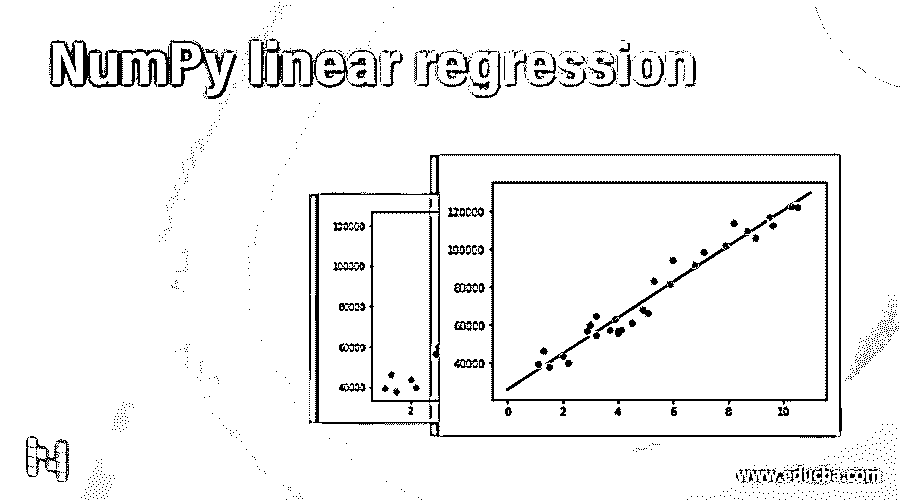
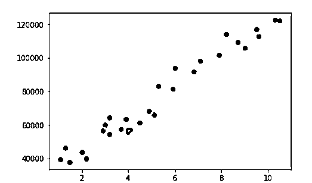
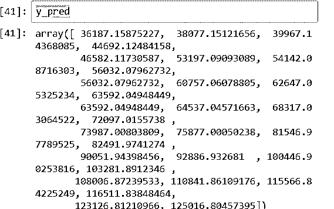
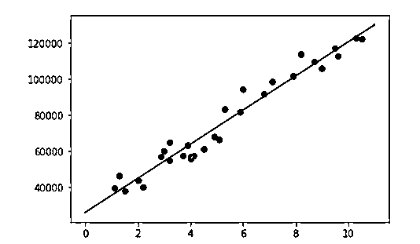

# 数字线性回归

> 原文：<https://www.educba.com/numpy-linear-regression/>




## NumPy 线性回归简介

线性回归是机器学习中最简单有效的算法之一。它显示了两个变量之间的关系。在这种情况下，一个变量是从属的，另一个变量是独立的。使用这两个变量由方程 Y=aX+b 表示，其中 Y 是依赖于 x 的输出变量，x 是独立的输入变量。Numpy 是一个 python 库，用于矩阵、代数和变换等数值运算。Numpy 是数字 python 的简称。Numpy 使线性回归的实现变得容易，并产生最佳的解决方案。在本主题中，我们将学习 NumPy 线性回归。

**语法**

<small>网页开发、编程语言、软件测试&其他</small>

```
import numpy as np
np.(operation)
```

在上面的语法中，第一个语法用于导入 numpy 库，第二个语法用于内置的数学运算，如 shape、reshape、max、min、mean、std、pow 等。

```
from sklearn. linear_model import Linear Regression
Obj1 = LinearRegression ()
```

在这个语法中，第一行用于导入 python 中的线性回归模型，第二个语法用于创建模型变量。模型变量是使用其他函数(如拟合、预测和评分)所需的对象。

### 线性回归在 NumPy 中是如何工作的？

线性回归基本上对拟合函数 Y= aX + b 起作用，在这个方程中，“Y”是函数的 n 变量和输出，“X”是独立的输入变量。于是，系数用‘a’表示，截距用‘b’表示；两者都用于描绘曲线。

要实现线性回归模型，第一步是导入任何需要的库，比如 Numpy、pandas、matplotlib 等。这些库有助于数据库的预处理和修改。然后下一步就是导入线性回归模型。导入模型后，我们可以将输入变量拟合到模型中，通过使用 predict 函数，我们可以预测输出变量 Y 的值。

### NumPy 线性回归示例

让我们考虑一个工资预测的例子。x 是输入独立变量，y 是 x 上的相关工资预测变量。在数据库中，有两列，第一列是经验年限，第二列是工资。总共 30 个条目，或者我们可以说该组合存在；因此，数据库的形状是三十行两列(30，2)。在这个例子中，我们的任务是找出线性回归曲线，并预测新条目和输出变量的工资…要跟踪任何曲线，我们应该知道 theta 曲线的坐标，所以我们将通过找到系数和截距来跟踪曲线。首先，我们需要像熊猫和 numpy 一样导入 pythons 中的库；这里我们导入 numpy 作为 np，熊猫作为 pd。我们可以对库使用任何变量来代替 np 和 pd。然后我们需要从数据库导入数据；这里，输入文件是一个 csv 文件(逗号分隔文件)。

然后，我们将使用 shape 函数检查数据库中的信息，数据库中有多少行和列，使用 info 函数可以看到其他信息。一旦我们重塑了数据库，我们就可以导入线性回归模型。线性回归模型在 sklearn 中可用。下一步，我们需要通过拟合函数来拟合数据库，但是在这个例子中，数据库的形状有问题；这就是为什么我们将使用 numpy 重塑数据库。然后，我们将能够将输入的 x 变量拟合到线性回归模型中。一旦我们拟合了模型，我们就可以检查一条线的系数和截距。然后还有一个被预测的函数。我们可以通过这个函数预测 y 值；这是我们的预期产量。我们正在使用另一个库 matplotlib，以图形方式查看曲线。在第一张图中，有数据库的输入值，在第三张图中，我们可以看到线性回归曲线。第二张图显示了 y 预测值的输出。

使用 Numpy 进行线性回归的 Python 代码:

```
import numpy as np
import pandas as pd
df = pd.read_csv('Salary.csv')
df.shape
df.info ( )
import matplotlib.pyplot as plt
plt.scatter ( df  [ 'YearsExperience' ] , df  [ 'Salary' ] )
from sklearn.linear_model
import LinearRegression
Obj1 = LinearRegression ( )
X = df [ 'YearsExperience' ]
y = df [ 'Salary' ]
X_np = X.values
X_np.reshape (-1 ,1) . shape
X1 = X_np. Reshape (30 ,1)
Obj1.fit( X1,y)
Obj1.intercept_
Obj1.coef_
plt.scatter ( df ['YearsExperience' ] ,df [ 'Salary' ])
plt.plot ( [ 0 ,11] , [Obj1.predict ( [  [ 0 ] ]) ,Obj1.predict ( [ [ 11] ] ) ] ,c = 'red')
model = LinearRegression ( )
y_pred
model.fit ( d f [ ['YearsExperience'] ] ,df [ 'Salary' ])
y_pred = model.predict ( df [ ['YearsExperience'] ])
```

图 1:输入数据




图 2:输出 Y 预测值




图 3:回归曲线




### 结论

在本文中，我们已经看到了如何使用 numpy 导入数据库和重塑数据库。然后，我们创建一个线性回归模型，拟合模型，并预测输出变量的值。在 Numpy 库中，我们使用了各种函数，如 shape、reshape 和值。该函数支持数据库预处理中的模型。我们还可以通过使用“得分”函数来检查线性回归模型的得分或准确性。

### 推荐文章

这是一个数字线性回归的指南。这里我们讨论线性回归如何在 NumPy 中工作，并给出代码示例。您也可以看看以下文章，了解更多信息–

1.  [NumPy vstack](https://www.educba.com/numpy-vstack/)
2.  [NumPy 指数](https://www.educba.com/numpy-exponential/)
3.  num py . dot()
4.  [NumPy fft](https://www.educba.com/numpy-fft/)


