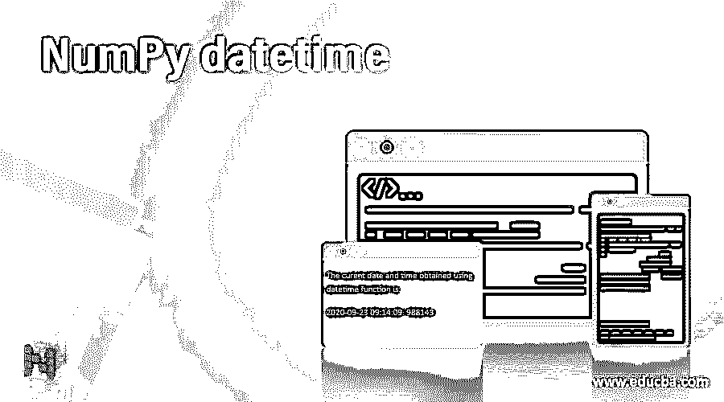
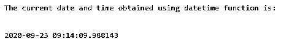
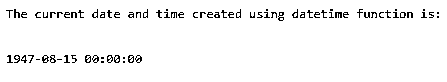

# NumPy datetime

> 原文：<https://www.educba.com/numpy-datetime/>




## NumPy 日期时间简介

python 中没有将日期作为对象的数据类型，因此要将 python 中的日期作为数据对象，我们需要在 python 中导入一个名为 datetime 的模块。此 datetime 函数以包含当前年份、当前月份、当前日期、当前小时、当前分钟、当前秒和当前微秒的格式返回输出，datetime 模块还可用于创建包含年值、月值、日值、小时值、分钟值、秒值、微秒值和时区值的日期。所以在这个主题中，我们将学习 NumPy 日期时间。

### 句法

Python 中 NumPy datetime 函数的语法如下:

<small>网页开发、编程语言、软件测试&其他</small>

```
datetime.datetime.now()
```

此 datetime 函数以包含当前年份、当前月份、当前日期、当前小时、当前分钟、当前秒和当前微秒的格式返回输出。

```
datetime.datetime(yearvalue, monthvalue, dayvalue, hourvalue, minutevalue, secondvalue. Microsecondvalue, timezonevalue)
```

此 datetime 模块可用于创建日期，该日期由年值、月值、日值、小时值、分钟值、秒值、微秒值以及时区和

小时的值、分钟的值、秒的值、微秒的值和时区的值是可选的，对于时区，它们的默认值是零和无。

### NumPy 中日期时间函数的使用

*   python 中没有将日期作为对象的数据类型，因此要将 python 中的日期作为数据对象，我们需要在 python 中导入一个名为 datetime 的模块。
*   此 datetime 函数以包含当前年份、当前月份、当前日期、当前小时、当前分钟、当前秒和当前微秒的格式返回输出。
*   datetime 模块还可用于创建日期，该日期由年值、月值、日值、小时值、分钟值、秒值、微秒值和时区值组成。
*   在创建日期的 datetime 模块中，小时值、分钟值、秒钟值、微秒值和时区值是可选的，对于时区，它们的默认值为零或无。

### NumPy 日期时间的示例

以下是 NumPy datetime 的示例:

#### 示例#1

Python 程序通过导入 datetime 模块并显示当前日期和时间来演示 NumPy datetime 函数:

**代码:**

```
#the datetime module is imported to make use of datetime function
import datetime
#datetime function is used to obtain the current date and time which is stored in a variable called currentdatetime
currentdatetime = datetime.datetime.now()
print '\n'
print('The current date and time obtained using datetime function is:')
print '\n'
#the current date and time obtained using datetime function is displayed as the output on the screen
print(currentdatetime)
```

**输出:**




首先，在上面的程序中，导入了 datetime 模块以利用 datetime 函数。然后使用 datetime 函数获取当前日期和时间，并存储在一个名为 current date-time 的变量中。然后，使用 datetime 函数获得的当前日期和时间将作为输出显示在屏幕上。

#### 实施例 2

Python 程序，通过导入 datetime 模块来演示 NumPy datetime 函数，从而在年、月和日值作为参数传递给 datetime 函数时创建日期:

**代码:**

```
#the datetime module is imported to make use of datetime function
import datetime
#datetime function is used to create the date and time for the given year, month and day values which is stored in a variable called currentdatetime
currentdatetime = datetime.datetime(2020, 9, 22)
print '\n'
print('The current date and time created using datetime function is:')
print '\n'
#the current date and time created using datetime function is displayed as the output on the screen
print(currentdatetime)
```

**输出:**


首先，在上面的程序中，导入了 datetime 模块以利用 datetime 函数。然后使用 datetime 函数为存储在名为 current date-time 的变量中的年、月和日的给定值创建日期和时间。然后，使用 datetime 函数创建的日期和时间将作为输出显示在屏幕上。

#### 实施例 3

Python 程序，通过导入 datetime 模块来演示 NumPy datetime 函数，从而在年、月和日值作为参数传递给 datetime 函数时创建日期:

**代码:**

```
#the datetime module is imported to make use of datetime function
import datetime
#datetime function is used to create the date and time for the given year, month and day values which is stored in a variable called currentdatetime
currentdatetime = datetime.datetime(1947, 8, 15)
print '\n'
print('The current date and time created using datetime function is:')
print '\n'
#the current date and time created using datetime function is displayed as the output on the screen
print(currentdatetime)
```

**输出:**




首先，在上面的程序中，导入了 datetime 模块以利用 datetime 函数。然后使用 datetime 函数为存储在名为 current date-time 的变量中的年、月和日的给定值创建日期和时间。然后，使用 datetime 函数创建的日期和时间将作为输出显示在屏幕上。

### 推荐文章

这是 NumPy datetime 的指南。在这里，我们通过编程示例和输出，通过 python 中日期时间函数的定义、语法和工作方式，讨论 Python 中 NumPy 日期时间函数的概念。您也可以看看以下文章，了解更多信息–

1.  [NumPy zip](https://www.educba.com/numpy-zip/)
2.  [NumPy vstack](https://www.educba.com/numpy-vstack/)
3.  [NumPy 回合](https://www.educba.com/numpy-round/)
4.  [Numpy.argsort()](https://www.educba.com/numpy-argsort/)


