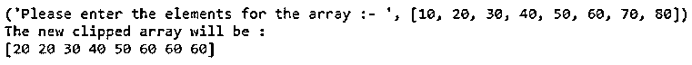
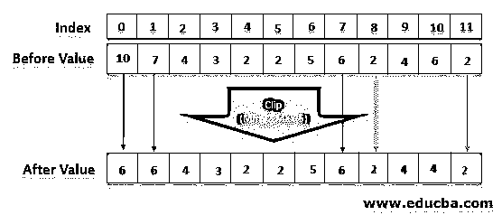

# Numpy.clip()

> 原文：<https://www.educba.com/numpy-dot-clip/>


## Python 中 Numpy.clip()简介

python 编码语言中的 Numpy.clip()函数用于裁剪，或者说限制用户输入的数组中指定的值。

用更简单的术语来说，对于指定的区间(例如:[0，1])，大于 1 的值将被视为 1，小于 0 的值将被视为 0。与使用函数 min()和 max()并通过 maximum()检查它们的比较值相比，clip()提供了一个更快、更全面的解决方案。

<small>网页开发、编程语言、软件测试&其他</small>

### Numpy clip()的语法和参数

以下语法在结构上用于构建 python 语言的代码:

```
numpy.clip (arr, a _min, a_max , out = None)
```

以下是 Python 中 numpy.clip()函数的语法中使用的参数:

| **参数** | **描述** |
| --- | --- |
| 数组(此处为 arr) | 用户输入的数组
(或者，可以在代码本身中指定) |
| a_min
(标量值，关键字:“arraylike”或关键字:“None”) | 数组限制的最小值是数组元素被检查的下限，如果它们小于下限。
如果没有指定，那么数组的最低元素将被认为是输入的数组中最小的元素。需要注意的是，参数 <u>NONE</u> 不应该同时为 a_min 和 a_max 指定。如果其中一个参数被保存为 ARRAYLIKE，将导致 3 个不同的数组被广播。 |
| a_max
(标量值，关键字:“arraylike”或关键字:“None”) | 数组限制的最大值是数组元素大于下限时检查数组元素的上限。 |

### 运行 Numpy.clip()时返回值

这个 Numpy.clip()函数返回一个二维数组，该数组是由数组中的元素字符串特化而来的。

```
numpy.clip ( arr,a_ min, a _ max, out  = None )
```

| **退货:** | **clipped** **_** **数组****:****ndarray**
这是对原来输入的数组进行元素改变处理后形成的结果数组。
此处，下限值由 a_min 值代替，上限值由 a_max 代替 |

### Numpy.clip()的示例

下面的 exclude 解释了使用 Numpy.clip 时数组如何变化以给出结果数组(显示在输出中):

**代码:**

```
# To demonstrate the usage of the Numpy clip () function in python language
# calling the Numpy by importing it to perform the clip function
import numpy as N1
Ar_array = [10 , 20 , 30 , 40 , 50 , 60 , 70 , 80 ]
print ("Please enter the elements for the array :- ", Ar_array )
Output_array = N1.clip(Ar_array, a_min = 20 , a_max = 60 )
print ("The new clipped array will be : " )
print Output_array
```

上面给出的代码的输出如下:




可以看到 python 上运行的 numpy.clip()函数代码正在裁剪用户输入的( *Ar)* 数组中的值，并在指定的限制内更改默认值。

### Numpy.clip()函数是如何工作的？

*   在许多关于问题和算法功能的数据中(例如在强化学习算法中使用的近似策略优化或 PPO ),需要将元素限制在一个上限值或下限值或两者之下。
*   numpy 剪辑用于提供限制值的预置功能。
*   下图以图形方式显示了 clip 功能的实际工作方式，并深入分析了其限制机制




图:此处的图像显示了如何使用索引号确定默认值，并将其置于限幅值之下

*   系统首先分析用户输入的数组中的值
*   然后检查上限值和下限值
*   然后，它与每个元素进行比较，如果它不符合限制，并检查它们相对于输入的初始数组的索引
*   它将默认指数更改为指定的上限和下限。
*   最后，它用替换的有限值来改变这些值，并生成一个新的数组，以满足用户要执行的功能的指定需求

### 结论

numpy clip 函数作为一个参数/线性解决方案，为各种算法经常需要的数组提供剪切的参数，从而减少运行代码所需的计算时间。它还减少了代码的冗长性，使其更适合大型数据分析。

### 推荐文章

这是 Numpy.clip()的指南。这里我们讨论 Numpy.clip()函数的介绍、语法、参数和工作方式，并给出例子。您也可以看看以下文章，了解更多信息–

1.  [NumPy 简介](https://www.educba.com/introduction-to-numpy/)
2.  [numpy.sort](https://www.educba.com/numpy-sort/)
3.  [NumPy 是什么？](https://www.educba.com/what-is-numpy/)
4.  [NumPy 数据类型](https://www.educba.com/numpy-data-types/)


