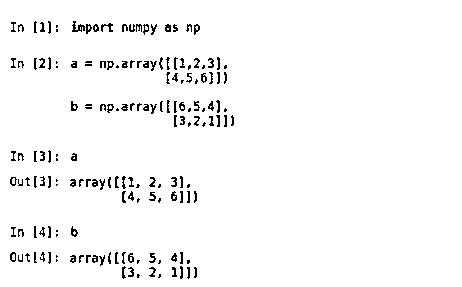
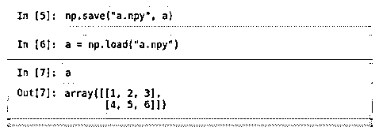
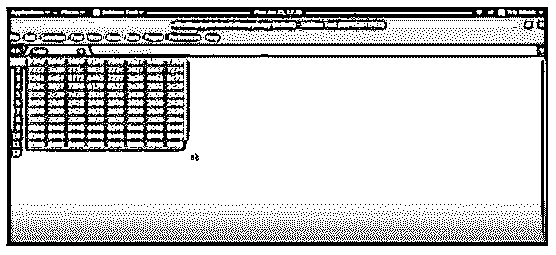
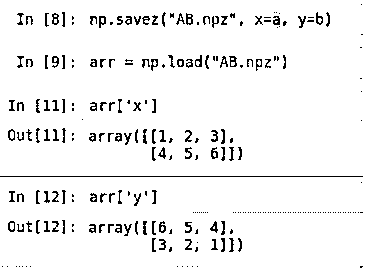

# numpy.save()

> 原文：<https://www.educba.com/numpy-save/>


## numpy.save()简介

Python 编码语言中使用 numpy.save()函数来保存一个单独的数组，该数组以 npy 格式存储一组数据，以确保数据存储在硬盘中的一个文件中，可以根据需要加载该文件。点 npy 格式是标准化格式，是一种用于在磁盘上保存单个数组的二进制文件保存方法。该格式负责存储所有数据类型或数据类型信息，以及在相同或不同的机器上重建数组所需的数组形状，这些机器可能具有或可能不具有类似的体系结构。

这种形式的设计在传递所有目标的同时，保持了简单性和可接近性。的。npz 格式用于在磁盘空间中存储持久化的多个数据。这可以很容易地理解为一个 zip 文件，其中包含许多。npy 文件，每个文件代表一个数组。

<small>网页开发、编程语言、软件测试&其他</small>

### 语法和参数

以下是使用 Python 编程语言编写代码时使用 numpy.save()的语法:

```
numpy.save * (file, * arr, allow * _ * pickle * = * True, * fix * _ * imports * = * True *)
```

以下是用 Python 编程语言编写的 numpy.save()函数所使用的参数:

**1。* file，* str，*或 pathlib。*路径**

*   它代表用于注册和保存数据的文件或文件名。如果文件是对象，文件名保持不变。
*   如果文件包含字符串数据或路径，则会在文件名中添加点 npy 扩展名，如果这样的扩展名尚不存在。

**2。***array _ like**

它表示包含需要保存的数组的数据。

**3。** * **allow_picklebool，可选**

*   该参数用于允许使用 Python pickles 保存各种对象数组的选项。嘿，不允许 pickle 有各种各样的原因，包括安全相关的问题(由于加载已经 pickle 的数据，可以执行任意代码)和可移植性相关的问题(已经 pickle 的对象可能无法加载各种 Python 安装。
*   例如，由于数据被存储为已被酸洗的对象，可能会出现不兼容问题。当在 Python 3 和 Python 2 之间转换时，这一点尤其明显。因此，除非指定，否则参数的默认值设置为 true。

**4。修复** * **_** * **导入工具，** * * **可选**

*   只有当 Python 3 平台中的对象数组中包含的对象必须在 Python 2 环境中以相对兼容的方式进行清理时，这个参数才是有用的。
*   如果参数为 true，pickle 会尝试将 Python 3 环境中创建的新名称映射到 Python 2 中使用过的现有模块名称，这使得创建的 pickle 数据流在 Python 2 环境中是可读的。

**Returns:** 该参数负责将用户已经输入的数据存储在磁盘文件中，文件扩展名为. npy。

### numpy.save()如何系统工作？

让我们借助一个例子来看看 numpy save 函数的功能。这里我们有两个数组，分别是 A 和 B。

**

** 




现在让我们假设我们想要将错误保存在项目文件夹中。我们可以看到已经创建了一个. npy 文件。该文件由二进制格式的系统生成器数据中的 numpy 数组数据组成。要打开这类文件，必须更改打开文件的默认程序。需要使用文本阅读器来打开文件。这里，我们使用 sublime 文本编辑器和阅读器程序来打开文件，我们可以看到数据以压缩的同步方式呈现。这种紧凑的数据存储在代表存储文件的磁盘区域的文件中。




现在，假设在同一个示例之前，假设我们想要说数组 A 和 B。天气新闻，命令 savez()来指定 npz 扩展 zip 文件，该文件包含二进制形式的数组 A 和 B。这里我们还规定包含数组 a 的文件名为 x，包含数组 b 的文件名为 y。同样，为了检查保存功能是否已经成功完成，我们必须尝试加载保存的文件。为了确保这一点，我们必须编写代码。




当我们应用 load 函数来调用已保存的文件并尝试检查包含在指定文件夹中的每个数组的元素是否遵循正确的顺序并且可读时，我们可以确保保存函数成功。

### Python 中 numpy.save()的示例

下面给出了在 Python 中显示 numpy.save()用法的示例:

#### 示例#1

解释 numpy.save 函数用法的 Python 程序。

**代码:**

```
import numpy as n1
# the array that has to be loaded is entered within b1
b1 = n1.load('num1file.npy')
print("The values contained is b1 are as follows:")
print(b1)
# b1 is then now printed using the file num1file.npy
print("The file b1 is printed from num1file.npy")
```

**显示 argmax 用法的上述代码的输出:**


#### 实施例 2

用 python 语言写了一个程序，用来说明 save()函数。

**代码:**

```
# save() function
import numpy as n1
a1 = n1.arange(5)
# printing the array a1.
print("Values contained in the array entered are:")
print(a1)
# the array has been saved in the file named numfile.npy
n1.save('numfile', a1)
print("The array has been now saved in the file numfile.npy")
```

**显示 argmax 用法的上述代码的输出:**


### 结论

numpy.save()函数对于确保对某些代码至关重要的数组或可能被各种代码用于动态编程的数组可以存储在一个公共位置非常重要，从这个位置加载和重用文件将非常容易，即使传输是由机器间传输组成的。

### 推荐文章

这是 numpy.save()的指南。这里我们讨论一下入门，numpy.save()是如何系统工作的？并附有示例。您也可以看看以下文章，了解更多信息–

1.  [NumPy.argmax()](https://www.educba.com/numpy-argmax/)
2.  [numpy.mean()](https://www.educba.com/numpy-mean/)
3.  num py . unique()
4.  [numpy.pad()](https://www.educba.com/numpy-pad/)


