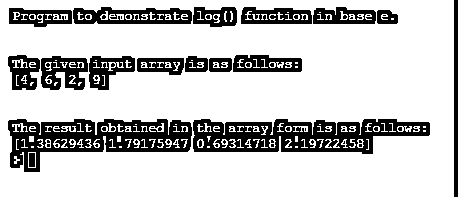
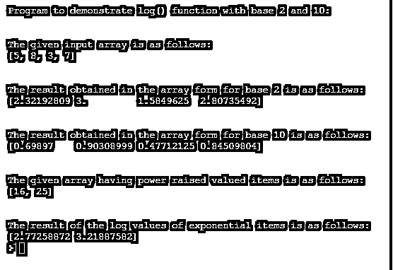
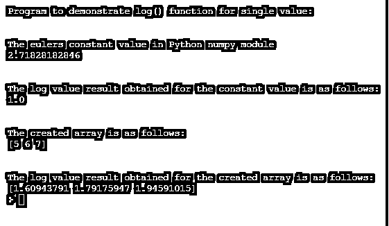

# num py log-num py 记录档

> 原文：<https://www.educba.com/numpy-log/>


## NumPy 日志简介

在本文中，我们将讨论 Python 中的 NumPy log()函数。在 Python 中，NumPy 是一个用于处理数组的模块，NumPy log()函数由用于处理对数运算的 NumPy 模块提供，这意味着 log()函数是一个数学函数，它将帮助我们在 Python 编程语言中计算自然对数。一般来说，自然对数是给定数组的输入元素的指数函数 exp()的倒数，可以用公式格式定义为 log(exp(x)) = x，其中 x 是输入数组的一项。

### Python 中 NumPy 的对数函数 log()的实现

在本文中，我们将详细讨论 NumPy.log()函数，这是另一种数学运算，可以在给定数组上使用，以计算以 e 为底的输入数组中给定项的对数。在 Python 中，此 log()函数不仅可以用于以 e 为底的对数，还可以用于以 2，10 为底的对数。我们应该注意，如果输入数组包含实数数据类型的值， 然后这个 log()函数返回也是实数数据类型的输出，并且如果每个值不是以实数值表示，那么该函数也产生 nan，因为它也不理解哪种数据类型，因此导致浮点错误标志。 类似地，如果输入数组项是复数，那么该函数也返回复分析值。所以我们可以用 NumPy 的这个 log()函数，一个数字，一个数字或者项目的列表，1 和一个多维数组。

<small>网页开发、编程语言、软件测试&其他</small>

现在让我们在下面的部分中看到 log()函数的语法和关于这个函数的例子来演示它，以便更好地理解它。

**语法:**

```
numpy.log( input_array, out )
```

**参数:**

*   **Input_array:** 该参数用于指定需要作为实参传递给 log()函数的数组。
*   **Out:** 这是一个可选参数，用来存储结果数组，结果数组是在给定数组上计算 log()函数后返回的输出数组。

### NumPy 日志示例

现在，让我们在下一节中看看演示 log()函数的各种例子。但是在开始举例之前，我们要注意的是，在执行这个 log()函数之前，首先要导入 NumPy 模块。

#### 示例#1

现在让我们看一个使用 log()函数计算以 e 为底的对数值的例子。

**代码:**

```
import numpy as np
print("Program to demonstrate log() function in base e.")
print("\n")
input_arr = [4, 6, 2, 9]
print ("The given input array is as follows: ")
print(input_arr)
print("\n")
output_arr = np.log(input_arr)
print ("The result obtained in the array form is as follows:")
print(output_arr)
```

**输出:**




在上面的程序中，我们可以看到我们声明了一个包含 4 个元素的输入数组，并且我们打印了这个数组，如输出的屏幕截图所示。然后，我们通过将数组名称指定为函数的参数，将这个给定的数组传递给 log 函数，我们没有提到任何 base，因此默认情况下它将接受 base e，结果将再次返回一个数组，其中包含给定数组中项目的 log 值，如我们在上面的屏幕截图中所看到的。

现在我们将看到另一个例子，在这个例子中，我们将以 2 和 10 为基数打印给定数组中项目的两个对数值。在这个例子中，我们还将看到如何找到具有形式为 e^x 或 e ** x 的指数函数的项目的对数值，以及当我们找到这个形式为 ln(e^x) = x 的指数函数的对数值时

#### 实施例 2

**代码:**

```
import numpy as nl
print("Program to demonstrate log() function with base 2 and 10:")
print("\n")
input_arr = [5, 8, 3, 7]
print ("The given input array is as follows: ")
print(input_arr)
print("\n")
output_arr1 = nl.log2(input_arr)
print ("The result obtained in the array form for base 2 is as follows:")
print(output_arr1)
print("\n")
output_arr2 = nl.log10(input_arr)
print ("The result obtained in the array form for base 10 is as follows:")
print(output_arr2)
print("\n")
exp_arr = [ 2**4, 5**2]
print("The given array having power raised valued items is as follows:")
print(exp_arr)
print("\n")
out_exparr = nl.log(exp_arr)
print("The result of the log values of exponential items is as follows:")
print(out_exparr)
```

**输出:**




在上面的程序中，我们可以看到我们首先声明了一个包含 4 个元素的数组，并且我们正在寻找这些指定项的以 2 为基数和以 10 为基数的对数值。结果如上图截图所示。在上面的程序中，我们还可以看到，我们已经声明了一个数组，该数组具有项值，例如像(2**4 = 2 ^4 = 16)这样的幂提升值，如上面的输出屏幕截图所示。我们可以看到，当我们打印这个指数值的数组时，它将打印这些值相乘后获得的值，因此它将找到这些值的值，然后它将找到在上面的屏幕截图中的数组中获得的乘积值的对数值。

这个 log()函数也可以用来查找单个值的值；正如我们在上面的例子中看到的，我们直接在列表或数组上工作。我们还可以使用 NumPy 模块创建一个数组，然后找到创建的数组的日志值。现在让我们在下面的例子中演示这两个概念:

#### 实施例 3

**代码:**

```
import numpy as nl
print("Program to demonstrate log() function for single value:")
print("\n")
print("The eulers constant value in Python numpy module")
print(nl.e)
print("\n")
out1 = nl.log(nl.e)
print ("The log value result obtained for the constant value is as follows:")
print(out1)
print("\n")
input_arr = nl.arange(start = 5, stop = 8)
print("The created array is as follows:")
print(input_arr)
print("\n")
out_arr = nl.log(input_arr)
print ("The log value result obtained for the created array is as follows:")
print(out_arr)
```

**输出:**




在上面的程序中，我们正在寻找欧拉常数及其对数值。我们还使用 NumPy 模块的 arrange()函数创建了一个数组，然后我们正在查找这个创建的数组的日志值。

### 结论

本文的结论是，我们已经定义了 numpy.log()函数，它用于查找给定项目、数组或列表的对数值。在本文中，我们看到了以 e、2 和 10 为基数查找对数值的例子。在本文中，我们还看到了如何通过示例找到单个值、数组和任何常量值的对数值的示例。

### 推荐文章

这是一个数字日志指南。这里我们将讨论 Python 中 NumPy 的对数函数 log()的工作原理，并给出例子。您也可以看看以下文章，了解更多信息–

1.  [numPy.where()](https://www.educba.com/numpy-where/)
2.  [NumPy 数组](https://www.educba.com/numpy-arrays/)
3.  [numpy.diff()](https://www.educba.com/numpy-dot-diff/)
4.  [numpy.ravel()](https://www.educba.com/numpy-dot-ravel/)


