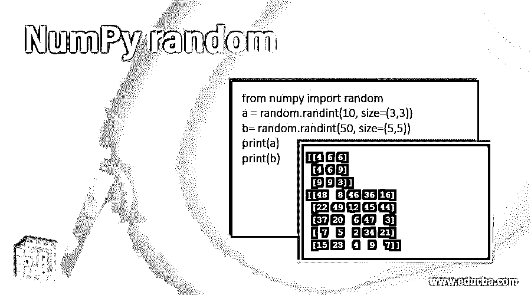
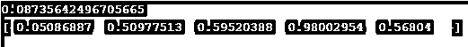
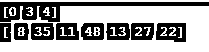
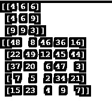
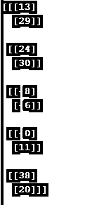
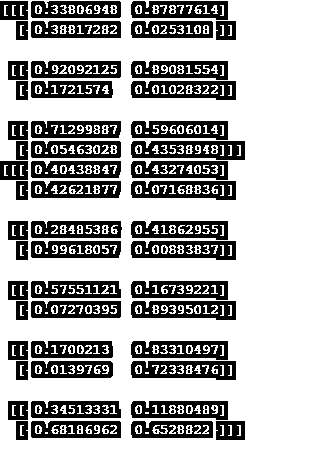
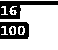
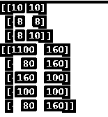

# NumPy 随机

> 原文：<https://www.educba.com/numpy-random/>




## NumPy random 简介

随机数是在不遵循任何逻辑或模式的情况下生成的数字，因此它不能再次用于任何过程；这种随机数生成在关键信息的安全或加密中非常有用，因此 python 有一个非常容易执行各种数字运算的库，称为 Numpy(数字 Python ),它可以用于使用位生成器生成伪随机数，位生成器给出序列的不同组合，然后生成器将序列转换为遵循概率分布的数字。

### 句法

Numpy 可用于为各种数据类型(如 float、int、array 等)生成随机序列。随机数生成是通过从 Numpy 库中导入随机包来执行的。numpy 随机生成的基本语法是

<small>网页开发、编程语言、软件测试&其他</small>

```
from numpy import random
randint(int)
```

### NumPy 随机的例子

为了更好地理解，让我们讨论一个不同的例子，其中我们使用不同的随机生成技术。

#### 示例#1

**代码:**

```
from numpy import random
a = random.randint(10)
b= random.randint(50)
print(a)
print(b)
```

**输出:**


在这个例子中，我们从 numpy 库中导入了随机包来执行操作。我们已经使用 numpy random.randint()语法生成了随机整数 a & b，我们在括号中给出的值是生成随机数的最大限制。产出 4 低于我们宣布的 10，产出 44 低于我们宣布的 50。

#### 实施例 2

在本例中，我们使用 Numpy random 来生成一个浮点值列表，

**代码:**

```
from numpy import random
a = random.rand()
b= random.rand(5)
print(a)
print(b)
```

**输出:**




在这个例子中，我们使用了 random.rand()语法，它允许我们生成浮点值。在变量' a '中，我们没有声明任何数字，所以它默认生成一个从 0 到 1 的随机浮点数。在变量 b 中，我们声明了一个 5 的限制，所以我们有一个 5 个随机浮点值的列表。我们可以声明任何数字来生成我们所声明限制的浮点值。

#### 实施例 3

在这个例子中，我们将讨论 numpy 数组的随机生成，使用的语法与我们在前面的例子中使用的相似。

**代码:**

```
from numpy import random
a = random.randint(10, size=(3))
b= random.randint(50, size=(7))
print(a)
print(b)
```

**输出:**




我们使用了 randint 语法，并声明了我们在这个例子中生成的序列的最大限制和大小。这种方法是随机生成一维数组。对于' a '，我们声明了最大限制为 10，序列长度为 3，对于' b '，我们声明了最大限制为 50，序列长度为 7，我们得到了相应的输出。

类似地，我们将尝试在下面的代码中生成二维数组。

**代码:**

```
from numpy import random
a = random.randint(10, size=(3,3))
b= random.randint(50, size=(5,5))
print(a)
print(b)
```

**输出:**




使用类似的代码，我们通过在二维中声明生成的大小，生成了二维随机数组。例如，在变量“a”中，我们声明最大限制为 10，序列的长度为 3，3，这是一个二维数组，而对于“b”，我们声明最大限制为 50，序列的长度为 5，5，我们得到了相应的二维数组作为输出。

我们也可以使用如下所示的相同技术生成三维数组。

**代码:**

```
from numpy import random
a = random.randint(10, size=(3,2,1))
print(a)
```

**输出:**


**代码:**

```
from numpy import random
b= random.randint(50, size=(5,2,1))
print(b)
```

**输出:**




在上面的例子中，我们为变量“a”和“b”生成了三维随机数组，其中“a”的大小为 10，序列的长度为(3，2，1)，这是一个二维数组，而“b”的最大限制为 50，序列的长度为(5，2，1)，我们得到了相应的三维数组作为输出。

#### 实施例 4

在前面的例子中，我们已经讨论了使用整数值生成多维数组；这里，我们将讨论浮点值的生成。

**代码:**

```
from numpy import random
a = random.rand(3,2)
b = random.rand(5,2)
print(a)
print(b)
```

**输出:**


当我们使用 random.rand 语法时，它会生成默认形式为 0 到 1 的浮点值，因此当我们像在上面的代码中那样在二维空间中声明随机生成的大小时，其中“a”和“b”的二维大小为(3，2) & (5，2)，我们会得到二维浮点数组。

类似地，对于三维浮动数组，

**代码:**

```
from numpy import random
a = random.rand(3,2,2)
b = random.rand(5,2,2)
print(a)
print(b)
```

**输出:**




所以在这段代码中，我们将 a & b 的三维大小声明为(3，2，2) & (5，2，2)，所以我们得到了一个三维数组的输出。

#### 实施例 5

Numpy 随机生成中的另一种方法使用函数作为选择()，它允许计算机从给定的值序列中选择一个随机选择。

**代码:**

```
from numpy import random
a = random.choice([8, 10, 16])
b= random.choice([80, 100, 160,1100])
print(a)
print(b)
```

**输出:**




在这个方法中，我们使用一个名为 choice()的函数，它允许计算机从用户声明的值数组中随机选择一个值。

choice()函数获取一个数组作为输入，并给出一个随机选择的值作为输出。因此，我们可以给出一个任意长度的数组，并从中生成一个随机值。

类似地，我们可以通过给定维度的大小，使用 choice()函数生成多维数组。

**代码:**

```
from numpy import random
a = random.choice([8, 10, 16],size=(3, 2))
b= random.choice([80, 100, 160,1100],size=(5, 2))
print(a)
print(b)
```

**输出:**




因此，使用 choice()函数，我们可以声明大小，并从我们声明的数组生成二维和三维数组。

### 结论

在本文中，我们使用各种示例详细讨论了 Numpy random。我们还讨论了如何使用整数、浮点数和数组生成随机值。我们还讨论了生成多维数组的不同技术 numpy random 对于涉及随机序列生成的各种项目非常有帮助。

### 推荐文章

这是 NumPy random 的指南。为了更好地理解，我们在这里讨论了 NumPy 随机和不同随机生成技术的例子。您也可以阅读以下文章来了解更多信息—

1.  [安装 NumPy](https://www.educba.com/install-numpy/)
2.  [NumPy Ndarray](https://www.educba.com/numpy-ndarray/)
3.  [numpy.ravel()](https://www.educba.com/numpy-dot-ravel/)
4.  [numpy.pad()](https://www.educba.com/numpy-pad/)


