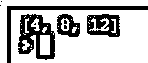

# 数字地图

> 原文：<https://www.educba.com/numpy-map/>


## 数字地图简介

每当我们有一个值列表或一个可迭代对象时，如果必须对给定的值列表或可迭代对象中的每个值应用一个特定的函数，我们就使用 numpy 中的一个名为 map() function 的函数， 它采用两个参数 function 和 iterable，其中 function 是必须应用于给定值列表中每个值的特定函数，或者 iterable 和 iterable 是必须应用特定函数 by name function 的值列表，numpy 中的 map()函数返回应用了指定函数的值列表。

**Python 中 NumPy map()函数的语法:**

<small>网页开发、编程语言、软件测试&其他</small>

```
numpy.map(functionname, iterable)
```

其中 function-name 是必须应用于给定值列表中每个值的特定函数的名称，或者 iterable 和 iterable 是必须应用特定函数 by name function 的值列表。

### NumPy map()函数的工作原理

*   每当我们有一个值列表或一个可迭代对象时，如果必须对给定的值列表或可迭代对象中的每个值应用一个特定的函数，我们就使用 numpy 中的一个名为 map() function 的函数。
*   NumPy 中的 map()函数接受两个参数 function-name 和 iterable。
*   函数名是特定函数的名称，该函数必须应用于给定值列表或 iterable 中的每个值。
*   Iterable 是值的列表，必须对其应用特定的函数 by name 函数。
*   numpy 中的 map()函数返回应用了指定函数的值的列表。

### NumPy 映射的示例

下面给出了 NumPy 映射的示例:

#### 示例#1

Python 程序演示了 NumPy map 函数来创建一个列表，该列表从两个只包含名字和姓氏的列表中给出了给定用户的名字和姓氏的组合。

**代码:**

```
#a function called user is defined which takes the two values firstname and lastname s the parameters and returns the combined value of firstname and lastname
def user(firstname, lastname):
    return firstname + lastname
#map function is used by specifying the user function as the function and providing the two list of values consisting of firstnames and lastnames alone on which the user function must be applied and the resulting list is stored in a variable called username
username = map(user, ('Shobha', 'Narendra', 'Ram'), ('Shivakumar', 'Modi', 'Krishna'))
#the resulting list after using the map function is displayed as the output on the screen
print(username)
```

**输出:**


在上面的程序中，定义了一个名为 user 的函数，它将 firstname 和 lastname 这两个值作为参数，并返回 firstname 和 lastname 的组合值。然后，通过将用户函数指定为函数并提供两个值列表来使用映射函数，这两个值列表仅由名字和姓氏组成，用户函数必须应用于这两个列表，结果列表存储在名为 username 的变量中。然后，使用映射功能后的结果列表作为输出显示在屏幕上。

#### 实施例 2

Python 程序演示了 NumPy map 函数来创建一个列表，该列表给出了两个列表中给定用户的名和姓之前使用的头衔的组合，这两个列表仅包含头衔和名、姓。

**代码:**

```
#a function called user is defined which takes the two values titles and firstnamelastname s the parameters and returns the combined value of firstname and lastname
def user(title, firstnamelastname):
    return title + firstnamelastname
#map function is used by specifying the user function as the function and providing the two list of values consisting of titles and firstnameslastnames alone on which the user function must be applied and the resulting list is stored in a variable called username
username = map(user, ('Ms.', 'Mr.', 'Mr'), ('ShobhaShivakumar', 'NarendraModi', 'RamKrishna'))
#the resulting list after using the map function is displayed as the output on the screen
print(username)
```

**输出:**


在上面的程序中，定义了一个名为 user 的函数，它将两个值 titles 和 firstnamelastname 作为参数，并返回 titles 和 firstnamelastname 的组合值。然后，通过将用户函数指定为函数并提供仅由 titles 和 first names 组成的两个值列表来使用映射函数，用户函数必须应用于这两个列表，结果列表存储在名为 username 的变量中。然后，使用映射功能后的结果列表作为输出显示在屏幕上。

#### 实施例 3

Python 程序演示了 NumPy map 函数，它创建了一个列表，当一个数相加时，该列表给出该数的和。

**代码:**

```
#a function called addition is defined which takes a single value number and as the parameter and returns the sum of adding the number with itself
def addition(number):
    return number + number
#map function is used by specifying the addition function as the function and providing the list of values consisting of numbers whose values must be added woth themselves on which the addition function must be applied and the resulting list is stored in a variable called result
result = map(addition, (2,4,6))
#the resulting list after using the map function is displayed as the output on the screen
print(result)
```

**输出:**




上面的程序中定义了一个叫加法的函数，它以单值数为参数，返回该数相加的和。然后，通过将加法函数指定为函数并提供由数值组成的值列表来使用映射函数，这些数值的值必须与必须应用加法函数的数值本身相加，并且结果列表存储在名为 result 的变量中。然后，使用映射功能后的结果列表作为输出显示在屏幕上。

### 推荐文章

这是 NumPy 地图的指南。这里我们分别讨论 NumPy map()函数的介绍、工作原理以及例子。您也可以看看以下文章，了解更多信息–

1.  [numpy.linspace()](https://www.educba.com/numpy-linspace/)
2.  [Numpy.argsort()](https://www.educba.com/numpy-argsort/)
3.  [NumPy 数组函数](https://www.educba.com/numpy-array-functions/)
4.  [NumPy Ndarray](https://www.educba.com/numpy-ndarray/)


