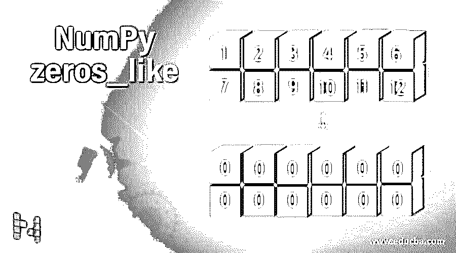
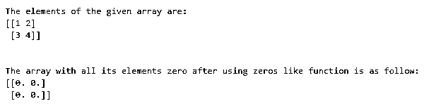
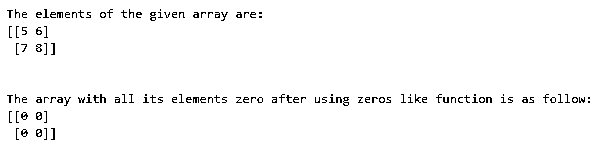

# NumPy 零 _like

> 原文：<https://www.educba.com/numpy-zeros_like/>




## NumPy zeros_like 简介

每当我们有一个数组，它的值必须用全零替换，并且数组的大小和形状必须保留为原始数组时，我们在 numpy 中使用一个称为类零函数的函数。这些类零函数采用四个参数 arrayname、datatype、memoryorder 和 subok，其中 datatype 和 subok 参数是可选的，datatype 表示存储在数组中的值的数据类型，该数组的名称由第一个参数 arrayname 表示，memory order 表示内存中的顺序，subok 表示布尔值，如果使用类零函数返回的数组是输入数组的子类，则该值为 true，如果返回的数组与原始数组相同，则该值为 false。在这个主题中，我们将学习 NumPy zeros_like。

### 句法

Python 中 NumPy zeros_like 函数的语法如下:

<small>网页开发、编程语言、软件测试&其他</small>

```
numpy.zeros_like(arrayname, datatype, memoryorder, subok)
```

其中 arrayname 是数组的名称，在不改变数组的大小和形状的情况下，数组的值必须替换为零，

数据类型是存储在数组中的值的数据类型。数组中给定值的默认数据类型是 float。该参数是可选的。

Memoryorder 表示内存中的顺序。subok 表示一个布尔值，如果使用 zeros like 函数返回的数组是输入数组的子类，则为 true 如果返回的数组与原始数组相同，则为 false。该参数是可选的。

### NumPy 类零函数的运算

*   每当我们有一个数组，它的值必须用全零替换，并且数组的大小和形状必须保留为原始数组时，我们就使用一个在 numpy 中称为 zeros like function 的函数。
*   zeros like 函数接受四个参数 arrayname、datatype、memoryorder 和 subok，其中 datatype 和 subok 参数是可选的。
*   datatype 表示存储在数组中的值的数据类型，数组的名称由第一个参数 arrayname 表示。
*   memoryorder 表示内存中的顺序。
*   subok 代表一个布尔值，如果使用 zeros like 函数返回的数组是输入数组的子类，则为 true 如果返回的数组与原始数组相同，则为 false。

### NumPy zeros_like 的示例

下面提到了不同的例子:

#### 示例#1

演示 numpy 类零函数的 Python 程序，使用 NumPy 中的数组函数创建数组，然后使用类零函数将数组元素替换为零:

**代码:**

```
#importing the package numpy
import numpy as n
#Creating an array by making use of array function in NumPy and storing it in a variable called orgarray
orgarray = n.array([[1,2],[3,4]])
#Displaying the elements of orgarray followed by one line space by making use of \n
print ("The elements of the given array are:")
print (orgarray)
print ("\n")
#using zeros like function of NumPy and passing the created array as the parameter to that function to replace all the elements of the array with zeros and store it in a variable called zerosarray
zerosarray = n.zeros_like(orgarray, float)
#Displaying the array consisting of all zero elements
print ("The array with all its elements zero after using zeros like function is as follow:")
print (zerosarray)
```

**输出:**




在上面的程序中，我们正在导入包 numpy，它允许我们使用函数 array 和 zeros_like。然后，我们利用 numpy 中的 array 函数创建一个名为 orgarray 的数组。然后数组 orgarray 的元素显示在屏幕上。然后我们正在使用 zeros_like 函数进行 make，新创建的数组 orgarray 作为参数传递给函数，在不改变数组大小和形状的情况下将数组的所有元素转换为零，得到的数组存储在一个名为 zerosarray 的变量中。最后，zerosarray 的元素显示在屏幕上。

#### 实施例 2

演示 numpy 类零函数的 Python 程序，使用 NumPy 中的数组函数创建数组，然后使用类零函数将数组元素替换为零:

**代码:**

```
#importing the package numpy
import numpy as n
#Creating an array by making use of array function in NumPy and storing it in a variable called orgarray
orgarray = n.array([[5,6],[7,8]])
#Displaying the elements of orgarray followed by one line space by making use of \n
print ("The elements of the given array are:")
print (orgarray)
print ("\n")
#using zeros like function of NumPy and passing the created array as the parameter to that function to replace all the elements of the array with zeros and store it in a variable called zerosarray
zerosarray = n.zeros_like(orgarray, int)
#Displaying the array consisting of all zero elements
print ("The array with all its elements zero after using zeros like function is as follow:")
print (zerosarray)
```

**输出:**




在上面的程序中，我们正在导入包 numpy，它允许我们使用函数 array 和 zeros_like。然后，我们利用 numpy 中的 array 函数创建一个名为 orgarray 的数组。然后数组 orgarray 的元素显示在屏幕上。然后我们使用 zeros_like 函数。新创建的数组 orgarray 作为参数传递给函数，将数组的所有元素转换为零，而不改变数组的大小和形状。数据类型 int 也作为参数传递，它将结果数组中的零显示为整数值。然后，生成的数组存储在一个名为 zerosarray 的变量中。最后，zerosarray 的元素显示在屏幕上。

### 结论

在本教程中，我们通过定义了解 Python 中 NumPy 类零函数的概念，通过编程示例及其输出了解类零函数的语法以及类零函数的工作原理。

### 推荐文章

这是一个 NumPy zeros_like 的指南。这里我们讨论 NumPy zeros_like 函数的工作原理和例子，以及代码和输出。您也可以阅读以下文章，了解更多信息——

1.  [NumPy 数组](https://www.educba.com/numpy-arrays/)
2.  [NumPy 中的矩阵](https://www.educba.com/matrix-in-numpy/)
3.  [NumPy Ndarray](https://www.educba.com/numpy-ndarray/)
4.  [NumPy 数组函数](https://www.educba.com/numpy-array-functions/)


