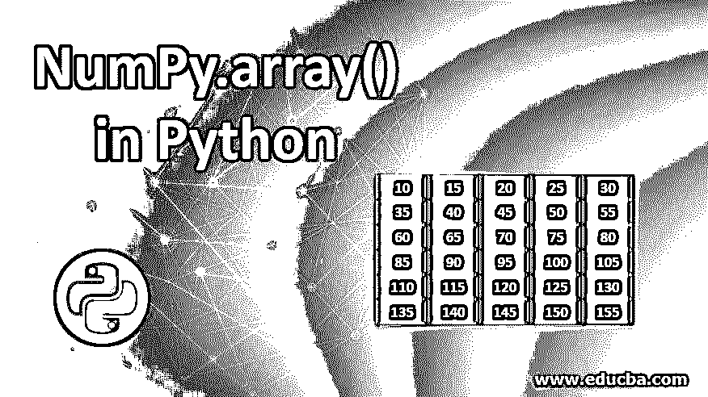
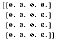
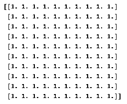
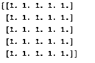
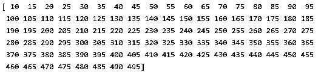
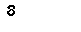
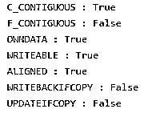

# Python 中的 NumPy.array()

> 原文：<https://www.educba.com/numpy-array-in-python/>




## Python 中 NumPy.array()简介

Python 的 Numpy。Array()是一个网格，用于保存相同数据类型的值，可以通过使用非负整数的元组进行索引。维数表示该数的秩。数组()，而元组表示数组的形状。

NumPy.array()或多或少类似于 Python 列表，但由于多种原因，同时还是非常不同的。而且，Numpy。由于更好的性能，Array()总是首选。

<small>网页开发、编程语言、软件测试&其他</small>

让我们举一个例子来更好地理解 NumPy 数组的语法:

```
## Python program to create a sample n x n NumPy array of zeros and print the same using Python's print function
import numpy as np
np_arr = np.zeros((4, 4))
print(np_arr)
```

**输出:**




### 这是如何工作的？

我们从使用 import 语句导入 NumPy 库开始，该语句的 array 是

```
import numpy as np
```

在第二行中，我们声明了一个名为“np_arr”的变量，并用一个零数组对其进行初始化，这将是一个在 np 的参数中定义的 4 x 4 数组。zeros()函数。

```
np_arr = np.zeros((4, 4))
```

最后，我们使用 Print 语句打印了相同的内容

但是，您应该知道，在结构层次上，NumPy 数组只不过是指向保存值的顺序内存位置的指针序列。

简而言之，基本上是以下几个方面的结合:

*   数据类型
*   存储地址
*   步幅和形状

数据指针是数组的第一个内存地址的指示器。顾名思义，形状是数组形状的指示器。

跨距是字节数，也取决于数组的数据类型，在数组的每个元素之间跳过。

### 如何制作空的 NumPy 数组？

0 和 1 的数组，可以作为未来值的占位符。

让我们举一些例子来说明这是如何做到的:

```
## Python program to create an array of ones as a placeholder, with user-defined dimension
import numpy as np
one = np.ones((10,10))
print(one)
```

**输出:**




NumPy 库有一个名为 ones()的函数，它可以创建一个在每个位置包含一个值的 NumPy 数组。尺寸参数可以根据需要指定。

**举例:**

```
## Python program to create an  array as a placeholder, with user-defined dimension
import numpy as np
Emp = np.ones((5,5))
print(Emp)
```

**输出:**




这一次我们利用了一个不同的函数，它就是 np。Empty()，但结果是一样的。维度的参数也可以根据 empty()函数的要求来指定。

**举例:**

```
## Python program to create an  array as a of evenly spaced values
import numpy as np
arr = n p.arange(10,500,5)
print(arr)
```

**输出:**




函数可以用来创建均匀分布的数组。我们可以将初始值、结束值和间隔值作为参数传递。

### 我们如何检查 NumPy 阵列？

有比我们讨论的更多的属性，所以 fat 是 NumPy 数组的数据类型、大小、步幅和形状。

让我们逐一讨论:

```
## Python program to check multiple attributes of an array
import numpy as np
arr = np.arange(10,500,5)
print(arr.size)
```

**输出:**


这里我们使用了 size 属性，它返回数组 arr 的大小，arr 是数组中元素的数量。

```
## Python program to check multiple attributes of an array
import numpy as np
Emp = np.empty((5,5))
print(Emp.itemsize)
```

**输出:**




这里我们使用了 itemsize 属性，它从 Emp 返回单个数组元素的大小，以字节为单位

```
## Python program to check multiple attributes of an array
import numpy as np
Emp = np.empty((5,5))
print(Emp.flags)
```

**输出:**




它打印与数组相关的多个标志值

### 结论–Python 中的 NumPy.array()

数组是一种有用的实体，可以用来处理类似类型的数据。它也可以暂时用作占位符元素，除非我们有实际的值。在讨论数据处理，特别是数据管理和操作时，NumPy 数组有许多用途。

### 推荐文章

这是 Python 中 NumPy.array()的指南。在这里，我们讨论介绍，如何使空 NumPy 数组，语法和参数，以及例子和输出。您也可以浏览我们推荐的其他文章，了解更多信息——

1.  [Python rstrip()](https://www.educba.com/python-rstrip/)
2.  [Python 中的 Split 函数](https://www.educba.com/split-function-in-python/)
3.  [Python 格式()函数](https://www.educba.com/python-format-function/)
4.  [Python 线程定时器](https://www.educba.com/python-threading-timer/)


