# Perl 命令

> 原文：<https://www.educba.com/perl-commands/>

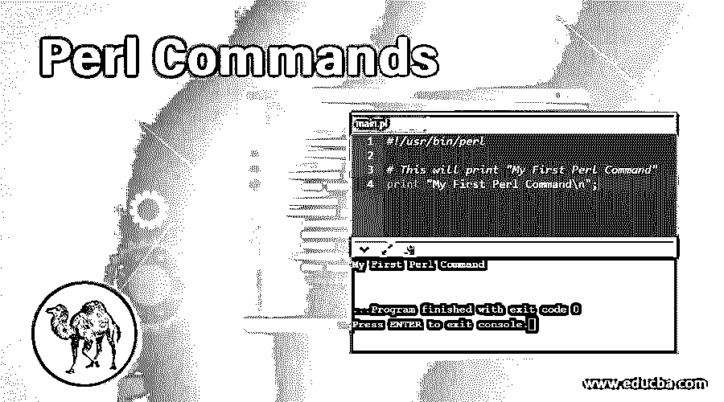

## Perl 命令简介

[Perl 是一种](https://www.educba.com/what-is-perl/)编程语言。早期它只是为文本编辑而设计的，现在它被用于许多目的，比如 Linux 中的系统管理、[、web 开发](https://www.educba.com/career-in-web-development/)、网络编程等等。Perl 的总设计师和创造者是拉里·沃尔。它创建于 1987 年，现在仍被用作主要的编程语言。Perl 是一种高级语言。它也是一种解释型动态编程语言。现在我们将详细学习 Perl 命令。

### 基本 Perl 命令

基本命令如下所述。

<small>网页开发、编程语言、软件测试&其他</small>

#### 1.用 Perl 打印的基本 Perl 命令

`#!/usr/bin/perl
# This will print "Hello, World"
print "Hello, world\n";`

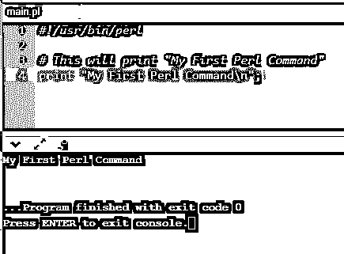

#### 2.Perl 中的单行注释

`#!/usr/bin/perl
# This is a single line comment
print "Hello Perl\n";`

**T2】**

 **#### 3.Perl 中的多行注释

`#!/usr/bin/perl
=begin comment
This is a multiline comment.
Line 1
Line 2
Line 3
We can insert
as much lines
as comments
until we code =cut
to end multiline comments
=cut
print "Hello Perl\n";`

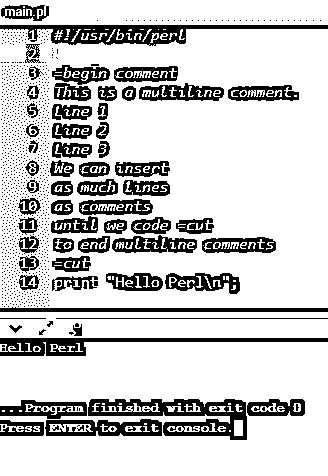

#### 4.Perl 中的变量赋值(双引号变量的插值)

`#!/usr/bin/perl
$a = 10;
print "Variable a = $a\n";`

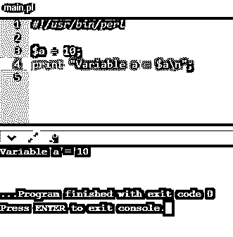

#### 5.Perl 中的转义字符

`#!/usr/bin/perl
$a = "This is \"Perl\"";
print "$a\n";
print "\$a\n";`

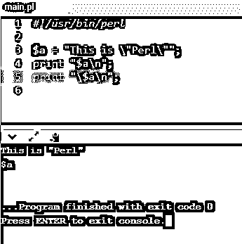

#### 6.在 Perl 中，字符串在双引号和单引号中有不同的行为。虽然双引号允许插值，但单引号不允许。

`#!/usr/bin/perl
# Interpolation example.
$str = "Hello \nPerl";
print "$str\n";
# Non-interpolation example.
$str = 'Hello \nPerl';
print "$str\n";`

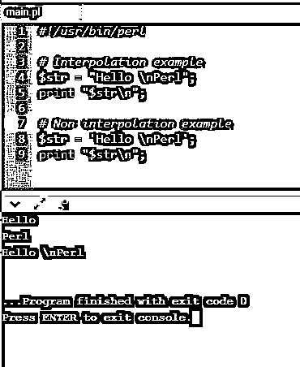

#### 7.Perl 命令的大写字母

`#!/usr/bin/perl
# Only u will become upper case.
$str = "\uhello perl";
print "$str\n";
# All the letters will become Uppercase.
$str = "\Uhello perl";
print "$str\n";
# A portion of string will become Uppercase.
$str = "hello \Uperl\E";
print "$str\n";`

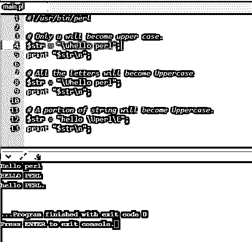

#### 8.Perl 中的标量变量赋值

`#!/usr/bin/perl
$age = 35; # Assigning an integer
$name = "Tony Stark"; # Assigning a string
$pi = 3.14; # Assigning a floating point
print "Age = $age\n";
print "Name = $name\n";
print "Pi = $pi\n";`

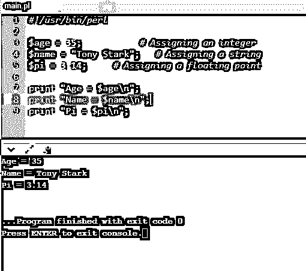

#### 9.Perl 中的简单标量运算

`#!/usr/bin/perl
$constr = "hi" . "perl";# Concatenates two or more strings.
$add = 40 + 10; # addition of two numbers.
$prod = 4 * 51;# multiplication of two numbers.
$connumstr = $constr . $add;# concatenation of string and number.
print "str = $constr\n";
print "num = $add\n";
print "mul = $prod\n";
print "mix = $connumstr\n";`

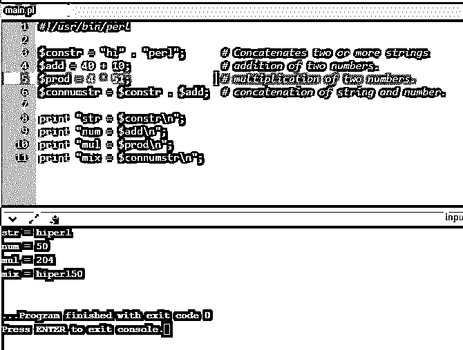

#### 10.Perl 中的特殊文字

`#!/usr/bin/perl
print "Current file name ". __FILENAME__ . "\n";
print "Current Line Number " . __LINENO__ ."\n";
print "Current Package " . __PACKAGENAME__ ."\n";
# here they cannot be interpolated
print "__FILENAME__ __LINENO__ __PACKAGENAME__\n";`

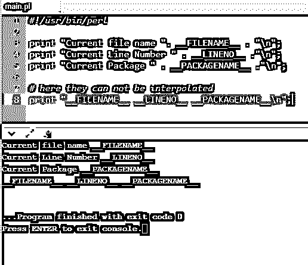

### 中间 Perl 命令

中间命令如下所述。

#### 1.Perl 中的数组

数组索引从 0 开始。负索引表示从最后一个位置开始的元素。下面的例子。

`#!/usr/bin/perl`

`@weekday = qw/Mon Tue Wed Thu Fri Sat Sun/;`

`print "$weekday[0]\n";
print "$weekday[1]\n";
print "$weekday[2]\n";
print "$weekday[6]\n";
print "$weekday[-1]\n";
print "$weekday[-6]\n";`

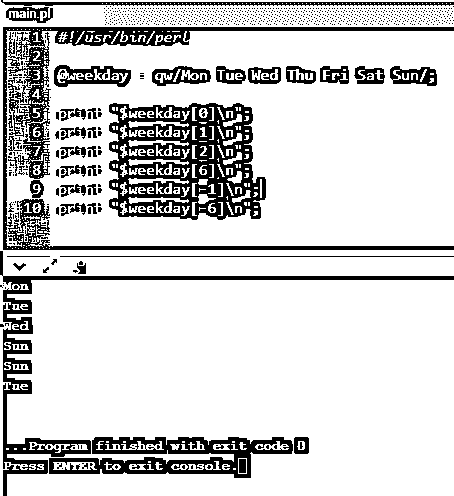

#### 2.序列中元素的数组

`#!/usr/bin/perl
@oneToTen = (1..10);
@fiftyToSeventyfive = (50..75);
@aToZ = (a..z);
print "@oneToTen\n"; # Prints one to ten
print "@fiftyToSeventyfive\n"; # Prints fifty to seventy five
print "@aToZ\n"; # Prints from a to z`

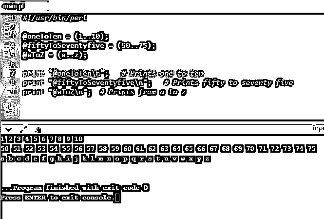

#### 3.数组元素的添加和移除

`#!/usr/bin/perl
# creating an array
@expression = ("happy","sad","angry");
print "1\. \@expression = @expression\n";
# add element to the end of the arraypush(@expression, "jolly");
print "2\. \@expression = @expression\n";
# add element to the beginning of the arrayunshift(@expression, "excited");
print "3\. \@expression = @expression\n";
# remove element to the last of the array.pop(@expression);
print "4\. \@expression = @expression\n";
# remove element from the beginning of the array.shift(@expression);
print "5\. \@expression = @expression\n";`

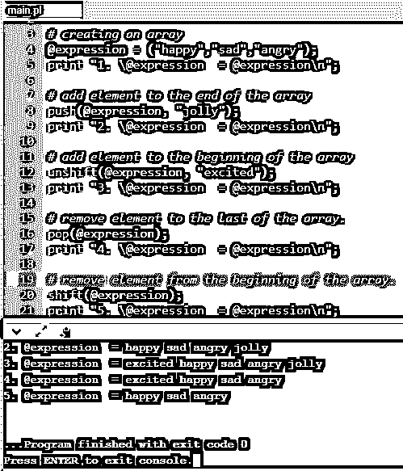

#### 4.Perl 中的散列

哈希是键值对的概念。下面是一个创建散列的例子。

`#!/usr/bin/perl
%data = ('Mohan Singh' => 55, 'Ram Gupta' => 25, 'Bhuvan Kumar' => 31);
@age = values %data;
print "$age[0]\n";
print "$age[1]\n";
print "$age[2]\n";`

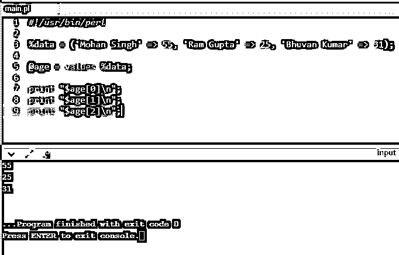

#### 5.哈希元素的添加和移除

`#!/usr/bin/perl
%data = ('Mohan Singh' => 55, 'Ram Gupta' => 25, 'Bhuvan Kumar' => 31);
@keys = keys %data;
$size = @keys;
print "a - Hash size: $size\n";
# add an element to the hash;
$data{'Imran Khan'} = 44;
@keys = keys %data;
$size = @keys;
print "b - Hash size: $size\n";
# delete an element from the hash;
delete $data{'Imran Khan'};
@keys = keys %data;
$size = @keys;
print "c - Hash size: $size\n";`

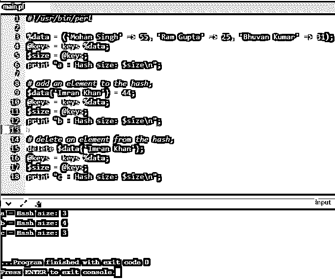

#### 6.Perl 中的条件语句:if…elsif…else

`#!/usr/local/bin/perl
$num = 50;
# check condition using if statement
if( $num == 40 ) {
# print the following if true
printf "num has a value which is 20\n";
} elsif( $num == 60 ) {
# else print if the next condition is true
printf "num has a value which is 30\n";
} else {
# if none is true print following
printf "num has a value which is $num\n";
}`

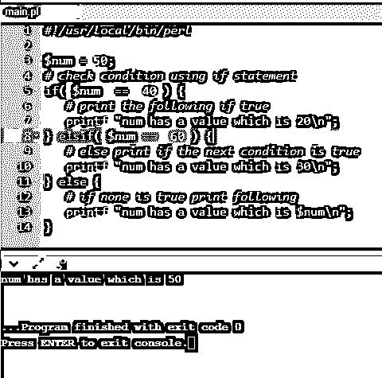

#### 7.Perl 中的条件语句:除非…elsif…else 语句

`#!/usr/local/bin/perl,
$num = 50;
# check condition using unless statement
unless( $num == 25) {
# if condition is false then print the following
printf "num has a value which is not 25\n";
} elsif( $num == 55) {
# if condition is true then print the following
printf "num has a value which is 55";
} else {
# if both the condition is dissatisfied, print the
original value
printf "num has a value which is $num\n";
}`

#### 8.Perl 中的循环:While 循环

`#!/usr/local/bin/perl
$i = 1;
# while loop
while( $i < 5 ) {
printf "Value of i: $i\n";
$i = $i + 1;
}`

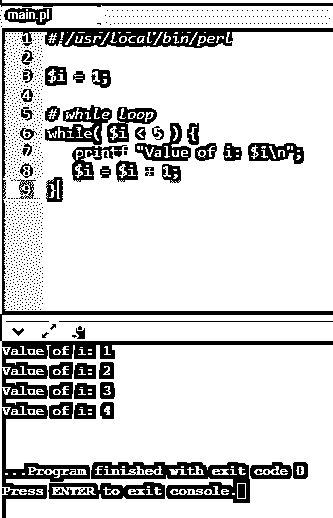

#### 9.Perl 中的循环:Until 循环和 For 循环

`#!/usr/local/bin/perl
$i = 1;
# until loop
until( $i > 5 ) {
printf "Value of i: $i\n";
$i = $i + 1;
}
# for loop
for ($j = 0; $j < 3; $j++) {
printf "Value of j: $j\n";
}`

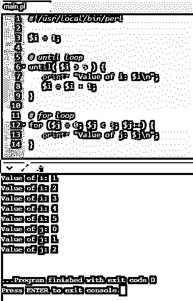

#### 10.Perl 中的循环:do…while 循环

`#!/usr/local/bin/perl
$i = 10;
# do...while loop
do{
printf "Value of i: $i\n";
$i = $i + 1;
}
while( $i < 20 );`

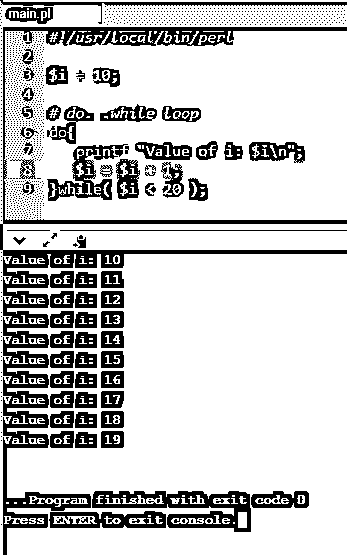

### 高级 Perl 命令

高级命令如下所述。

#### 1.Perl: Server 中的套接字编程

`#!/usr/bin/perl -w
# Filename : server.pl
use strict;
use Socket;
# use port 8081 as default
my $port = shift || 8081;
my $protocol = getprotobyname('tcp');
my $server = "localhost"; # Host IP running the
server
# create a socket, make it reusable
socket(SOCKET, PF_INET, SOCK_STREAM,
$protocol)
or die "Can't open socket $!\n";
setsockopt(SOCKET, SOL_SOCKET,
SO_REUSEADDR, 1)
or die "Can't set socket option to SO_REUSEADDR
$!\n";
# bind to a port, then listen
bind( SOCKET, pack_sockaddr_in($port,
inet_aton($server)))
or die "Can't bind to port $port! \n";
listen(SOCKET, 5) or die "listen: $!";
print "SERVER started on port $port\n";
# accepting a connection
my $client_addr;
while ($client_addr = accept(NEW_SOCKET,
SOCKET)) {
# send them a message, close connection
my $name = gethostbyaddr($client_addr,
AF_INET );
print NEW_SOCKET "Smile from the server";
print "Connection recieved from $name\n";
close NEW_SOCKET;
}`

#### 2.Perl 中的套接字编程:客户端

`!/usr/bin/perl -w
# Filename : client.pl
use strict;
use Socket;
# initialize host and port
my $host = shift || 'localhost';
my $port = shift || 8081;
my $server = "localhost"; # Host IP running the
server
# create the socket, connect to the port
socket(SOCKET,PF_INET,SOCK_STREAM,(getproto
byname('tcp'))[2])
or die "Can't create a socket $!\n";
connect( SOCKET, pack_sockaddr_in($port,
inet_aton($server)))
or die "Can't connect to port $port! \n";
my $line;
while ($line = <SOCKET>) {
print "$line\n";
}close SOCKET or die "close: $!";`

#### 3.使用 Perl 的数据库连接

`#!/usr/bin/per
use DBI
use strict;
my $driver = "mysql";
my $database = "DBTEST";
my $dsn = "DBI:$driver:database=$database";
my $userid = "user123";
my $password = "pass123";
my $dbh = DBI->connect($dsn, $userid, $password
) or die $DBI::errstr;`

#### 4.使用 Perl 进行 CGI 编程

`#!/usr/bin/perl
print "Content-type:text/html\r\n\r\n";
print '<html>';
print '<head>';
print '<title>Hello Perl - CGI Example</title>';
print '</head>';
print '<body>';
print '<h2>Hello Perl! This is a CGI program example</h2>';
print '</body>';
print '</html>';
1;`

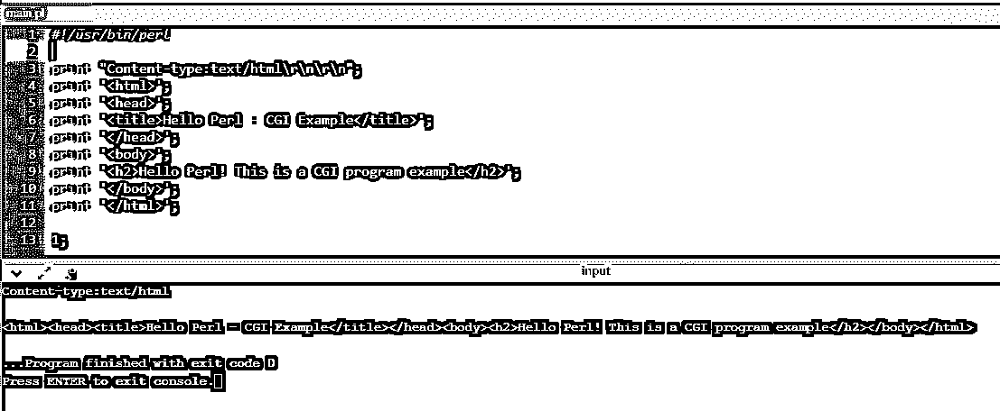

### 提示和技巧

据说 Perl 是所有语言的混合体，也就是说，它具备了主流编程语言的最佳特性。最重要的方面是掌握基础知识，并继续练习这门语言。升级和[自我提升是成功的关键](https://www.educba.com/self-improvement-tips/)。

### 结论

上述程序是样本，将有助于一个实体了解基本知识，并继续自我增强。这被认为是一种丑陋的编程语言，但实际上，它展示了各种各样的特性。建议按照这个文档来编译代码，了解程序本身发生了什么。

### 推荐文章

这是 Perl 命令的指南。在这里，我们讨论了基本、中级和高级 Perl 命令以及使用的技巧和诀窍。你也可以看看下面的文章来了解更多-

1.  [MongoDB 命令](https://www.educba.com/mongodb-commands/)
2.  [猪命令](https://www.educba.com/pig-commands/)
3.  [Perl 版本](https://www.educba.com/perl-versions/)
4.  [Perl 变量](https://www.educba.com/perl-variables/)

**