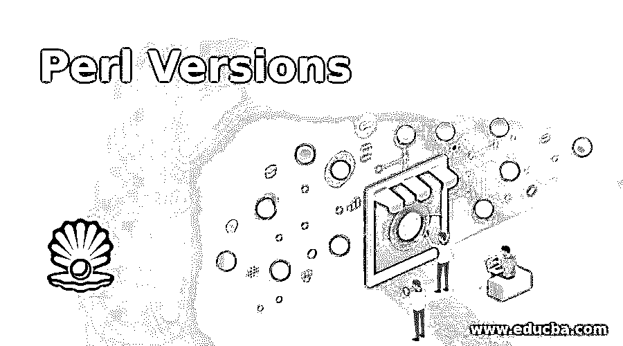

# Perl 版本

> 原文：<https://www.educba.com/perl-versions/>

## Perl 版本介绍

一种可以跨不同平台使用的稳定的编程语言称为 Perl，也称为实用提取和报告语言，它是一种受 Artistic License 提供的许可证保护的开源软件，到目前为止，Perl 从 1987 年的 Perl 1.0 开始，已经发展了不同的版本，Perl 的不同版本有 Perl 5.000、Perl 5.001、Perl 5.002、Perl 5.002_1、Perl 5.003、Perl 5.003_1、Perl 5.000

### 不同版本的 Perl

Perl 的不同版本是:

<small>网页开发、编程语言、软件测试&其他</small>

#### 1.Perl 5.000

*   它于 1994 年 10 月 17 日推出。
*   这个版本的解释器具有完全重写的特性。
*   这个版本表示反对。
*   此版本引用。
*   这个版本支持词法变量。
*   这个版本有一些模块，使用这些模块可以在不修改解释器的情况下扩展语言。

#### 2.Perl 5.001

*   它于 1995 年 3 月 13 日被引进。
*   它引入了两个新的钩子，叫做$SIG{_WARN_}和$SIG{_DIE_}
*   这个版本有闭包。
*   该版本有按照 redef 警告计数定义导入的例程。
*   这个版本已经修复了错误。

#### 3.Perl 5.002

*   它于 1996 年 2 月 29 日推出。
*   这个版本引入了一个叫做原型的新特性。
*   这个版本在很大程度上升级了 Perl 的所有模块。
*   这个版本在配置和构建系统方面都有很大的变化。
*   这个版本修复了一些错误。

#### 4.Perl 5.002_1

*   它是 1996 年 3 月 25 日日引进的。
*   它在嵌入的名称空间中引入了变化。
*   这个版本引入了两个新的变量，称为魔术变量，$^E 和$^O.
*   这个版本引入了一种机制，在 Perl -v 的输出中有应用的补丁列表。
*   这个版本修复了几个错误，并有几个杂项变化。
*   此版本引入了对文档的次要和杂项更新和更正。
*   该版本对 OS/2 和 VMS 的端口进行了更大程度的更新。

#### 5.Perl 5.003

*   它于 1996 年 6 月 25 日被引进。
*   这个版本有安全补丁。
*   这个版本修复了一些错误。

#### 6.Perl 5.005

*   它于 1998 年 7 月 22 日推出。
*   它与以前发布的其他 Perl 版本不兼容。
*   这个版本有 ANSI C 语言的源代码。
*   这个版本支持 MPE/ix、DOS、BeOS 等新平台。
*   这个版本支持 EXPR foreach EXPR 语法和许多实验功能。
*   这个版本支持在 windows 32 位操作系统上对 Perl C++对象的抽象。
*   这个版本[支持预编译的正则表达式](https://www.educba.com/regular-expression-in-ruby/)。
*   该版本支持 64 位 windows 操作系统。
*   该版本提供了在启用线程选项时可以依赖的信号。
*   这个版本支持异常处理。
*   这个版本支持 GCC/EGCS 编译器在 32 位 Windows 操作系统上运行。

#### 7.Perl 5.6.0

*   它于 2000 年 3 月 22 日推出。
*   此版本将版本号更改为“revision.version.subversion”格式。
*   它停止了对 EBCDIC 的支持。
*   它在内部将字符串表示更改为 UTF-8。
*   它支持解释器的并发性。
*   这个版本有字符序数来写字符串文字。
*   这个版本拥有使用新语法编写的子程序的属性。
*   这个版本支持大文件。
*   它支持二进制数。
*   这个版本有一个与 Perl 合并的 Java Perl Lingo (JPL)发行版。
*   这个版本有新的文档作为参考和教程。
*   这个版本有几个实验性的特点。
*   它支持 Unicode。
*   它支持 windows 上的线程和 fork()模拟。
*   它支持 64 位 Windows 操作系统。
*   它支持 L 值子程序。
*   它支持弱引用。
*   它支持伪散列数据类型。

#### 8.Perl 5.8.0

*   2002 年 7 月 18 日推出。
*   它支持 Unicode 3.2.0。
*   这个版本的正则表达式支持 Unicode。
*   这个版本通过 encode 模块支持非拉丁语编码。
*   它在解释器中引入了线程。
*   这个版本有 PerlIO 的新实现。
*   这个版本通过内置例程提高了字符串到数字转换的准确性。
*   该版本支持 64 位 windows 操作系统。
*   这个版本引入了新的模块，如 File::Temp、Filter::Simple 等。

#### 9.Perl 5.10

*   于 2007 年 12 月 18 日推出。
*   它支持 Unicode 5.0。
*   它引入了一个叫做 pragma 的新特性。
*   它引入了一个名为 or (//)的新运算符。
*   这个版本引入了一个新特性，叫做切换和智能匹配操作符(~~)。
*   这个版本引入了正则表达式的几个特性。
*   这个版本引入了一个新的内置功能，称为 say。

#### 10.Perl 5.14

*   2011 年 5 月 14 日推出。
*   它支持 Unicode 6.0。
*   这个版本具有适用于所有字符串的 Unicode 语义。
*   这个版本引入了非破坏性替换(s///r)。
*   这个版本的 Perl 引入了可重入的正则表达式。
*   这个版本的 Perl 有自动解引用提供的内置功能。

#### 11.Perl 5.16

*   2012 年 5 月 20 日推出。
*   这个版本引入了 SUB，它表示当前正在执行的子程序。
*   它引入了编码消除歧义的 eval。

#### 12.Perl 5.18

*   2013 年 5 月 18 日推出。
*   这个版本引入了正则表达式的字符集操作。
*   这个版本的 Perl 引入了词法子例程。

#### 13.Perl 5.20

*   2014 年 5 月 27 日推出。
*   这个版本引入了子程序的签名。
*   这个版本引入了后缀的解引用。
*   这个版本的 Perl 为键值引入了切片语法。

#### 14.Perl 5.22

*   2015 年 6 月 1 日出台。
*   这个版本支持 Unicode 7.0。
*   它删除了 CGI.pm、Module::Build 等历史模块。从核心分布来看。
*   它引入了一种叫做双菱形算子的算子。
*   它引入了消除歧义的按位运算符。
*   这个版本引入了变量别名。

#### 15.Perl 5.24

*   2016 年 5 月 8 日推出。
*   这个版本的 Perl 支持 Unicode 8.0。
*   这个版本的 Perl 在正则表达式中引入了新的换行符边界。
*   这个版本的 Perl 引入了带有扩展括号的字符类，可以在 UTF 8 语言环境中工作。
*   这个版本的 Perl 对 printf 和 sprintf 的参数进行了重新排序。
*   这个版本的 Perl 有 sigaction 回调，包含更多的字段。

#### 16.Perl 5.26

*   2017 年 5 月 30 日出台。
*   它从模块搜索路径的末尾移除了当前目录。
*   这个版本的 Perl 有词法子程序，但它们不是实验性的。
*   这个版本的 Perl 有缩进的文档。
*   这个版本的 Perl 有正则表达式的捕获组和修饰符。
*   它支持 Unicode 9.0。
*   这个版本的 Perl 启用了 UTF 8 语言环境中的排序规则。

#### 17.Perl 5.28

*   2018 年 6 月 22 日推出。
*   这个版本的 Perl 支持 Unicode 10.0。
*   这个版本的 Perl 有带删除功能的键值散列片。
*   这个版本的 Perl 有按字母顺序排列的正则表达式同义词。
*   这个版本的 Perl 可以检测混合的 Unicode 脚本。
*   这个版本的 Perl 使用 Perl -i 进行了安全的就地编辑。
*   这个版本的 Perl 已经初始化了集合变量。
*   这个版本有完整大小的索引节点号。
*   这个版本有 sprintf %j 格式大小修饰符。
*   该版本自动设置了执行时关闭标志。
*   这个版本在安全方面有一些修正。

### 推荐文章

这是一个 Perl 版本指南。在这里，我们还将讨论 Perl 的简介和前 17 个版本及其特性。您也可以看看以下文章，了解更多信息–

1.  [Perl 变量](https://www.educba.com/perl-variables/)
2.  [Perl 数组](https://www.educba.com/perl-array/)
3.  [Perl last](https://www.educba.com/perl-last/)
4.  [Perl 注释](https://www.educba.com/perl-comments/)

