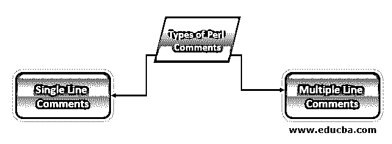
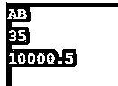

# Perl 注释

> 原文：<https://www.educba.com/perl-comments/>

## Perl 注释简介

Perl 注释用于使我们的程序对用户友好。perl 语言中的解释器跳过注释部分，而不在注释中的其他部分将被执行。有两种类型的注释可用，如单行注释和多行注释。单行注释用在我们必须在单行中给出注释的时候，多行注释用在我们必须一次给出多行注释的时候。评论在语言中是非常有用和重要的。

### Perl 注释的类型

下面给出了两种类型的注释和示例:

<small>网页开发、编程语言、软件测试&其他</small>

*   单行注释
*   多行注释

在 perl 语言中，编写任何代码时，注释都是必要且有用的。如果我们没有在代码中编写任何注释，那么新用户很难理解代码。注释是非常有用和重要。注释提供了代码或程序的基本解释。在程序中添加注释后，我们可以在很长时间后很容易地理解程序，也适合新用户理解程序或代码。我们可以用#号注释单行注释。散列符号用于注释单行。我们可以使用“= begin”和“= cut”关键字注释多行。它用于使我们的程序对用户友好，注释部分被解释器跳过，其他不在注释中的部分将被执行。

#### 1.单行注释

*   在 perl 语言中，当我们只能在一行中给出注释时，就使用单行注释。
*   单行注释以井号(#)开始。单行注释以同一行开始和结束。如果我们的语句没有在第一行结束，那么我们必须再次提到第二行的散列符号。
*   单行注释非常有用和重要。

**举例:**

**代码:**

`my $emp_fname = 'AB';         # Declaration of string scalar data type
my $emp_age = 35;                # Declaration of integer scalar data type
my $emp_salary = 10000.50;   # Declaration of floating point number scalar data type
use warnings;                         # Show warning of code
if (0<1)                                     # Execute inside section when condition is true
{
print "$emp_fname\n";         # Initialization of emp_fname variable.
print "$emp_age\n";              # Initialization of emp_age variable.
print "$emp_salary\n";          # Initialization of emp_salary variable.
}                                                            # End of code`

**输出:**

*   在上面的代码中，我们对每一行都使用了单行注释。我们已经观察到注释行代码没有被解释器执行。它只执行非注释行代码并显示输出。
*   单行注释是在我们给单行注释时使用的。

#### 2.多行注释

*   在 Perl 语言中，我们可以使用“= begin”和“= cut”关键字来注释多行。
*   多行注释非常有用和重要。
*   在 perl 语言中，当我们在使用多行注释的同时必须在多行中给出注释时，就会使用多行注释。
*   Perl 解释器无法执行多行注释下的部分。它会找到“=begin”关键字，找到后会跳过执行，直到“= cut”关键字没有得到。
*   多行注释比单行注释更重要。使用多行注释时，不需要在每行定义“= begin”和“= cut”关键字。我们只需要在注释开始和结束的时候定义它。

**举例:**

**代码:**

`my $emp_fname = 'ABC';
my $emp_age = 40;
my $emp_salary = 20000.50;
=begin
Let's declare the emp_fname as string scalar data type,
emp_age as integer scalar data type,
emp_salary as floating point number scalar data type.
=cut
use warnings;
=begin
Show warning
Which was occurred in code
=cut
if (0<1)
{
print "$emp_fname\n";
print "$emp_age\n";
print "$emp_salary\n";
}
=begin
Initialization of emp_fname variable.
Initialization of emp_age variable.# End of code
Initialization of emp_salary variable.
=cut`

**输出:**

*   在上面的代码中，我们对多行使用了多行注释。我们已经观察到注释行代码没有被解释器执行。它只执行非注释行代码并显示输出。
*   当我们给多行注释时，就使用多行注释。多行注释比单行注释更有用。

### Perl 注释的优点

以下是优点:

*   使用注释是 perl，我们解释在程序或代码中使用了哪些内容。
*   代码描述很容易使用注释。
*   当我们使用注释时，代码或程序的调试很容易。
*   在 perl 程序中使用注释时，我们增加了代码的可读性。
*   当在程序中使用注释时，我们将使它对用户友好。任何人都可以理解并为之努力。
*   使用注释，我们可以很容易地找到实现的代码逻辑。
*   在 perl 中使用 comment 时，我们可以很容易地识别问题并在短时间内解决它。
*   这是有用的，它将增加代码的可读性。
*   它用于增加几天前已经实现的代码的可重用性。
*   perl 中的注释有助于提高程序的可理解性。
*   在 perl 中，注释对于描述代码内容非常有用和重要。

### 结论

基本上，perl 中有两种类型的注释，比如单行注释和多行注释。单行注释用在我们只能给单行注释的时候，多行注释用在我们必须一次给多行注释的时候。

### 推荐文章

这是一个 Perl 注释指南。这里我们讨论 perl 注释的介绍，并给出例子和优点。您也可以看看以下文章，了解更多信息–

1.  [Perl 命令](https://www.educba.com/perl-commands/)
2.  [Perl 运算符](https://www.educba.com/perl-operators/)
3.  [Perl 类](https://www.educba.com/perl-class/)
4.  [Perl 下一步](https://www.educba.com/perl-next/)

