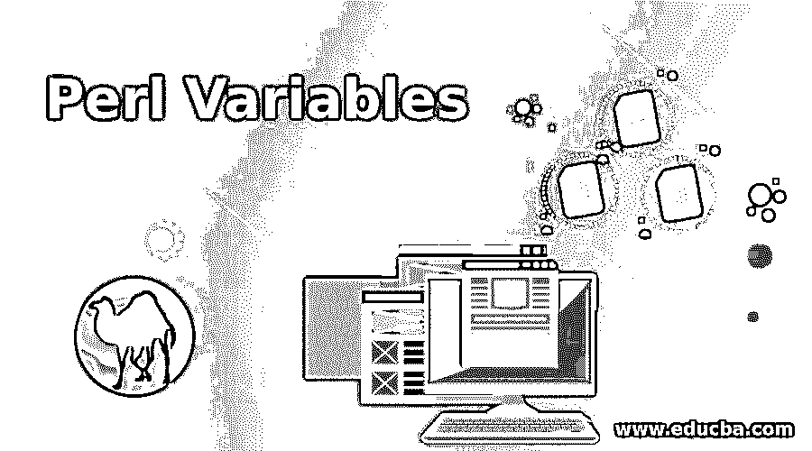
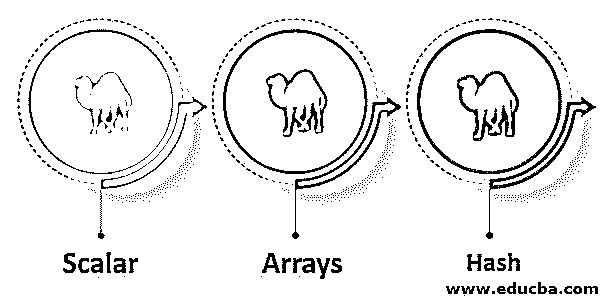
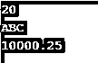
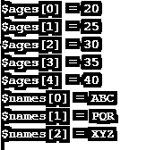
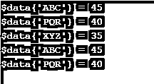

# Perl 变量

> 原文：<https://www.educba.com/perl-variables/>

## Perl 变量的定义

Perl 变量是用来保留内存来存储已声明变量的值的变量，这意味着在 Perl 中创建或声明变量时，我们会为该变量保留一些内存空间。内存分配基于我们在创建新变量时使用的数据类型。在 Perl 中将内存分配给变量的基础上，我们可以将字符串、整数和十进制数据类型分配给变量。变量是 Perl 中最重要和最有用的。

### 如何声明 Perl 变量？

这些例子如下:

<small>网页开发、编程语言、软件测试&其他</small>

*   perl 中有三种基本的数据类型。使用这种类型，我们必须按照我们的要求声明变量。
*   如果我们想声明一个变量，我们需要在声明变量之前使用我的包名。
*   有三种类型的变量可用，每种类型的声明因变量而异。
*   我们可以声明一个整型变量如下。下面是声明整型变量的例子如下。整数属于标量类型。
    *   我的$年龄= 20；#这是整型变量声明。
*   如果我们想要声明一个字符串或字符，那么我们在 perl 中使用标量变量作为字符串类型。
    *   My $ name = " ABC#这是字符串类型变量声明。
*   如果我们想声明一个浮点数，那么我们已经在 perl 中将标量变量用作浮点数。
    *   我的$工资= 10000.25；#这是浮点类型变量声明。
*   如果我们想声明一个数组并给数组的单个变量赋值，那么我们已经在 perl 中使用了一个数组变量。下面是数组变量声明的示例:
    *   @ages = (20，25，30，45，40)；#整数类型变量数组声明。
    *   @names = ('ABC '，' PQR '，' XYZ ')；#字符串类型变量数组声明。
    *   @salary = (10.1，10.2，10.3，10.4，10.5)；#浮点型变量数组声明。

下面是声明哈希变量的示例:

*   哈希变量声明以%符号开始。%data = ('AB '，25，' PQ '，30，' XY '，35，' AB '，45，' PQ '，40)；

### 如何初始化？

下面是初始化的例子。

*   我们可以根据我们使用的变量类型来初始化变量。下面是初始化标量类型变量的例子如下。
*   我们可以在单行和多行中初始化变量。我们以下面的变量声明为例。

`my $age = 25;
my $name = AB;                  # Declaration
my $salary = 1000.25;`

*   多行变量初始化–

`{
print "$age\n";
print "$name\n";
print "$salary\n";
}`

*   单行变量初始化–

`print "\n $age, $name\n, $salary\n";`

*   在上面的例子中，我们已经在一行和多行中初始化了变量。在 Perl 中使用单行和多行初始化时，变量初始化的输出是相同的。

### Perl 变量的类型及示例

变量基本上有三种类型。

*   数量
*   数组
*   混杂

perl 中有不同类型的符号用于声明和初始化变量。标量用于声明整数或字符串，在 Perl 中它以美元($)符号开始或开头。我们已经根据我们在程序中使用的数据类型记录定义了变量的类型。

#### 1.数量

*   以下示例显示了 perl 中的标量类型变量。在下面的示例中，我们将三个变量 age 声明为整数类型，name 声明为字符串类型，salary 声明为浮点类型。
*   标量类型变量以我的包名开始，前面有一个美元($)符号。
*   标量变量表示单个单元数据。

##### 例子

`my $age = 20;                      # this is integer type variable declaration.
my $name = ABC;                 # this is the string type variable declaration.
my $salary = 10000.25;       # this is the floating point type variable declaration.
use warnings;
if (1<2)
{
print "$age\n";
print "$name\n";
print "$salary\n";
}`

**输出:**

#### 2.数组

*   perl 中的数组变量只不过是标量变量的有序列表。perl 中的数组变量以@符号开始。
*   在下面的例子中，我们将一个变量声明为五个年龄值，将一个变量声明为三个姓名值。
*   数组变量的初始化我们需要用一个$符号来显示数组变量的单个元素。
*   下面是 perl 中数组变量的例子如下。

##### 例子

`@ages = (20, 25, 30, 35, 40);       # integer type variable array declaration.
@names = ('ABC', 'PQR', 'XYZ');   # String type variable array declaration.
use warnings;
if (1<2)
{
print "\$ages[0] = $ages[0]\n";
print "\$ages[1] = $ages[1]\n";
print "\$ages[2] = $ages[2]\n";
print "\$ages[3] = $ages[3]\n";
print "\$ages[4] = $ages[4]\n";
print "\$names[0] = $names[0]\n";
print "\$names[1] = $names[1]\n";
print "\$names[2] = $names[2]\n";
}`

**输出:**

#### 3.混杂

*   Perl 中的散列变量只是一组键或值对。Perl 中的散列变量以%符号开始。
*   在下面的例子中，我们在数据变量中声明了姓名和年龄的密钥对。
*   哈希变量的初始化我们需要使用$符号来显示哈希变量的单个元素。

下面是哈希变量的示例:

##### 例子

`%data = ('ABC', 25, 'PQR', 30, 'XYZ', 35, 'ABC', 45, 'PQR', 40);
use warnings;
if (1<2)
{
print "\$data{'ABC'} = $data{'ABC'}\n";
print "\$data{'PQR'} = $data{'PQR'}\n";
print "\$data{'XYZ'} = $data{'XYZ'}\n";
print "\$data{'ABC'} = $data{'ABC'}\n";
print "\$data{'PQR'} = $data{'PQR'}\n";
}`

**输出:**

### 推荐文章

这是一个 Perl 变量的指南。这里我们也讨论一下 perl 变量的介绍和如何声明？以及不同的示例及其代码实现。您也可以看看以下文章，了解更多信息–

1.  [Perl last](https://www.educba.com/perl-last/)
2.  [Perl 类](https://www.educba.com/perl-class/)
3.  [Perl 注释](https://www.educba.com/perl-comments/)
4.  [Perl 中的文件处理](https://www.educba.com/file-handling-in-perl/)

