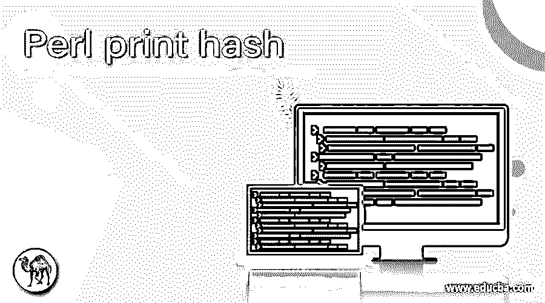
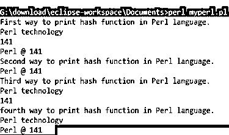
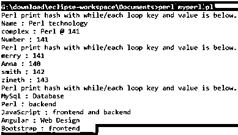

# Perl 打印散列

> 原文：<https://www.educba.com/perl-print-hash/>

## Perl 打印散列的定义

*   Perl 打印散列是在 Perl 技术中使用方法和条件打印散列类型的数据。
*   Perl 打印散列对于显示 Perl 语言中数据的键和值集很有用。
*   Perl 打印散列显示为 Perl 散列函数中任意大小或固定大小的数据。
*   Perl print hash 使用键和值帮助设置 Perl hash 中的用户数据，并将其显示在输出屏幕上。
*   这对于使用 Perl 循环和条件语句打印 Perl 散列函数元素是必要的。

**语法:**

基本的 Perl 打印散列语法如下。

<small>网页开发、编程语言、软件测试&其他</small>

*   用 Perl 语言打印散列函数的第一种方法。

`$ perl_print_hash_variable{'hash_key1'} = 'hash value in string format';
$ perl_print_hash_variable{'hash_key2'} = 141;
print "$ perl_print_hash_variable{'hash_key1'} \n";
print "$ perl_print_hash_variable{'hash_key2'} \n";`

*   用 Perl 语言打印散列函数的第二种方法。

`% perl_print_hash_variable = ('hash_key1', 'hash value in string format', 'hash_key2', 141,);
print "$ perl_print_hash_variable{'hash_key1'} \n";
print "$ perl_print_hash_variable{'hash_key2'} \n";`

*   用 Perl 语言打印散列函数的第三种方法。

`% perl_print_hash_variable = ('hash_key1' => 'hash value in string format', 'hash_key2' => 141,);
print "$ perl_print_hash_variable{'hash_key1'} \n";`

*   用 Perl 语言打印散列函数的第四种方法。

`% perl_print_hash_variable = (-hash_key1 => 'hash value in string format', -hash_key2 => 141);
print "$ perl_print_hash_variable{'-hash_key1'} \n";
print "$ perl_print_hash_variable{'-hash_key2'} \n";`

**描述:**

Perl print hash 可以使用$符号来表示单个 hash 键及其值。Perl 打印散列可以对多个散列键及其值使用%符号。

下面是带有“foreach”循环语法的 Perl 打印散列。

`% perl_print_hash_variable = ('hash_key1' => 'hash value in string format', 'hash_key2' => 141);
foreach $key (keys %perl_print_hash_variable)
{
print "$key : $perl_print_hash_variable{$key} \n";
}`

**描述:**

foreach 循环用来打印多个 Perl 散列元素。用户可以应用 print 关键字一次，并显示所有散列键和值。foreach 循环打印无序散列键和值。

*   下面是带有“while/each”循环语法的 Perl 打印散列。

`% perl_print_hash_variable = ('hash_key1' => 'hash value in string format', 'hash_key2' => 141);
while (($key, $value) = each (%perl_print_hash_variable))
{
print "$key : $perl_print_hash_variable{$key} \n";
}`

**描述:**

while/each 循环用于打印多个 Perl 散列元素。用户可以应用 print 关键字一次，并显示所有散列键和值。while/each 循环打印有序散列键和值。

### 如何在 Perl 中打印 hash？

*   下载 Perl 软件并将其安装在设备的操作系统中。

[https://www.Perl.org](https://www.perl.org/)/或[http://strawberryPerl.com/](https://strawberryperl.com/)都普遍使用 Perl 软件网站。

*   在设备中创建一个扩展名为 Perl 的文件，并将该文件保存在命令行路径中。

示例:`helloo.pl or first pearl.pl`

*   创建 Perl 散列变量并用 Perl 键和值进行初始化。

`% perl_print_hash_variable = ('hash_key1' => 'hash value in string format', 'hash_key2' => 141);`

*   Perl print hash 语法用于显示 Perl hash 单个元素。

`print "$ perl_print_hash_variable{'hash_key1'} \n;`

*   Perl print hash 语法用于显示 Perl hash 的多个键和值。

`foreach $key (keys %perl_print_hash_variable)
{
print "$key : $perl_print_hash_variable{$key} \n";
}`

*   下面是结合 Perl 打印散列的工作步骤。

`% perl_print_hash_variable = ('Perl' =>'backend', 'Bootstrap' =>'frontend', 'JavaScript' => 'frontend and backend ', 'MySql' =>'Database', 'Angular' =>'Web Design');
foreach $key (keys %perl_print_hash_variable)
{
print "$key : $perl_print_hash_variable{$key} \n";
}`

### 例子

基本的 Perl 打印散列示例和输出。

#### 示例#1

基本的 Perl 打印散列示例和输出。

`$ perl_print_hash_variable{'Name'} = 'Perl technology';
$ perl_print_hash_variable{'Number'} = 141;
$ perl_print_hash_variable{'complex'} = 'Perl @ 141';
print "First way to print hash function in Perl language. \n";
print "$ perl_print_hash_variable{'Name'} \n";
print "$ perl_print_hash_variable{'Number'} \n";
print "$ perl_print_hash_variable{'complex'} \n";
% perl_print_hash_variable1 = ('Name', 'Perl technology', 'Number', 141, 'complex','Perl @ 141');
print "Second way to print hash function in Perl language. \n";
print "$ perl_print_hash_variable{'complex'} \n";
% perl_print_hash_variable2 = ('Name' => 'Perl technology', 'Number' => 141, 'complex' => 'Perl @ 141');
print "Third way to print hash function in Perl language. \n";
print "$ perl_print_hash_variable2{'Name'} \n";
print "$ perl_print_hash_variable2{'Number'} \n";
% perl_print_hash_variable3 = (-Name => 'Perl technology', -Number => 141, -complex => 'Perl @ 141');
print "fourth way to print hash function in Perl language. \n";
print "$ perl_print_hash_variable3{'-Name'} \n";
print "$ perl_print_hash_variable3{'-complex'} \n";`

#### 实施例 2

带有 foreach 循环的 Perl 打印散列示例和输出。

`$ perl_print_hash_variable{'Name'} = 'Perl technology';
$ perl_print_hash_variable{'Number'} = 141;
$ perl_print_hash_variable{'complex'} = 'Perl @ 141';
print "Perl print hash with foreach loop key and value is below. \n";
foreach $key (keys %perl_print_hash_variable)
{
print "$key : $perl_print_hash_variable{$key} \n";
}
% perl_print_hash_variable2 = ('Anna' => 140, 'merry' => 141, 'smith' => 142, 'zineth' => 143);
print "Perl print hash with foreach loop key and value is below. \n";
foreach $key (keys %perl_print_hash_variable2)
{
print "$key : $perl_print_hash_variable2{$key} \n";
}
% perl_print_hash_variable3 = ('Perl' =>'backend', 'Bootstrap' =>'frontend', 'JavaScript' =>'frontend and backend ', 'MySql' =>'Database', 'Angular' =>'Web Design');
print "Perl print hash with foreach loop key and value is below. \n";
foreach $key (keys %perl_print_hash_variable3)
{
print "$key : $perl_print_hash_variable3{$key} \n";
}`

#### 实施例 3

带有 while/each 循环示例和输出的 Perl 打印散列。

`$ perl_print_hash_variable{'Name'} = 'Perl technology';
$ perl_print_hash_variable{'Number'} = 141;
$ perl_print_hash_variable{'complex'} = 'Perl @ 141';
print "Perl print hash with while/each loop key and value is below. \n";
while (($key, $value) = each (%perl_print_hash_variable))
{
print "$key : $perl_print_hash_variable{$key} \n";
}
% perl_print_hash_variable2 = ('Anna' => 140, 'merry' => 141, 'smith' => 142, 'zineth' => 143);
print "Perl print hash with while/each loop key and value is below. \n";
while (($key, $value) = each (%perl_print_hash_variable2))
{
print "$key : $perl_print_hash_variable2{$key} \n";
}
% perl_print_hash_variable3 = ('Perl' =>'backend', 'Bootstrap' =>'frontend', 'JavaScript' =>'frontend and backend ', 'MySql' =>'Database', 'Angular' =>'Web Design');
print "Perl print hash with while/each loop key and value is below. \n";
while (($key, $value) = each (%perl_print_hash_variable3))
{
print "$key : $perl_print_hash_variable3{$key} \n";
}`

### 结论

*   它用于根据需要显示多个键及其值。
*   它按照用户的选择排序和无序的散列键和值。
*   它是 Perl 技术中排序的、易于使用的、用户友好的函数。

### 推荐文章

这是一个 Perl 打印散列的指南。这里我们讨论定义，如何在 Perl 中打印 hash，以及代码实现的例子。您也可以浏览我们推荐的其他文章，了解更多信息——

1.  [Perl 卸载](https://www.educba.com/perl-unshift/)
2.  [Perl 解包](https://www.educba.com/perl-unpack/)
3.  [珠光打开](https://www.educba.com/perl-open/)
4.  [Perl 祝福](https://www.educba.com/perl-bless/)

