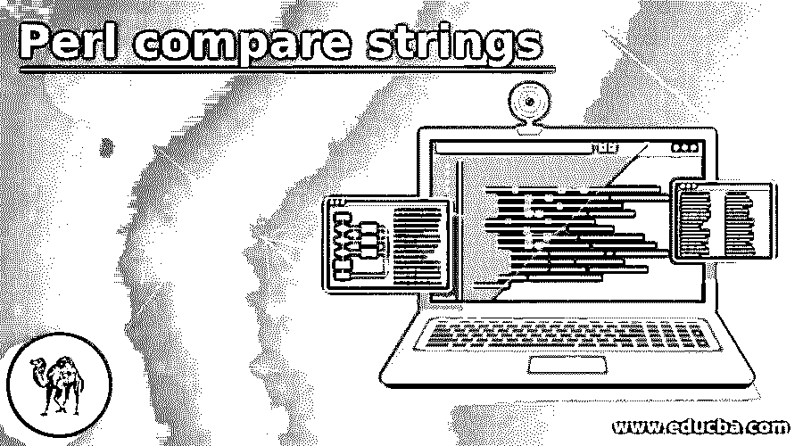
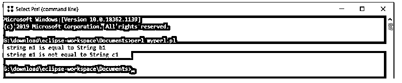
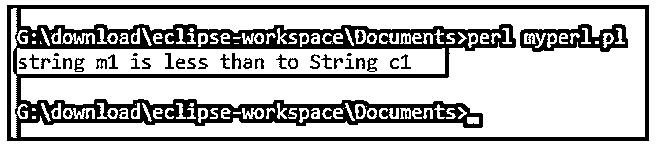
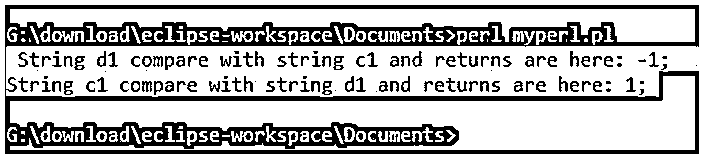
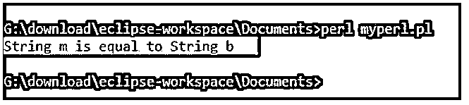
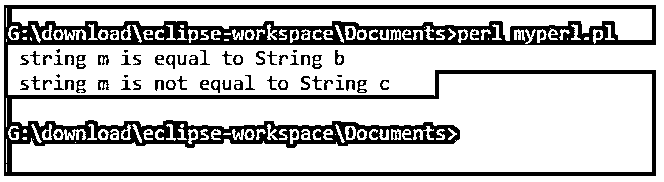

# Perl 比较字符串

> 原文：<https://www.educba.com/perl-compare-strings/>

## Perl 比较字符串简介

Perl 比较字符串是比较两个字符串变量及其值的基本操作。在 Perl 技术中，确定两个字符串值相等或不同是有用的方法和操作符。它使用 Perl 语言中的“eq”或“ne”运算符检查两个字符串值是否相等。它还使用“lt，gt，ge，le”比较运算符检查一个字符串值是大于还是小于另一个字符串值。

**Perl 比较字符串的语法**

<small>网页开发、编程语言、软件测试&其他</small>

字符串必须为比较和其他操作进行初始化。初始化字符串的语法如下。

`$m1 = “welcome”;
$n1 = “Perl”`

这两个字符串的“等于”运算语法如下。

`If($m1 eq $n1){ required coding … }`

这两个字符串的“不等于”运算语法如下。

`If($m1 ne $n1){ required coding … }`

这两个字符串的“大于”运算语法如下。

`If($m1 gt $n1){ required coding … }`

这两个字符串的“小于”运算语法如下。

`If($m1 lt $n1){ required coding … }`

这两个字符串的“大于等于”运算语法如下。

`If($m1 ge $n1){ required coding … }`

这两个字符串的“小于等于”运算语法如下。

`If($m1 le $n1){ required coding … }`

字符串与数值进行比较，然后使用符号进行运算。

“等于”运算语法如下。

`If($m1 == 0){ required coding … }`

### 如何在 Perl 中比较字符串？

*   在设备的操作系统中下载并安装 Perl 最新版本。

https://www.perl.org/或 http://strawberryperl.com/大多使用 Perl IDE 网站链接。

*   用。pl 扩展名，并将文件保存在所需的命令行路径中。

**举例:**

**helloo.pl 或 firstpearl.pl**

*   创建两个字符串变量并用所需的值初始化。
*   在变量名前写美元符号以理解字符串变量。

**$m1 = "欢迎"；**

**$ B1 = " Perl "；**

*   写下下面的 Perl 比较字符串语法。
*   两个字符串相等的语法如下。

`if($m1 eq $b1)
{
print " string m1 is equal to String b1";
}
else
{
print "string m1 is not equal to String b1";
}`

*   两个字符串“不相等”,语法如下。

`if($m1 ne $b1)
{
print " string m1 is not equal to String b1";
}
else
{
print "string m1 is equal to String b1";
}`

*   所有的步骤结合起来得到 Perl 来比较字符串示例。

`File name: myperl.pl
$a1 = "String";
$b1 = "String";
$c1 = "compare";
if($a eq $b)
{
print " string a1 is equal to String b1 \n";
}
else
{
print "string a1 is not equal to String b1 \n";
}
if($a1 ne $c1)
{
print " string a1 is not equal to String c1 \n";
}
else
{
print "string a1 is equal to String c1 \n";
}`

*   美元符号($a1)用于在 Perl 文件中创建一个变量。
*   Perl 字符串值用双引号(“Perl”)符号或单引号(“Perl”)符号创建。
*   打印机利用命令行显示输出。
*   转到命令行窗口，用文件名(Perl myperl.pl)编写 Perl。
*   按下“输入按钮”,然后您可以在窗口上看到所需的输出。

### Perl 比较字符串的例子

下面提到了不同的例子:

#### 示例#1

使用相等和不相等运算符比较两个字符串的示例和输出。

**代码:**

`$m1 = "String";
$b1 = "String";
$c1 = "compare";
if($m1 eq $b1)
{
print " string m1 is equal to String b1 \n";
}
else
{
print "string m1 is not equal to String b1 \n";
}
if($m1 ne $c1)
{
print " string m1 is not equal to String c1 \n";
}
else
{
print "string m1 is equal to String c1 \n";
}`

**输出:**

**说明:**

*   eq 运算符对于 Perl 比较字符串中的“等于”运算很有用。
*   “ne”对于 Perl 比较字符串中的“不等于”操作很有用。

#### 实施例 2

使用大于和小于运算符比较两个字符串的示例和输出。

**代码:**

`$m1 = "String";
$c1 = "compare";
if($m1 eq $c1)
{
print " string m1 is equal to String c1 \n";
}
if($m1 gt $c1)
{
print " string m1 is greater than to String c1 \n";
}
if($m1 lt $c1)
{
print "string m1 is less than to String c1 \n";
}`

**输出:**

**说明:**

*   “gt”对于 Perl 比较字符串中的“大于”字符串操作很有用。
*   “lt”对于“小于”字符串操作很有用。

#### 实施例 3

用于比较两个字符串示例和输出的“cmp”运算符。

**代码:**

`$d1 = "String";
$c1 = "compare";
$m1 = $d cmp $c;
$n1 = $c cmp $d;
print " String d1 compare with string c1 and returns are here: $m1; \n";
print "String c1 compare with string d1 and returns are here: $n1; \n";`

**输出:**

**说明:**

*   当第一个字符串大于第二个字符串时，“cmp”运算符显示 1。
*   当第一个字符串小于第二个字符串时，“cmp”运算符显示-1。
*   当第一个字符串等于第二个字符串时，“cmp”运算符显示 0。

#### 实施例 4

“==”运算符用于比较两个字符串示例和输出。

**代码:**

`$m = "String";
$c = "compare";
if($m == $c)
{
print "String m is equal to String b \n";
}
else
{
print "String m is equal to String b \n";
}`

**输出:**

**说明:**

*   “==”运算符比较字符串对象和内存位置是否相同。

#### 实施例 5

区分大小写的字符串比较示例和输出。

**代码:**

`$m = "String";
$b = "String";
$c = "string";
if($m eq $b)
{
print " string m is equal to String b \n";
}
else
{
print "string m is not equal to String b \n";
}
if($m ne $c)
{
print " string m is not equal to String c \n";
}
else
{
print "string m is equal to String c \n";
}`

**输出:**

**说明:**

*   在$m，$b 变量中使用大写字母“S ”,在$c 变量中使用小写字母“S”。

### 结论

Perl 比较字符串对于验证和匹配两个字符串变量及其值非常有用。这对于排序、搜索和筛选多个字符串值非常有用。

### 推荐文章

这是一个 Perl 比较字符串的指南。这里我们讨论一下入门，如何在 Perl 中比较字符串？和示例。您也可以看看以下文章，了解更多信息——

1.  [Perl 哈希](https://www.educba.com/perl-hash/)
2.  [Perl for 循环](https://www.educba.com/perl-for-loop/)
3.  [Perl 读取文件](https://www.educba.com/perl-read-file/)
4.  [Perl 开关](https://www.educba.com/perl-switch/)

