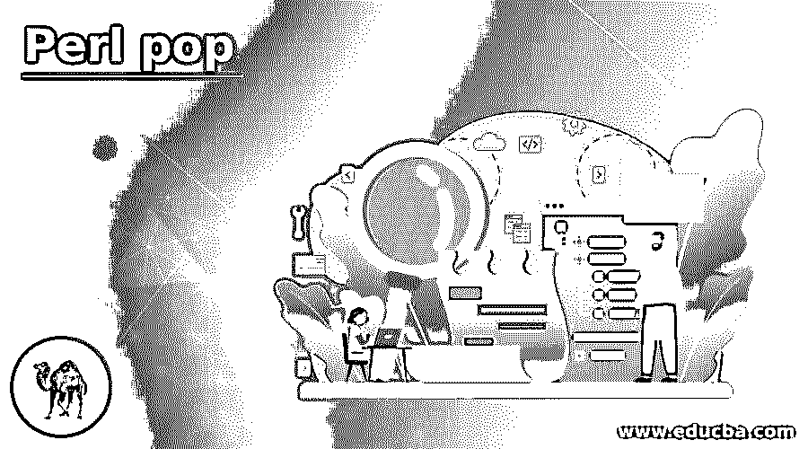
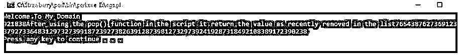
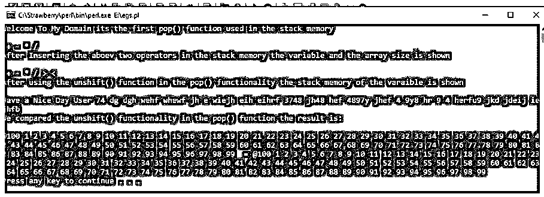
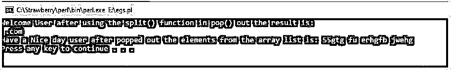

# Perl pop 乐队

> 原文：<https://www.educba.com/perl-pop/>

## Perl pop 简介

Perl pop 是一个函数，可用于弹出数据结构概念中的元素，如堆栈、列表、数组等。在 LIFO(后进先出)位置插入元素，以便弹出用户输入的值，无论这些值是最近添加的，也可以在弹出值后将其传递到参数中。在完成从数组中弹出的操作后，弹出值将显式传递到数组中。内存中的大小将自动减小。该元素的参考值也将从内存中删除。

**语法:**

<small>网页开发、编程语言、软件测试&其他</small>

Perl 脚本使用了一些数据结构概念，比如 push 和 pop。它主要用于操纵数据，并减少内存以快速执行操作。pop()函数必须从数组或内存中的任何其他数据结构中删除最后一个元素。

`@var =(‘ ‘);
print pop(@var);
----some perl script codes depends upon the user requirement the perl functions will be called and used in the file---`

以上代码是 Perl 脚本中使用的 pop()函数的基本语法；用户输入值在数据结构上弹出。

### Perl 中的 pop 函数是如何工作的？

*   Perl 脚本使用一些默认函数、关键字和变量来创建复杂的应用程序。同样，我们使用一些数据结构概念，如数组、堆栈、队列、push、pop、shift 等。，用于保护数据以及减少存储单元中的数据使用。Perl array 使用 pop()函数删除数组的最后一个元素；它还指出了数据集合中的堆栈和结构概念。它还用于从数组中移除、返回或弹出最后一个元素。
*   这意味着减少数组中元素的数量。通常，元素的最后一级或位置是在堆栈内存中自动生成的最高级别的索引。同样，pop()函数的元素是从数组列表的右边位置切掉的元素，它会在内存中自动地一个一个地减少元素的大小，并尽快返回该元素。数组元素也被认为是从上到下编号的盒子的堆栈，增加元素大小会减少，因此堆栈内存的底部会在内存中弹出。

### Perl pop 的例子

下面给出了 Perl pop 的例子:

#### 示例#1

**代码:**

`#!/usr/bin/perl -w
@var = (7654,3876,2736,91237,237,9273,36483,12973,2739,918723,9273,8263,912873,9812732,973924,192873184,9210838,91723,90238,921838);
print("Welcome To My Domain", pop(@var), "After using the pop() function in the script it return the value as recently removed in the list",@var, "\n")`

**输出:**

在上面的例子中，我们使用了一个像@var 这样的基本变量来初始化值；将它们存储在数组中的时间会很长。所以每个值都有一个单独的引用，它保存了对堆栈内存位置的引用，因为当我们移除堆栈中的特定元素时，它也保存了对内存的引用，这样就不会发生内存丢失，因为它避免了内存泄漏和消耗。如果我们使用 pop()函数，它删除数组中从左到右位置的最后一个元素；元素的最后一个位置是 921838，它将在堆栈内存中被删除。

#### 实施例 2

**代码:**

`use strict;
use warnings;
my @var = qw(+ - * / %);
pop @var;
print "Welcome To My Domain its the first pop() function used in the stack memory \n \n @var\n";
push(@var, '>', '<');
print "After Inserting the aboev two operators in the stack memory the variable and the array size is shown \n \n @var \n";
my @var1 = qw(74 dg dgh wehf whewf jh e wiejh eih eihrf 3748 jh48 hef 4897y jhef 4 9y8 hr 9 4 herfu9 jkd jdeij iejhfb wefih);
pop (@var1);
unshift @var1, 'Have a Nice Day User';
print "After using the unshift() function in the pop() functionality the stack memory of the varaible is shown \n \n@var1\n";
my @demo = ('1'..'100');
unshift(@demo, pop(@demo));
print "We compared the unshift() functionality in the pop() function the result is: \n \n\@@demo = @@demo\n";`

**输出:**

在第二个例子中，我们在 pop()功能中使用了一些不同的函数，比如 unshift 和 push()。移除堆栈中的最后一个元素后，特定值的内存引用也为空。它在零空间中，所以通过使用 push()操作，它将被其他元素占据；它将被插入到数组列表中。当我们使用 unshift()函数时，我们可以调用 pop()函数和用户输入变量来比较脚本中的两个功能。这里我们用了 1..变量@demo 中的 100；它将在 unshift(@demo，pop(@demo))方法中被调用，用于比较不同目的的相同变量值。

#### 实施例 3

**代码:**

`use strict;
use warnings;
my $var = pop @{[split m|k|, "www.facebook.com"]};
print "Welcome User after using the split() function in pop() out the result is: \n $var\n";
my $var1 = ['55gtg', 'fu', 'erhgfb', 'jwehg', 'jehwgfvj'];
pop @$var1;
print "Have a Nice day user after popped out the elements from the array list is: @{$var1}\n"`

**输出:**

在最后一个例子中，我们使用了一个额外的函数作为拆分给定字符串中的字符。这也是字符串功能，因此它会使用分隔符将字符串拆分为每个字符，即。)这里我们使用 m|k|这里的“m”是关键字，使用| |符号内的“k”是字符，因此在“k”之后，所有其他值都会在 pop 函数中列出，以便在输出控制台中显示并返回。这是 pop()函数中使用的 split 的基本功能之一。

### 结论

在结论部分，Perl 脚本在应用程序中使用了许多默认方法及其属性。同样，pop()是使用 Perl 脚本的数据结构的一个很好的功能。使用这些函数，我们将从数据结构中删除最后一个元素并减少内存。

### 推荐文章

这是一个 Perl pop 指南。这里我们讨论引言；Perl 中 pop 函数是如何工作的？和示例。您也可以看看以下文章，了解更多信息–

1.  [Perl join](https://www.educba.com/perl-join/)
2.  [Perl 哈希](https://www.educba.com/perl-hash/)
3.  [Perl for 循环](https://www.educba.com/perl-for-loop/)
4.  [Perl while 循环](https://www.educba.com/perl-while-loop/)

