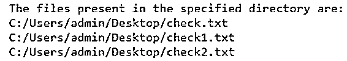
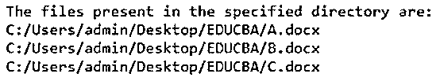
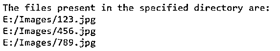
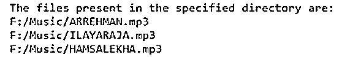
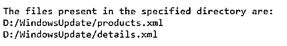

# Perl glob

> 原文：<https://www.educba.com/perl-glob/>

## Perl glob 简介

每当我们想要在 Perl 中打印特定目录中给定的文件名时，我们就使用一个名为 glob() function 的函数。它将参数作为文件所在目录的路径，这些文件的名称将作为 glob()函数的输出返回。这个 glob()函数既可以打印目录中存在的所有文件的名称，也可以打印目录中存在的特定文件的名称，这取决于我们在文件存在的目录路径中作为参数指定的内容，该参数的名称将作为 glob()函数的输出返回。

**在 Perl 中声明 glob()函数的语法:**

<small>网页开发、编程语言、软件测试&其他</small>

`glob(path_to_the_directory);`

其中，path_to_the_directory 是文件所在目录的路径，这些文件的名称将作为 glob()函数的输出返回。

### Perl 中 glob()函数的使用

*   每当我们想要在 Perl 中打印特定目录中给定的文件名时，我们就使用一个名为 glob() function 的函数。
*   glob()函数将参数作为文件所在目录的路径，这些文件的名称将作为 glob()函数的输出返回。
*   glob()函数既可以打印目录中存在的所有文件的名称，也可以打印目录中存在的特定文件的名称，这取决于我们在文件存在的目录路径中作为参数指定的内容，该参数的名称将作为 glob()函数的输出返回。

### Perl glob 的例子

下面给出了 Perl glob 的例子:

#### 示例#1

Perl 程序使用 glob()函数打印指定目录中的文件名。

**代码:**

`#making use of glob function by passing the path of the directory where the files are present to print the names of the files present in the directory
@filenames = glob('C:/Users/admin/Desktop/*');
print "The files present in the specified directory are:\n";
foreach $eachfile(@filenames){
print "$eachfile\n";
}`

**输出:**

在上面的程序中，我们通过传递文件所在目录的路径来使用 glob()函数，以打印目录中文件的名称。然后，目录中的文件名将作为输出打印在屏幕上。

#### 实施例 2

Perl 程序使用 glob()函数打印指定目录中的文件名。

**代码:**

`#making use of glob function by passing the path of the directory where the files are present to print the names of the files present in the directory
@filenames = glob('C:/Users/admin/Desktop/EDUCBA/*’);
print "The files present in the specified directory are:\n";
foreach $eachfile(@filenames){
print "$eachfile\n";
}`

**输出:**

在上面的程序中，我们通过传递文件所在目录的路径来使用 glob()函数，以打印目录中文件的名称。然后，目录中的文件名将作为输出打印在屏幕上。

#### 实施例 3

Perl 程序使用 glob()函数打印指定目录中的文件名。

**代码:**

`#making use of glob function by passing the path of the directory where the files are present to print the names of the files present in the directory
@filenames = glob(img/*’);
print "The files present in the specified directory are:\n";
foreach $eachfile(@filenames){
print "$eachfile\n";
}`

**输出:**

在上面的程序中，我们通过传递文件所在目录的路径来使用 glob()函数，以打印目录中文件的名称。然后，目录中的文件名将作为输出打印在屏幕上。

#### 实施例 4

Perl 程序使用 glob()函数打印指定目录中的文件名。

**代码:**

`#making use of glob function by passing the path of the directory where the files are present to print the names of the files present in the directory
@filenames = glob(F:/Music/*’);
print "The files present in the specified directory are:\n";
foreach $eachfile(@filenames){
print "$eachfile\n";
}`

**输出:**

在上面的程序中，我们通过传递文件所在目录的路径来使用 glob()函数，以打印目录中文件的名称。然后，目录中的文件名将作为输出打印在屏幕上。

#### 实施例 5

Perl 程序使用 glob()函数打印指定目录中的文件名。

**代码:**

`#making use of glob function by passing the path of the directory where the files are present to print the names of the files present in the directory
@filenames = glob(D:/WindowsUpdate/*’);
print "The files present in the specified directory are:\n";
foreach $eachfile(@filenames){
print "$eachfile\n";
}`

**输出:**

在上面的程序中，我们通过传递文件所在目录的路径来使用 glob()函数，以打印目录中文件的名称。然后，目录中的文件名将作为输出打印在屏幕上。

### 推荐文章

这是一个 Perl glob 指南。这里我们分别讨论 Perl 中 glob()函数的介绍、工作原理以及例子。您也可以看看以下文章，了解更多信息–

1.  perl eval
2.  [Perl for 循环](https://www.educba.com/perl-for-loop/)
3.  [Perl 写入文件](https://www.educba.com/perl-write-to-file/)
4.  [Perl while 循环](https://www.educba.com/perl-while-loop/)

