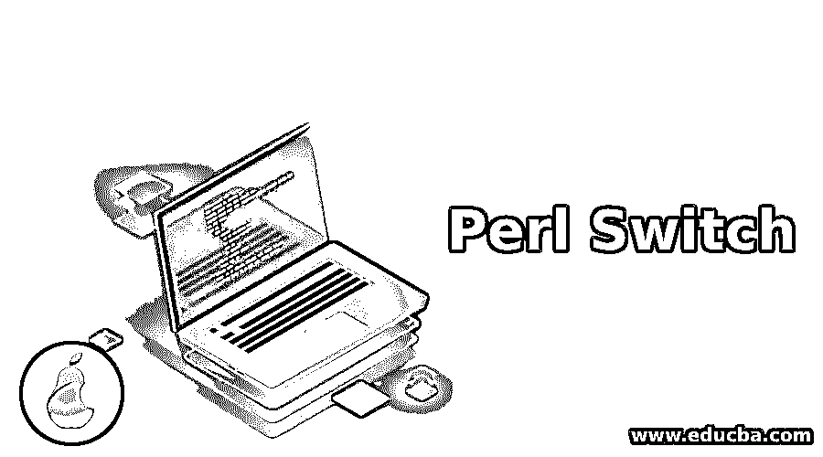
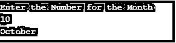
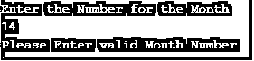

# Perl 开关

> 原文：<https://www.educba.com/perl-switch/>

## Perl Switch 语句简介

Switch 语句用于通过多个条件评估一个值，如果一个条件不匹配，将转到另一个条件，如果第二个条件不匹配，将转到另一个条件，以此类推。Perl 语言不支持 switch 语句，要在 perl 中实现 switch，需要使用 given 和 when 语句，其中 given 用于 switch 的情况，when 用于 case 的情况。开关和 case 已经在 Perl 中使用过了，但是它给出了一些编译错误。为了解决这些错误，后来 Perl 语言只是将其升级并实现了 given 和 when to use for switch 语句。

**语法:**

<small>网页开发、编程语言、软件测试&其他</small>

`given(expression)
{
when ( first value)
{
statement to be executed;
}
when (second value)
{
statement to be executed;
}
....
...
when (nth value)
{
statement to be executed;
}
default
{
statement to be executed if all the cases are not matched.;
}
}`

### Perl 中 Switch 语句是如何工作的？

给定和 when 关键字用于在 Perl 中实现 switch。given 关键字用于代替处理需要计算的表达式或值的开关。当代替处理各种条件的 case 并基于用户输入时，它执行适当的 case。也就是说，它首先检查情况 1，即第一个条件，如果它与用户输入匹配，它将执行该循环，否则它将把流控制转移到另一个情况，即另一个条件。如果第二个条件与用户输入匹配，它将执行该案例，否则转移到第三个案例。同样，它将执行 case，直到找到匹配为止。一旦用户输入找到匹配，它将终止程序。如果上述条件都不符合用户输入，它将执行缺省块。默认块用于在用户输入与条件不匹配时执行语句。

### 用 Perl 实现 Switch 语句的例子

下面是一些例子:

#### 示例#1

用 Perl 打印月份

**代码:**

`use feature qw(switch say);
print "Enter the Number for the Month \n";
chomp( my $month = <> );
given ($month)
{
when('1')
{
say "January";
}
when('2')
{
say "February";
}
when('3')
{
say "March";
}
when('4')
{
say "April";
}
when('5')
{
say "May";
}
when('6')
{
say "June";
}
when('7')
{
say "July";
}
when('8')
{
say "August";
}
when('9')
{
say "September";
}
when('10')
{
say "October";
}
when('11')
{
say "November";
}
when('12')
{
say "December";
}
default
{
say "Please Enter valid Month Number";
}
}`

**输出:**
当用户输入 10 时，会显示如下图所示的结果

当用户输入案例中没有提到的值时，它将执行默认语句并打印结果，如下图所示。

**解释:**这里我们写了一个程序，根据用户输入打印具体的月份。使用特征 qw(开关说)；库用于使用给定的和 when 语句在 Perl 中实现 switch。第一个程序将为用户提示消息“输入月份的数字”。变量 month 用于存储用户输入的值。然后给定关键字将切换月份的值并将流控制转移到切换条件。根据用户输入，将执行适当的条件。

#### 实施例 2

用 Perl 打印星期几

**代码:**

`use feature qw(switch say);
print "Enter the Number for the Week \n";
chomp( my $week = <> );
given ($week)
{
when('1')
{
say "Monday";
}
when('2')
{
say "Tuesday";
}
when('3')
{
say "Wednesday";
}
when('4')
{
say "Thursday";
}
when('5')
{
say "Friday";
}
when('6')
{
say "Saturday";
}
when('7')
{
say "Sunday";
}
default
{
say "Please Enter valid Week Number";
}
}`

**输出:**
当用户输入 5 时，会显示如下图所示的结果。

当用户输入案例中没有提到的值时，它将执行默认语句并打印结果，如下图所示。

**解释:**这里我们写了一个程序，根据用户输入打印工作日。该示例与第一个示例相同。第一个程序提示信息“输入星期数”。week 变量用于存储用户输入。执行过程与第一个示例相同

### 结论

在本文中，我们已经看到了如何在 Perl 中使用 when 和 given 语句，而不是 Switch 和 case 语句以及语法和程序。我希望这篇文章对你有所帮助。

### 推荐文章

这是一个 Perl 开关指南。这里我们讨论 Perl Switch 的语法介绍，它是如何工作的，以及例子。您也可以浏览我们的其他相关文章，了解更多信息——

1.  [Perl 运算符](https://www.educba.com/perl-operators/)
2.  [什么是 Perl？](https://www.educba.com/what-is-perl/)
3.  [Perl last](https://www.educba.com/perl-last/)
4.  [Perl 类](https://www.educba.com/perl-class/)

