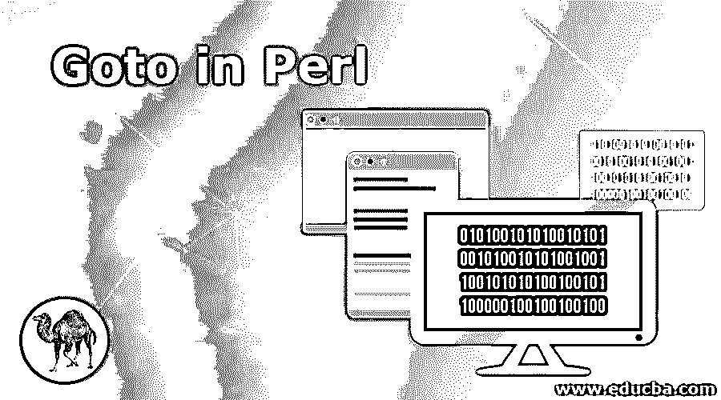
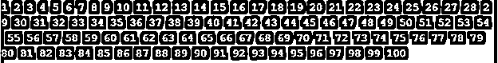
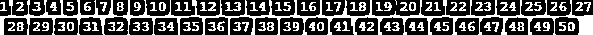
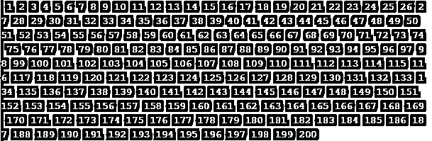

# Perl 中的 Goto

> 原文：<https://www.educba.com/goto-in-perl/>

## Perl 中 Goto 语句简介

Perl 中的 Goto 是一个语句，也称为跳转语句，goto 语句有时也称为无条件跳转语句。Goto 语句主要用于从一个语句跳转到另一个语句，或者在程序中使用的同一个函数内跳转。这个语句对于在函数中从一个语句跳到另一个语句非常重要和有用。Perl 中 goto 语句有三种形式，即标签、表达式和 goto & name，这三种基本形式在 Perl goto 语句中使用。

**语法:**

<small>网页开发、编程语言、软件测试&其他</small>

下面是如下的语法。

1.`LABEL: -- Jumps statement using label.
Statement 1;
Statement 2;
…   -- Statement is nothing but expression which we have used in code.
…
Statement N;
Goto label; -- Jumps statement using label.`

2.`Goto label -- Jumps statement using label.
OR
Goto EXPR       -- Jumps statement using expressions.
OR
Goto &NAME      -- It is used to substitute call of subroutines.
Jumps statement using subroutines.`

### Perl 中 Goto 的参数

下面是参数描述语法:

**1。标签:**标签用于从一个语句跳转到另一个语句，或者在 Perl 中使用 goto 语句在同一个函数内跳转。标签在 Perl goto 语句中非常重要和有用。

**2。语句 1 到语句 N:** 我们可以在 goto label 语句中使用 N 条语句。

**3。Goto:** Goto 语句又称跳转语句，在 Perl 中 Goto 语句有时也称为无条件跳转语句。

**4。表达式:**goto 语句中的表达式声明它将期望返回表达式作为标签名，然后跳转到带标签的语句。它是 Perl goto 语句中 global 语句的概括。

**5。&名称:**用于替代 Perl goto 语句中子程序的调用。

### 流程图

下面是流程图 Perl goto 语句的图示。

*   在上图中，goto 语句的流程将从 goto 语句的开始处开始。我们需要使用 start 关键字开始一个语句。
*   然后编译器会转到 label1，在 label 1 中我们使用了语句 1，编译器会像执行语句 1 一样执行 label 1 语句。
*   我们总共使用了三个标签和三个语句来表示 Perl goto 语句的流程图。
*   第一条语句执行后，编译器将从语句 1 跳到语句 3。编译器将执行第三条语句。
*   编译器将跳过第二条语句，直接跳到第三条语句。我们在流程图中使用了标签。
*   标签被定义为用户定义的标识符，用于指示或定义目标语句。
*   标签使用 goto 语句用于从一个语句跳转到另一个语句。或者用于在函数内跳转。
*   在执行上述流程图中的第三条语句后，编译器将直接转到 goto 语句体的 end 语句。它不会执行第二条语句。

### Perl 中 goto 语句如何工作？

下面是工作:

**1。**Perl goto 语句中有三种主要的语句形式如下。

1.  Goto Label
2.  转到表达式
3.  转到&名称

**2。**goto 语句有三种形式，perl 是标签、表达式和 goto &名，这三种基本形式都用在 perl goto 语句中。

*   **Goto Label:** 用于查找名字作为标签，找到名字后控制会停止执行，执行下一个块的语句。标签可以放在任何地方，但是这个语句的范围是动态的。
*   **Goto 表达式:**Goto 语句中的表达式声明它将期望返回表达式作为标签名，然后跳转到带标签的语句。
*   **Goto &名称:**用于替代子程序的调用。这是 perl goto 语句中非常重要的一种形式。

**3。** Goto 语句也称为跳转语句，在 perl 中 Goto 语句有时也称为无条件跳转语句。

**4。** Perl goto 语句在 Perl 语言中非常重要和有用。

**5。**perl 中的 Goto 语句基本上是用来从一个语句跳转到另一个语句或者在程序中使用的同一个函数内跳转。

### 在 Perl 中实现 Goto 的例子

下面是一些例子:

#### 示例#1

下面的例子显示了使用标签的 perl goto 语句如下。

**代码:**

`use strict;
use warnings;
# Define function name as goto Label
sub gotoLabel()
{
my $number = 1;    ## Define variable name as number.
label:                      ## Label define in a code with goto statement.
print "$number ";
$number++;
if ($number <= 100)
{
goto label;    ##goto statement with label
}
}
gotoLabel ();`

**输出:**

#### 实施例 2

下面的例子显示了 perl goto 语句使用的表达式如下。

**代码:**

`use strict;
use warnings;
$a = "lab";
$b = "el";
# Define function name as gotoExpression
sub gotoExpression()
{
my $number = 1;    ## Define variable name as number.
label:                      # Label define in a code with goto statement.
print "$number ";
$number++;
if ($number <= 50)
{
goto $a.$b;   # goto statement used with expressions.
}
}
gotoExpression ();`

**输出:**

#### 实施例 3

下面的例子显示了 perl goto 语句使用的子程序如下。

**代码:**

`## Define function name as gotoLabel
sub gotoSubroutine
{
print "$number ";   # Print number
$number++;
if($number <= 200)  # Loop used to print the number from 1 to 200
{
goto &gotoSubroutine;    ##goto statement with subroutines
}
}
my $number = 1;        ## Define variable name as number.
gotoSubroutine ();`

**输出:**

### 结论

Perl 中的 Goto 语句基本上是用来从一个语句跳转到另一个语句，或者在程序中使用的同一个函数内跳转。在 perl 语言中，从一个函数或一个语句跳到另一个语句是非常重要和有用的。

### 推荐文章

这是一个 Perl 中的 Goto 指南。在这里，我们将讨论 Perl 中 Goto 语句及其不同参数的简要概述，以及示例和代码实现。您也可以浏览我们推荐的其他文章，了解更多信息——

1.  [Perl 下一步](https://www.educba.com/perl-next/)
2.  [Perl chomp()](https://www.educba.com/perl-chomp/)
3.  [Perl 正则表达式](https://www.educba.com/perl-regular-expression/)
4.  [Perl 写入文件](https://www.educba.com/perl-write-to-file/)

