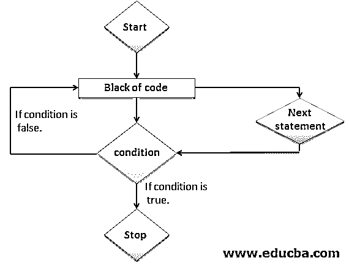
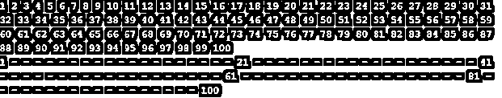
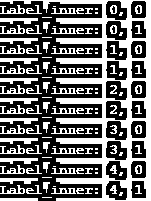

# Perl next

> 原文：<https://www.educba.com/perl-next/>

## Perl next 语句简介

Perl next 语句的工作方式与其他语言中的 continue 语句相同，该语句用于移动数组或散列的下一次迭代，跳过数组的所有元素。next 语句用于开始下一条语句或循环的迭代，我们也可以为 next 语句提供一个标签。Perl 中的 Next 语句在嵌套循环中使用，当我们没有在 next 语句中指定标签时，它将应用于程序代码的最近循环。移动到下一个元素非常重要。

**语法:**

<small>网页开发、编程语言、软件测试&其他</small>

`1\. Next;`

`2\. Next [ label ];`

### Perl next 语句中的参数

下面是语法的参数描述如下:

*   **Next:**Next 语句用于执行程序代码块的下一条语句。下一条语句对于执行代码的下一个语句块非常有用和重要。next 语句在嵌套循环中有用的地方使用。
*   **Label:** 这是 perl 中下一个语句的可选参数。在 Perl 中，这个标签被定义为下一个循环的标签。我们可以考虑标签是否在方括号内，标签是可选的，如果我们没有在语句中指定任何标签，那么 perl 中的下一条语句将直接进入最近的循环的下一次迭代。

### 流程图

下面是 perl 中下一条语句的流程图。流程图只不过是程序代码的逐步执行。该图显示了 perl 中下一个语句的流程图。

*   流程图对于发现下一个语句的逐步执行是非常重要的，它是如何在程序语句中工作的。

*   上图显示了程序代码中下一个语句的图形表示或流程。下一条语句如何工作在流程图中显示。
*   下一条语句的流程图以关键字名称作为 start 开始，以名称作为 stop 结束，或者我们也可以以名称作为 end 关键字结束流程图。
*   启动后，流程图编译器将执行程序代码块。如果我们的块包含下一条语句，那么执行将转到代码或语句的下一个语句块。
*   然后编译器将执行条件语句。如果块的条件为真，那么编译器将执行程序代码的最后一条语句。
*   如果块的条件为假，那么编译器将再次进入循环。它将再次执行前面的语句。它将执行循环语句，直到条件不为真。
*   如果块条件为真，编译器将执行程序代码的最后一块。
*   流程图对于显示 Perl 语言中任何程序或代码的图形流程非常重要。

### 下一条语句如何在 Perl 中工作？

下面是 perl 中下一个语句的工作原理。

**1。**它位于循环内部，用于开始下一次迭代，并跳过循环迭代下面的所有代码。我们可以在 next 语句中使用 label，在 perl 中，label 语句在 next 语句中有多种用法。

**2。**next 语句用于开始下一条语句或循环的迭代，我们也可以为 next 语句提供一个标签。移动到下一个元素非常重要。

**3。**它的工作原理和其他语言中的 continue 语句一样，这个语句用来移动我们数组的下一个元素或者跳过一个数组的所有元素哈希。

**4。**perl 中的 next 语句在嵌套循环中使用，当我们在 next 语句中没有指定标签时，它将应用于程序代码的最近循环。我们可以在下一个要处理的语句中使用一个数组元素，并且可以使用 perl 中的下一个语句跳过数组中的其余元素。

**5。**如果我们的条件为真，那么将使用 perl 中的下一条语句从数组中跳过数组元素。下一条语句用于执行程序代码块的下一条语句。我们可以使用 next 语句和连词来指定开始下一个迭代或语句。

**6。**我们可以在 perl 的 for 和 while 循环语句中常用 next 语句。perl 中的 Next 语句基本上跳过语句的当前执行，执行代码的下一次迭代。我们可以在下一个语句中使用 label。但是 label 是下一条语句中的可选参数。

### Perl 下一步要实现的示例

下面是 perl 中 next 语句的例子。

#### 示例#1

不使用 label 的 Perl next 语句。在下面的例子中，我们没有使用任何标签。

**代码:**

`#define array of number from 1 to 100
@array_number = (1..100);
##Display number from 1 to 100.
print("@array_number\n");
## Used for loop to print number from 1 to 100.
for ($number = 0; $number < @array_number; $number++) {
if ($number == 0 || $number == 20 || $number == 40 || $number == 60 || $number == 80 || $number == 99) {
next;   ## Skip all the number only print 1, 21, 41, 61, 81 and 100
}
$array_number[$number] = "-";
}
## Print the number
print("@array_number\n");`

**输出:**

#### 实施例 2

使用标签的 Perl 下一条语句。我们在下面的例子中使用标签。

**代码:**

`## Using label with next statement.
OUTER: for ($p = 0; $p < 5; $p++) {    ## Used for loop to define value of p and q variables.
for ($q = 0; $q < 5; $q++) {   ## Inner for loop for auto increment of p and q variables.
print("Label_inner: $p, $q\n");
if ($q == 1) {
next OUTER;     ## Using outer label with next statement.
}
}
print("outer: $p, $q\n\n");   ## print the value of p and q variables.
}`

**输出:**

### 结论

perl 中的下一条语句对于将光标移动到下一次迭代非常重要和有用。perl 中的 next 语句在嵌套循环中使用，当我们在 next 语句中没有指定标签时，它将应用于程序代码的最近循环。

### 推荐文章

这是 Perl next 的指南。在这里，我们讨论 Perl 的下一条语句及其不同参数的简要概述，以及示例和代码实现。您也可以浏览我们推荐的其他文章，了解更多信息——

1.  [Perl 变量](https://www.educba.com/perl-variables/)
2.  [Perl 读取文件](https://www.educba.com/perl-read-file/)
3.  [Perl STDIN](https://www.educba.com/perl-stdin/)
4.  [Perl 写入文件](https://www.educba.com/perl-write-to-file/)

