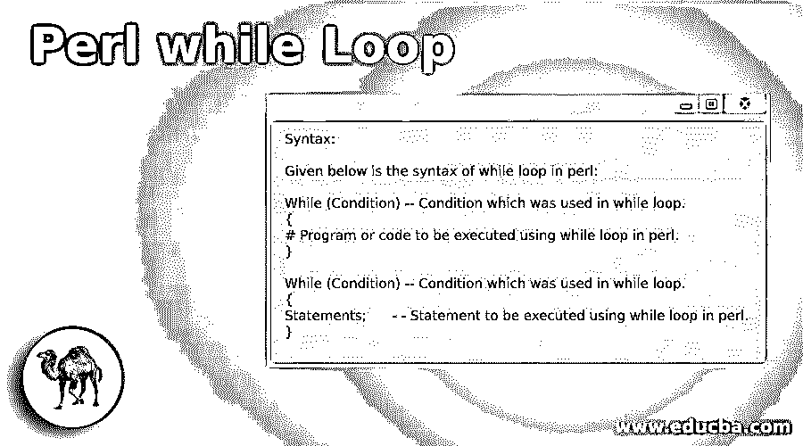
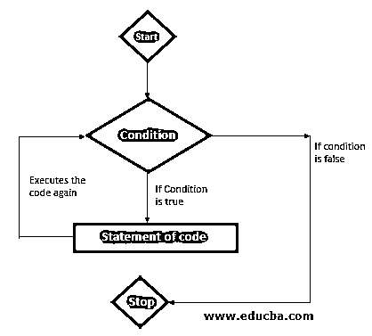
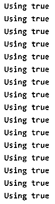
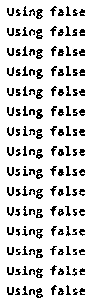
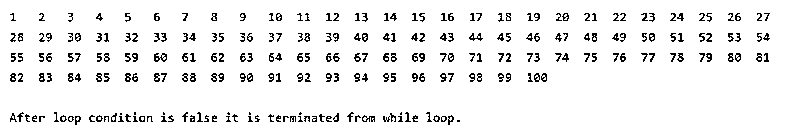
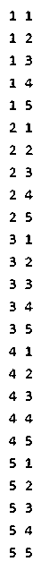

# Perl while 循环

> 原文：<https://www.educba.com/perl-while-loop/>

## Perl while 循环简介

Perl while 循环基本上用于迭代程序的一部分或者多次执行程序的语句。在 while 循环中，我们在代码语句之前给出了条件，条件是在程序中要执行的代码语句之前给出的。在 while 循环中，当程序开始执行时，编译器首先检查给定的代码条件是真还是假，如果给定的条件为真，那么循环语句将执行。如果给定条件为假，while 循环将从循环中终止。

**语法:**

<small>网页开发、编程语言、软件测试&其他</small>

下面给出了 perl 中 while 循环的语法:

`While (Condition) -- Condition which was used in while loop.
{
# Program or code to be executed using while loop in perl.
}`

`While (Condition) -- Condition which was used in while loop.
{
Statements;      - - Statement to be executed using while loop in perl.
}`

**下面是 perl while 循环的参数描述语法:**

*   **While:** While 循环在 perl 中非常重要和有用，可以多次迭代代码的语句。While 循环将重复执行 while 条件中的语句。它将重复执行该语句，直到条件不为假。
*   **条件:**条件是 perl 中 while 循环的重要参数。条件被定义为我们用来执行循环的条件。我们也可以在 while 循环中使用 true 或 false 条件。如果我们使用了 true 条件，那么 while 循环执行我们在程序代码中使用的语句，如果我们使用了 false 条件，那么循环将从循环中终止。
*   **语句:**语句用于执行 while 语句下的代码。语句就是 while 循环下的代码。

### 流程图

*   流程图只不过是程序代码的逐步执行。
*   下图显示了 perl 中 while 循环的流程图。
*   流程图对于了解 while 循环在程序语句中的逐步执行非常重要。

*   上图显示了程序代码中 while 循环的图示或流程。while 循环如何工作在流程图中显示。
*   while 循环的流程图以关键字名称作为开始，以名称作为结束，或者我们也可以以名称作为结束关键字来结束流程图。
*   流程图开始后，编译器将执行 while 循环条件块。如果条件为真，则 while 循环执行我们在程序代码中使用的语句，如果我们使用了假条件，则 while 循环将从循环中终止。
*   如果条件为真，编译器将反复执行语句或代码块，直到 while 循环条件不再失败。
*   如果条件为 fail，则循环从该条件终止，并执行程序的下一条语句。
*   流程图对于显示 perl 语言中任何程序或代码的图形流程都是非常重要的。

### Perl 中的 while 循环是如何工作的？

*   While 循环将重复执行 while 条件中的语句。它将重复执行该语句，直到条件不为假。
*   While 循环对于在 perl 中多次迭代代码语句非常重要和有用。
*   如果我们在条件中使用 true 关键字，那么 while 循环将进入无限循环。

下面的例子显示了在循环条件中使用 true 关键字时，循环进入无限循环。

**举例:**

**代码:**

`while(true)  ## Loop goes into the infinite condition.
{
printf"Using true\n";
}`

**输出:**

*   如果我们在条件中使用 false 关键字，那么 while 循环将进入无限循环。

下面的例子显示了在循环条件中使用 false 关键字时，循环进入无限循环。

**举例:**

**代码:**

`while(false) ## Loop goes into the infinite condition.
{
printf"Using false\n";
}`

**输出:**

*   在 while 循环中，我们在代码语句之前给出了条件，条件是在程序中要执行的代码语句之前给出的。
*   在 while 循环中，当程序开始执行时，编译器首先检查给定的代码条件是真还是假，如果给定的条件为真，循环或循环语句将执行。
*   如果给定的循环条件为假，那么 while 循环将从循环中终止。
*   Perl while 循环基本上用于迭代程序的一部分或者多次执行程序的语句。

### Perl while 循环的例子

下面是提到的例子:

#### 示例#1: while 循环

下面是 perl 中 while 循环的例子，在下面的例子中我们打印了从 1 到 100 的数字。

**代码:**

`$i = 1;
# while loop execution start from 1
while( $i<= 100 ){
printf "$i\t";
$i++; ## loop will execute until the number is not reached 100.
}
printf "\n\nAfter loop condition is false it is terminated from while loop.";`

**输出:**

#### 示例 2:嵌套的 while 循环

嵌套 while 循环只不过是在另一个 while 循环中使用的一个 while 循环。循环的执行从外部 while 循环开始，并以外部 while 循环结束。

**代码:**

`$i = 1;
# while loop execution start from 1.
while( $i<= 5 ){ ## First while loop define value of i is 5
$j = 1;
while( $j <= 5 ){ ## second while loop define value of j is 5
printf "$i $j\n";
$j++;
} ## End of second while loop.
$i++;
} ## End of first while loop.`

**输出:**

### 结论

while 循环对于在 perl 中多次迭代代码语句非常重要和有用。在 while 循环中，当程序开始执行时，编译器首先检查给定的代码条件是真还是假，如果给定的条件为真，那么循环语句将执行。

### 推荐文章

这是一个 Perl while 循环指南。在这里，我们讨论 Perl while 循环的介绍，以及循环如何工作，并举例说明以便更好地理解。您也可以看看以下文章，了解更多信息–

1.  [Perl 数据类型](https://www.educba.com/perl-data-types/)
2.  [Perl 变量](https://www.educba.com/perl-variables/)
3.  [Perl 命令](https://www.educba.com/perl-commands/)
4.  [Perl 运算符](https://www.educba.com/perl-operators/)

