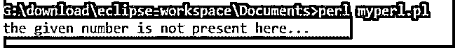

# Perl else if

> 原文：<https://www.educba.com/perl-else-if/>

## Perl else if 简介

“if-else”语句对于选择一个条件是有用的，但是当涉及多个条件时,“Perl else if”语句在技术上是有用的。这对于在语句中出现相同优先级的多个条件并且只选择一个条件的技术是有用的。它从上到下工作，并在 else if 语句中逐个传递参数。“else if”在技术上称为 Perl“elsif ”,在语言中用作语句。

**语法:**

<small>网页开发、编程语言、软件测试&其他</small>

else if (elsif)语句语法如下:

`elsif(condition for statement)
{
Perl code for statement;
}`

条件语法中使用的 else if (elsif)语句如下:

`if(condition_1 for statement)
{
Perl code for statement execution (if the condition is true);
}
elsif(condition_2 for statement)
{
Perl code for statement execution (if the condition is true);
}
elsif(condition_3 for statement)
{
Perl code for statement execution (if the condition is true);
}
else(condition_4 for statement)
{
Perl code for statement execution (if all above conditions are failed);
}`

工作语法的 Perl else if (elsif)规则如下:

*   放在“if 语句”之后，“else 语句”之前。
*   它需要代码中的两个以上的条件。
*   当“如果条件”失败时，它成功。
*   它成功，则剩余的 elsif 和 else 条件将失败。

### 在 Perl 中，if 语句还有其他工作方式吗？

下载并在设备上安装最新版本的操作系统。

https://www.Perl.org/或 http://strawberryPerl.com/大多使用 Perl IDE 网站链接。

用。pl 扩展名，并将文件保存在所需的命令行路径中。

**举例:**

`helloo.pl or first pearl.pl`

在代码中使用 else if (elsif)语句语法。

`if(condition_1 for statement)
{
Perl code for statement execution (if the condition is true);
}
elsif(condition_2 for statement)
{
Perl code for statement execution (if the condition is true);
}
elsif(condition_3 for statement)
{
Perl code for statement execution (if the condition is true);
}
else(condition_4 for statement)
{
Perl code for statement execution (if all above conditions are failed);
}`

**Perl else if 语句描述:**

*   首先，if 语句作为参数传递，当 if 条件失败时，则 else if (elsif)语句作为参数传递。
*   条件失败，然后另一个 else if (elsif)语句作为参数传递。
*   当最后一个 else if (elsif)条件变为失败时，则 else 条件变为真。
*   else 条件在 then if 语句和 available all else if 语句失败时变为 true。
*   它与“Perl unless”语句一起用于多个条件语句。

else if 语句的工作示例如下:

**代码:**

`$number_var = 240;
if($number_var == 40)
{
print "the given number is 40 \n";
}
elsif($number_var == 24)
{
print "the given number is 24 \n";
}
elsif($number_var== 240)
{
print "the given number is 240 \n";
}
else
{
print "the given number is not present here... \n";
}`

### Perl else if 的例子

下面是一些例子:

#### 示例#1

简单的 else if (elsif)语句示例和输出。

**代码:**

`$number_var = 240;
if($number_var == 40)
{
print "the given number is 40 \n";
}
elsif($number_var == 24)
{
print "the given number is 24 \n";
}
elsif($number_var== 240)
{
print "the given number is 240 \n";
}
else
{
print "the given number is not present here... \n";
}`

**输出:**

#### 实施例 2

带有 If 语句 true 的语句示例和输出。

**代码:**

`$number_var = 410;
if($number_var == 410)
{
print "the given number is 410 \n";
}
elsif($number_var == 240)
{
print "the given number is 240 \n";
}
elsif($number_var== 420)
{
print "the given number is 420 \n";
}
else
{
print "the given number is not present here... \n";
}`

**输出:**

**说明:**

*   if 语句具有真条件。
*   上面的示例在屏幕上显示 if 语句输出。

#### 实施例 3

带有 else 语句的语句示例和输出。

**代码:**

`$number_var = 840;
if($number_var < 410)
{
print "the given number is 410 \n";
}
elsif($number_var > 940)
{
print "the given number is 240 \n";
}
elsif($number_var == 420)
{
print "the given number is 420 \n";
}
else
{
print "the given number is not present here... \n";
}`

**输出:**

**说明:**

*   if 语句和 else If (elsif)语句具有错误的条件。
*   上面的示例在屏幕上显示 else 语句输出。

#### 实施例 4

带有除非语句示例和输出的语句。

**代码:**

`$number_var = 840;
unless($number_var == 840)
{
print "the given number is not 410 \n";
}
elsif($number_var == 840)
{
print "the given number is 840 \n";
}
else
{
print "the given number is not present here... \n ";
}`

**输出:**

**说明:**

*   上面例子中的 unless 和 else if 语句是一样的。
*   语句首先作为参数传递，然后是除非语句。
*   它作为输出显示在屏幕上。

#### 实施例 5

带有多个 else if 示例和输出的语句。

**代码:**

`$number_var = 840;
if($number_var < 240)
{
print "the given number is not 410 \n";
}
elsif($number_var > 240)
{
print "the given number is greater than 240 \n";
}
elsif($number_var == 840)
{
print "the given number is 840 \n";
}
else
{
print "the given number is not present here... \n ";
}`

**输出:**

**说明:**

*   两个以上的 else if (elsif)语句为真，则第一个 else if 语句显示为输出。
*   上例两个“else if”语句都为真，但第一个语句显示为输出。

### 结论

else if (elsif)语句使得在该技术中选择多个条件变得容易和简单。该语句适用于类似的优先级条件及其一个输出。

### 推荐文章

这是一个 Perl else if 的指南。这里我们讨论一下入门，if 语句在 perl 中还有什么其他的工作方式？并分别举例说明。您也可以看看以下文章，了解更多信息–

1.  [Perl 卸载](https://www.educba.com/perl-unshift/)
2.  [Perl 解包](https://www.educba.com/perl-unpack/)
3.  [Perl 数组长度](https://www.educba.com/perl-array-length/)
4.  [Perl for 循环](https://www.educba.com/perl-for-loop/)

