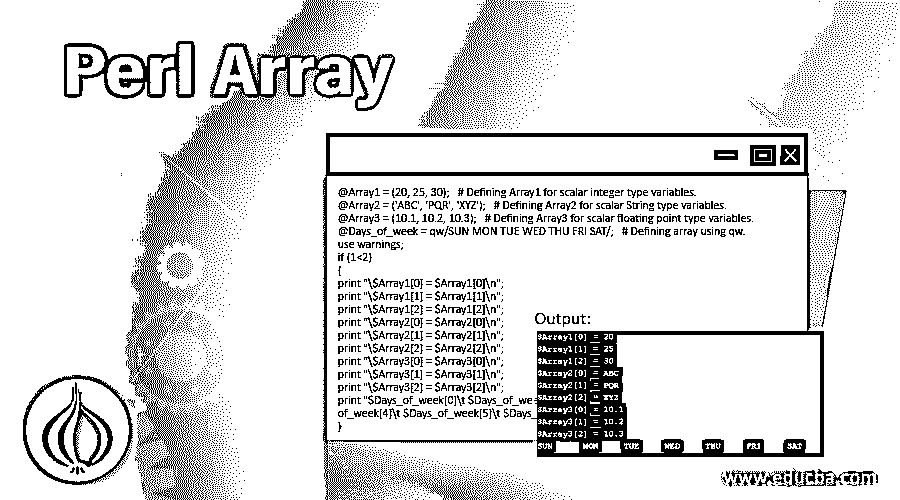
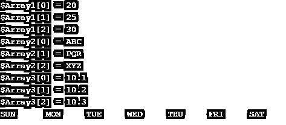
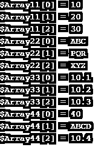
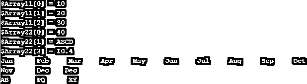
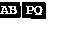
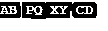
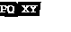
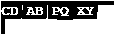
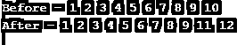

# Perl 数组

> 原文：<https://www.educba.com/perl-array/>

## 什么是 Perl 数组？

Perl 数组被定义为存储标量值的有序列表的变量，Perl 语言中的数组变量以“at”(@)符号开头。如果我们初始化一个数组元素，我们需要在 Perl 语言中使用美元符号。这个数组用来存储值或对象的列表，数组中的每个值称为数组的元素，数组是这种语言中一种特殊类型的变量。我们可以声明任何标量值的数组元素，如数字、字符串和浮点数。

### 如何在 Perl 中定义数组？

我们可以为数组定义任何数字、字符串和浮点值。下面是在 for 中定义数组的例子，同样如下。我们需要在定义数组的时候使用一个变量名。

<small>网页开发、编程语言、软件测试&其他</small>

**代码:**

`@Array1 = (20, 25, 30);   # Defining Array1 for scalar integer type variables.
@Array2 = ('ABC', 'PQR', 'XYZ');   # Defining Array2 for scalar String type variables.
@Array3 = (10.1, 10.2, 10.3);   # Defining Array3 for scalar floating point type variables.
@Days_of_week = qw/SUN MON TUE WED THU FRI SAT/;   # Defining array using qw.
use warnings;
if (1<2)
{
print "\$Array1[0] = $Array1[0]\n";
print "\$Array1[1] = $Array1[1]\n";
print "\$Array1[2] = $Array1[2]\n";
print "\$Array2[0] = $Array2[0]\n";
print "\$Array2[1] = $Array2[1]\n";
print "\$Array2[2] = $Array2[2]\n";
print "\$Array3[0] = $Array3[0]\n";
print "\$Array3[1] = $Array3[1]\n";
print "\$Array3[2] = $Array3[2]\n";
print "$Days_of_week[0]\t $Days_of_week[1]\t $Days_of_week[2]\t $Days_of_week[3]\t $Days_of_week[4]\t $Days_of_week[5]\t $Days_of_week[6]\t";
}`

**输出:**

**说明:**在上面的例子中，我们要定义三个类似数组的 array1，array2，array3。Array1 代表整数类型变量，array2 代表字符串类型变量，array3 代表浮点数类型变量。

### 如何在 Perl 中初始化数组？

我们可以将数组变量初始化为整数、字符串和浮点数。我们也可以在单个元素中初始化标量数据类型的数组。我们需要使用$(美元)符号开始的数组，同时初始化同一语言的数组。下面是用 Perl 初始化数组的例子如下。

**代码:**

`@Array11 = (10, 20, 30);# Defining Array1 for scalar integer type variables.
@Array22 = ('ABC', 'PQR', 'XYZ');# Defining Array2 for scalar String type variables.
@Array33 = (10.1, 10.2, 10.3);# Defining Array3 for scalar floating point type variables.
@Array44 = (40, 'ABCD', 10.4);# Defining Array44 for all scalar data types variables.
use warnings;
if (1<2)
{
print "\$Array11[0] = $Array11[0]\n";
print "\$Array11[1] = $Array11[1]\n";    # Initializing Array11 element.
print "\$Array11[2] = $Array11[2]\n";
print "\$Array22[0] = $Array22[0]\n";
print "\$Array22[1] = $Array22[1]\n";    # Initializing Array22 element.
print "\$Array22[2] = $Array22[2]\n";
print "\$Array33[0] = $Array33[0]\n";
print "\$Array33[1] = $Array33[1]\n";     # Initializing Array33 element.
print "\$Array33[2] = $Array33[2]\n";
print "\$Array44[0] = $Array44[0]\n";
print "\$Array44[1] = $Array44[1]\n";     # Initializing Array44 element.
print "\$Array44[2] = $Array44[2]\n";
}`

**输出:**

**说明:**在上面的例子中，我们已经初始化并声明了整型标量数据类型的 array11、字符串标量数据类型的 array22 和浮点数标量数据类型的 array33。我们已经将 array44 数组初始化并声明为所有标量数据类型变量的组合。

### 如何在 Perl 中访问数组元素？

我们可以从完整的数组元素中访问单个元素或对象。在 Perl 中，我们可以使用美元($)来访问单个元素。在访问数组中的一个元素之前，我们可以使用美元符号，在访问之前和之后，我们需要添加变量的索引。下面是访问数组元素的例子如下。

**代码:**

`@Array11 = (10, 20, 30);   # Defining Array11 for scalar integer type variables.
@Array22 = (40, 'ABCD', 10.4);     # Defining Array22 for all scalar data types variables.
@Months = qw/Jan Feb Mar Apr May Jun Jul Aug Sep Oct Nov Dec/;     # Defining array of month by using qw.
@Array33 = ('AB', 'PQ', 'XY');    # Defining Array33 for scalar String type variables.
use warnings;
if (1<2)
{
print "\$Array11[0] = $Array11[0]\n";
print "\$Array11[1] = $Array11[1]\n";    # Accessing Array11 element.
print "\$Array11[2] = $Array11[2]\n";
print "\$Array22[0] = $Array22[0]\n";
print "\$Array22[1] = $Array22[1]\n";    # Accessing Array22 element.
print "\$Array22[2] = $Array22[2]\n";
print "$Months[0]\t $Months[1]\t $Months[2]\t $Months[3]\t $Months[4]\t $Months[5]\t $Months[6]\t $Months[7]\t $Months[8]\t $Months[9]\t $Months[10]\t $Months[11]\t";
# Accessing array element of months variables.
print "$Months[11]\n";
print "$Array33[0]\t $Array33[1]\t $Array33[2]\t";  # Accessing element in single line.
}`

**输出:**

**说明:**在上面的例子中，我们有 array11、array22、months 和 array 33 的 access 数组元素。

### Perl 中数组的类型

下面是数组的类型。

*   流行音乐
*   变化
*   推
*   松开打字机或键盘的字型变换键
*   接合

#### 1.流行音乐

pop 数组从数组的最后一个元素中移除。下面是 pop 数组的示例。

**代码:**

`@Array = ("AB", "PQ", "XY");
pop @Array;
print "@Array\n";`

**输出:**

#### 2.推

推送数组是在数组中追加新元素。下面是一个推送数组的例子。

**代码:**

`@Array = ("AB", "PQ", "XY");
push @Array, "CD";
print "@Array\n";`

**输出:**

#### 3.变化

Shift array 将移除数组左边的元素。下面是移位数组的例子。

**代码:**

`@Array = ("AB", "PQ", "XY");
shift @Array;
print "@Array\n";`

**输出:**

#### 4.松开打字机或键盘的字型变换键

Unshift 数组将添加新元素开始到数组中。下面是非移位阵列的例子。

**代码:**

`@Array = ("AB", "PQ", "XY");
unshift @Array, "CD";
print "@Array\n";`

**输出:**

#### 5.接合

拼接将删除和替换定义的元素。下面是拼接的例子。

**代码:**

`@Number = (1..10);
print "Before - @Number\n";
splice(@Number, 9, 10, 11..12);
print "After - @Number\n";`

**输出:**

### 在 Perl 中使用数组的优势

下面是优点如下。

*   使用数组访问多个数据项。
*   使用数组可以节省内存。
*   在 Perl 代码调试中使用数组很容易。
*   定义单个元素时声明数组是有效的。
*   数组用于帮助提高代码的可重用性。

### 结论

Perl 数组用来存储一列值，数组中的每个值被称为数组的元素，数组是一种特殊类型的变量语言。我们可以声明任何标量值的数组元素，就像数字一样。数组是 Perl 中最重要和最有用的。

### 推荐文章

这是一个 Perl 数组的指南。这里我们用 5 种 Perl 数组类型和优点来讨论如何在 Perl 中定义、初始化和访问数组。您也可以浏览我们的其他相关文章，了解更多信息——

1.  [Perl last](https://www.educba.com/perl-last/)
2.  [Perl 类](https://www.educba.com/perl-class/)
3.  [Perl 注释](https://www.educba.com/perl-comments/)
4.  [Perl 下一步](https://www.educba.com/perl-next/)

