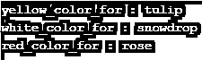

# Perl chop()

> 原文：<https://www.educba.com/perl-chop/>

")

## Perl chop()函数简介

Perl chop()函数用于删除输入字符串的最后一个字符，并将截断的字符作为输出返回给用户。如果我们在 Perl 中没有用 Chop 函数指定任何值，chop 函数已经从列表、表达式和$_ 中删除了每个元素的最后一个字符。这个函数对于从字符串中删除最后一个字符并返回截断的字符串作为输出非常有用和重要。这是 Perl 语言的一个内置函数，我们可以在处理字符串时使用这个函数。

**语法:**

<small>网页开发、编程语言、软件测试&其他</small>

下面是 chop 函数的语法:

1.剁(串)；–斩波功能使用的输入字符串。

2.斩波变量；–程序中使用的 Chop 变量。

3.chop(List)-最后一个元素的列表。

4.砍

**下面是 Perl chop 函数的参数描述语法。**

1.  **Chop:** 用于删除输入字符串中的最后一个字符，这个函数在 Perl 中非常重要和有用。我们可以对字符串、变量、散列、$_、数组和字符串变量使用 chop 函数。斩波功能效率高，比 s/更重要。$//s，因为 chop 函数不复制或扫描输入字符串。
2.  **String:** String 定义为输入字符串，我们用它来删除字符串中的最后一个字符。我们可以在 chop 函数中使用任何字符串或字符串变量。
3.  **变量:**这被定义为 chop 变量，我们在 Perl 中使用了 chop 函数。可变参数在斩波功能中非常重要和有用。
4.  **List:** 如果我们使用输入字符串作为一个删减列表，那么列表中的每个元素都将被删减。它会将斩波值作为输出返回给用户。

### Perl 中 chop()函数是如何工作的？

下面是斩波功能的工作原理:

**1。** Chop 函数用于删除输入字符串的最后一个字符。如果我们使用数组作为输入字符串，那么 chop 函数将从给定的数组中删除每个输入元素的最后一个字符。

**2。**如果我们使用输入字符串作为哈希值，那么 chop 函数将像数组一样工作，但是在哈希值中，只有哈希值将被 chop 或删除。哈希的密钥不会改变，它将保持不变。

**3。**我们可以对字符串使用 chop 函数，而对字符串使用 chop 函数会删除输入字符串的最后一个字符。

**4。**如果我们使用输入字符串作为删减列表，那么列表中的每个元素都将被删减。它会将斩波值作为输出返回给用户。

**5。**我们也可以对标量变量使用 chop 函数，这个函数也会去掉标量变量的最后一个字符。

**6。**Perl 中的 chop 函数从列表、表达式和$_ 中的每个元素中移除最后一个字符，如果我们没有用 Chop 函数指定任何值。

7 .**。** Chop 函数是 Perl 语言的内置函数，我们可以在处理字符串时使用这个函数。

**8。** Perl chop 函数用于删除输入字符串的最后一个字符，并将截断的字符作为输出返回给用户。

**9。** Perl chop 函数非常有用，也非常重要，它可以删除字符串中的最后一个字符，并返回被截断的字符串作为输出。

### Perl chop 函数的实现示例

下面是一些例子。

#### 示例#1

使用字符串的斩波功能:

*   在下面的例子中，我们在 Perl 中使用了带 chop 函数的字符串。Chop 函数将删除字符串中的最后一个字符。
*   我们有用户输入字符串作为“Perl 示例”。

**代码:**

`use strict;
use warnings;
# Using chop function and reverse in perl.
# Define variable name as Char_string and char_reverse
my $Char_string = " Perl example ";
my $char_reverse = reverse $Char_string;
# Use chop function in input string.
chop($char_reverse);
$Char_string = reverse $char_reverse;
#Print the input string.
print "$Char_string\n";
$Char_string = "Perl example";
$Char_string = substr $Char_string, 1;
print "$Char_string\n";`

**输出:**

#### 实施例 2

使用字符串变量的斩波功能:

*   在下面的例子中，我们在 Perl 中使用了带有 chop 函数的字符串变量。Chop 函数将从字符串变量中删除最后一个字符。
*   我们把输入的字符串当作一个“绿色”来使用。

**代码:**

`use strict;
use warnings;
# Use input string as "Greens" using chop function.
chop(my $color_chop = 'Greens');
# Display the result of input string using chop function.
print "$color_chop\n";`

**输出:**

#### 实施例 3

使用数组的斩波功能:

*   在下面的例子中，我们在 Perl 中使用了一个带 chop 函数的数组。使用 perl 中的 chop 函数将每个元素的最后一个字符从数组中删除。
*   我们使用输入数组作为“红蓝绿”。

**代码:**

`use strict;
use warnings;
# Use input as array of multiple color using chop function.
my @chop_color = qw(reds blues greens);
chop(@chop_color);
# Display the result array using chop function.
print join(" ",@chop_color), "\n";`

**输出:**

#### 实施例 4

使用哈希的 Chop 函数:

*   在下面的例子中，我们在 Perl 中使用了带有 chop 函数的散列。在散列中，只有散列值会被截断或删除。哈希的密钥不会改变，它将保持不变。

**代码:**

`use strict;
use warnings;
#define a hashes for colors and flowers
my %Chop_colors = ( red_color_for => 'roses',
yellow_color_for => 'tulips',
white_color_for => 'snowdrops'
);
chop(%Chop_colors);
while (my ($key, $value) = each % Chop_colors) {
print "$key : $Chop_colors{$key}\n";
}`

**输出:**

### 优势

*   Chop 函数用于删除输入字符串中的最后一个字符。
*   Chop 函数将把截断的字符串作为输出返回给用户。
*   在 Perl 中，我们可以对数组、标量变量、字符串和散列使用 chop 函数。
*   Chop 函数将与哈希和数组一样工作，但只有哈希值会发生变化，但密钥在哈希中保持不变。
*   Chop 函数在 Perl 中非常重要和有用，可以删除字符串的最后一个字符。

### 结论

Perl 中的 Chop 函数已经从列表、表达式和$_ 中删除了每个元素的最后一个字符，如果我们没有用 Perl 中的 chop 函数指定任何值的话。Chop 函数是 Perl 语言的内置函数，我们可以在处理 string 时使用这个函数。

### 推荐文章

这是一个 Perl chop()的指南。在这里，我们讨论 Perl chop()函数及其不同参数的简要概述，以及示例和代码实现。您也可以浏览我们推荐的其他文章，了解更多信息——

1.  [Perl sort()](https://www.educba.com/perl-sort/)
2.  [Perl 读取文件](https://www.educba.com/perl-read-file/)
3.  [Perl 写入文件](https://www.educba.com/perl-write-to-file/)
4.  [Perl 子程序](https://www.educba.com/perl-subroutine/)

