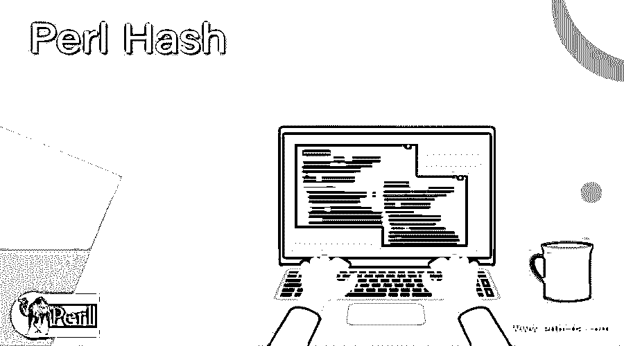
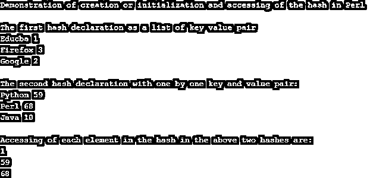
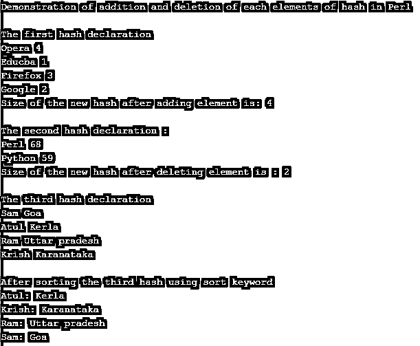

# Perl Hash

> 原文：<https://www.educba.com/perl-hash/>

## Perl 散列的定义

在 Perl 中，散列被定义为一个由无序的键-值对集合组成的关联数组，键具有唯一的字符串，值是标量，散列也被认为是一种类似于 Perl 中的数组、字典等的数据结构。一般来说，Perl 中的散列被定义为由无序的键-值对组成的项目或元素的集合，其中值可以通过使用指定给每个值的键来访问，而在 Perl 中，散列变量由百分号(%)表示或以百分号(%)开头，单个元素可以通过使用“$”符号后跟大括号中的键和值来引用。

### Perl 中散列的功能

在本文中，我们将讨论 Perl 中的 hash，它被定义为一种数据结构，该数据结构包含具有键-值对的元素的集合或集合，每个值可以是任何类型，如字符串、数字或引用，这些值通过它们各自的键来访问，其中键是唯一的，并且在没有重复键的整个 hash 中是字符串类型。如果散列中没有关键字，则它们被视为空散列。因此，我们可以在任何数据不整齐的时候使用散列。注意，如果我们想要访问一个特定的值，那么我们应该知道该值的适当的键，如果不知道该键，那么我们需要使用 key 函数来访问散列以获得整个键列表，然后我们可以迭代这些键以找到特定的值。

<small>网页开发、编程语言、软件测试&其他</small>

现在让我们看看 Perl 编程语言中 hash 的语法和示例。通常很少有开发人员使用“my”关键字来声明 Perl 中的任何变量，并使用关键字“%key_name”来声明 key。这里我们将看到没有使用“我的”关键字。

**语法:**

有两种方法可以使用键值对来声明散列:

1.  `$key{‘key_name’} = key_value;`
2.  `%key = (‘key_name’ => key_value);`

在上面的例子中，有两种在 Perl 中定义或声明 hash 的方法。在第一个语法中，我们可以看到我们已经为名为的键赋了一个值，这些值将放在花括号中，当我们想要逐个声明每个键-值对并且键前面有“$”时，可以使用这个值。

在第二种语法中，我们通过使用以%开头的 key 来声明键-值对的列表，为了方便起见，每个键后面都跟= >以指向它在键-值对列表中的值。如果通过值使用键引用，那么我们需要使用“$value = %key{-key_name}”的格式。注意，我们需要在 key_name 之前使用“-”。

现在，让我们在下面的例子中演示如何在 Perl 中使用哈希:

### 示例:

在下面的例子中，我们将用 Perl 编写一个简单的程序来创建一个 hash，初始化 hash，并访问 hash。

**代码:**

`#!/usr/bin/perl
print "Demonstration of creation or initialization and accessing of the hash in Perl";
print "\n";
print "\n";
print "The first hash declaration as a list of key value pair";
%institute = ('Educba' => 1, 'Google' => 2, 'Firefox' => 3);
print "\n";
foreach $key (keys %institute)
{
print "$key $institute{$key}\n";
}
print "\n";
print "The second hash declaration with one by one key and value pair:";
$course{'Python'} = 59;
$course{'Java'} = 10;
$course{'Perl'} = 68;
print "\n";
foreach $key (keys %course)
{
print "$key $course{$key}\n";
}
print "\n";
print "Accessing of each element in the hash in the above two hashes are: ";
print "\n";
print "$institute{'Educba'}\n";
print "$course{'Python'}\n";
print "$course{'Perl'}\n";`

**输出:**

在上面的程序中，我们可以看到以两种不同的方式声明了两个散列，如上面的语法部分所示。在上面的代码中，我们使用与上面给出的语法相同的格式创建了 hash，然后我们使用“foreach”循环打印两个 hash 元素，该循环将遍历整个 hash 并打印键和值对，如果 hash 非常大，我们还可以使用“while each”循环。然后，我们访问或获取两个散列中的每个元素，使用它的键和放在花括号中的键名来访问键值。

现在我们将看到另一个例子，如何在 hash 中添加和删除元素，以及如何在 Perl 中对 hash 进行排序。

#### 示例 2:

**代码:**

`#!/usr/bin/perl
print "Demonstration of addition and deletion of each elements of hash in Perl";
print "\n";
print "\n";
print "The first hash declaration ";
%institute = ('Educba' => 1, 'Google' => 2, 'Firefox' => 3);
print "\n";
@keys = keys %institute;
$institute{'Opera'} = 4;
@keys= keys %institute;
foreach $key (keys %institute)
{
print "$key $institute{$key}\n";
}
$size = @keys;
print "Size of the new hash after adding element is: $size\n";
print "\n";
print "The second hash declaration :";
$course{'Python'} = 59;
$course{'Java'} = 10;
$course{'Perl'} = 68;
print "\n";
@keys= keys %course;
delete $course{'Java'};
@keys= keys %course;
foreach $key (keys %course)
{
print "$key $course{$key}\n";
}
$size = @keys;
print "Size of the new hash after deleting element is : $size\n";
print "\n";
print "The third hash declaration";
%employee = (
"Ram" => "Uttar pradesh",
"Sam" => "Goa",
"Krish" => "Karanataka",
"Atul" => "Kerla"
);
print "\n";
foreach $key (keys %employee)
{
print "$key $employee{$key}\n";
}
print "\n";
print "After sorting the third hash using sort keyword";
print "\n";
foreach $key (sort keys %employee) {
print "$key: $employee{$key}\n";
}`

**输出:**

在上面的程序中，我们可以看到我们已经声明了 3 个 hash，其中一个通过使用 hash 中创建单个元素的语法来显示元素的添加，并在使用“size”关键字添加元素后打印 hash 的大小。然后，在第二个散列中，我们删除一个元素，并使用关键字“delete”打印散列及其大小，以删除元素。然后在第三个散列中，我们使用“sort”关键字对散列进行排序。输出可以在上面的截图中看到。

### 结论

在本文中，我们得出结论，Perl 中的 hash 也类似于无序键值对元素上使用的其他数据结构。在本文中，我们通过一个简单的例子看到了如何创建或初始化 hash，如何访问键值，以及如何使用“foreach”循环打印整个 hash。然后，我们还看到了一个例子，展示了如何添加和删除元素，如何使用“sort”对元素进行排序，以及如何使用“size”找到散列的大小。

### 推荐文章

这是一个 Perl Hash 的指南。这里我们还讨论了 Perl 中散列的定义和工作方式，以及不同的例子和代码实现。您也可以看看以下文章，了解更多信息–

1.  [Perl for 循环](https://www.educba.com/perl-for-loop/)
2.  [Perl sort()](https://www.educba.com/perl-sort/)
3.  [Perl 读取文件](https://www.educba.com/perl-read-file/)
4.  [Perl STDIN](https://www.educba.com/perl-stdin/)

