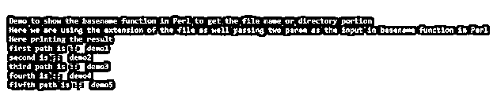

# Perl 基本名称

> 原文：<https://www.educba.com/perl-basename/>

## Perl basename 函数的定义

Perl 中的 basename 函数用于从路径中获取文件名。在 Perl 中用于处理目录、文件名和后缀的 basename 函数。但是 basename 函数主要处理文件名，如果我们想获取目录部分，我们可能必须使用 Perl 中的其他函数，而且 basename 函数采用不同的参数从现有路径中获取文件名。在下一节中，我们将详细讨论 Perl 中可用的 basename 函数。

**语法:**

<small>网页开发、编程语言、软件测试&其他</small>

正如我们所讨论的，这个函数用于从路径中获取文件的基本名称。这是 Perl 脚本中的一个内置函数。让我们详细讨论它的语法，以便更好地理解函数的细节，见下文；

1) `basename($Your_path);`

2) `basename($Your_path, @Your_suffixes);`

正如你在上面提到的 Perl 中 basename 函数的语法中所看到的，它使用不同的参数来返回文件的路径，但主要取决于我们在这里作为输入传递的参数。让我们来看一个示例语法练习，以便初学者更好地理解它。

**例如:**

`basename("my/sample/path");`

在上面的输入行中，正如你所看到的，我们将路径传递到那里，它将返回结果给我们。在下一节中，我们将详细讨论这个函数的工作原理。

### 在 Perl 中 basename 函数是如何工作的？

现在我们知道 basename 函数用于从传递的参数中获取文件路径。该函数接受输入参数，并基于此返回名称。但是这个函数返回最后一级的文件路径，它可以是目录本身。它将返回路径的最后一级。我们也可以将后缀作为参数传递，它将是文件的扩展名。在本节中，我们将首先看到方法签名，以理解这个函数在 Perl 中是如何工作的，以便从下面提到的路径中获取文件名或文件名的一部分；

**方法签名:**

**1) basename($Your_path):** 在这个函数中，我们可以传递一个参数作为输入 param。该参数将文件的路径作为输入，之后它将返回包含路径最后一级的结果作为文件名。它可以是出现在路径末尾的任何文件名或目录。见下面这个函数的例子见下面；

例如:

`my $filesample1 = basename("/my/sample/path/for/demo");`

正如你在上面的示例中看到的，我们将文件的路径作为“/my/sample/path/for/demo”传递，因此在检索结果时，它将打印“demo”作为结果，因为它是路径中的最后一个值。

**2) basename($Your_path，@Your_suffixes):** 在这个函数中，它以路径和后缀作为输入参数。这里的第二个参数是文件的后缀。让我们看一个例子来更详细地理解函数的工作原理，我们如何在编程时传递这个 using，见下文；

`my $filesample1 = basename("my/sample/path/for/demo.sql", ".sql");`

在上面的代码行中，我们使用文件的路径和后缀来检索文件。这样，我们将在这里获得文件，因为路径的最后一级是 file only，所以它将在这里返回文件名。

**在 Perl 中使用 basename 函数时需要记住的几点:**

*   这个函数用来获取文件名的一部分。不是完整的文件名
*   如果这个函数在路径的末尾找到了目录名，那么它将只返回目录名。
*   要在 Perl 中使用这个函数，我们必须包含文件库，它只是 Perl 编程的一部分。

### 例子

1)在本例中，我们尝试使用 Perl 中的 basename 函数从文件路径中获取名称。它会将我们返回到路径的最后一级，作为这里的输出。这也是一个让初学者更好理解用法的样例。

#### 示例#1

**代码:**

`use File::Basename;
print "Demo to show the basename function in Perl to get the file name or directory portion\n";
my $filesample1 = basename("/my/sample/path/for/demo1");
my $filesample2 = basename("/my/sample/path/for/demo2");
my $filesample3 = basename("/my/sample/path/for/demo3");
my $filesample4 = basename("/my/sample/path/for/demo4");
my $filesample5 = basename("/my/sample/path/for/demo5");
my $filesample6 = basename("/my/sample/path/for/demo6");
print "Here printing the result\n";
print "first path is :: ";
print "$filesample1\n";
print "second is :: ";
print "$filesample2\n";
print "third path is :: ";
print "$filesample3\n";
print "fourth is :: ";
print "$filesample4\n";
print "fivfth path is :: ";
print "$filesample5\n";`

**输出:**

2)在这个例子中，我们在 basename 函数中传递两个参数，一个是文件的路径，另一个是文件的后缀。但是将返回路径的最后一级。这也是一个让初学者更好理解用法的样例。

#### 实施例 2

**代码:**

`use File::Basename;
print "Demo to show the basename function in Perl to get the file name or directory portion\n";
print "Here we are using the extension of the file as well passing two param as the input in basename function in Perl\n";
my $filesample1 = basename("https://cdn.educba.com/my/sample/path/for/demo1.txt", ".txt");
my $filesample2 = basename("https://cdn.educba.com/my/sample/path/for/demo2.txt", ".txt");
my $filesample3 = basename("https://cdn.educba.com/my/sample/path/for/demo3.txt", ".txt");
my $filesample4 = basename("https://cdn.educba.com/my/sample/path/for/demo4.txt", ".txt");
my $filesample5 = basename("https://cdn.educba.com/my/sample/path/for/demo5.txt", ".txt");
my $filesample6 = basename("https://cdn.educba.com/my/sample/path/for/demo6.txt", ".txt");
print "Here printing the result\n";
print "first path is :: ";
print "$filesample1\n";
print "second is :: ";
print "$filesample2\n";
print "third path is :: ";
print "$filesample3\n";
print "fourth is :: ";
print "$filesample4\n";
print "fivfth path is :: ";
print "$filesample5\n";`

**输出:**

### 结论

这样，我们就可以从路径中获取文件的名称。我们也可以根据需要传递参数，对此没有限制。在 Perl 中调用函数时，它可以将文件路径作为带或不带后缀的路径。

### 推荐文章

这是一个 Perl basename 的指南。这里我们讨论一下介绍，在 Perl 中 basename 函数是如何工作的？并分别举例说明。您也可以看看以下文章，了解更多信息–

1.  [Perl readdir](https://www.educba.com/perl-readdir/)
2.  [Perl 文件存在](https://www.educba.com/perl-file-exists/)
3.  [珠联体](https://www.educba.com/perl-json/)
4.  perl eval

