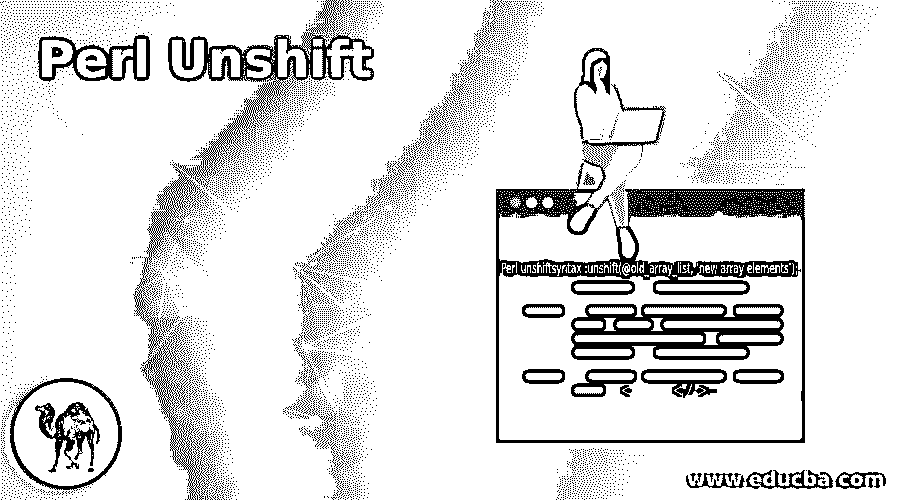
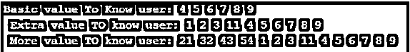
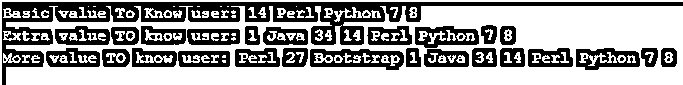
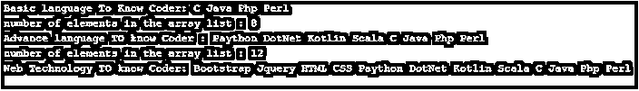
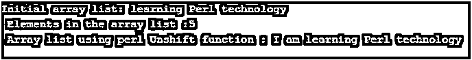

# Perl 取消转移

> 原文：<https://www.educba.com/perl-unshift/>

## Perl 非移位的定义

*   Perl unshift 函数的工作原理与 Perl 技术中的 shift 函数相反，用于数组操作。
*   Perlunshift 函数对于向正确方向移动数组元素很有用。
*   Perlunshift 函数在左侧添加一个新的数组元素，在右侧移动旧的元素。
*   Perl unshift 函数对于数组列表的移动和在数组列表左侧添加新元素非常有用。

**语法:**

Perlunshift 函数的语法如下。

<small>网页开发、编程语言、软件测试&其他</small>

`Perl unshiftsyntax :unshift(@old_array_list, ‘new array elements’);`

Perlunshift()方法用于将旧的数组列表向右移动，并添加一个新的数组列表。旧的数组列表变量放在 Perl unshift 方法中，然后用旧的数组变量添加新的数组元素。放在单引号内的字符串数组的新元素(“数组的元素”)。

### 在 Perl 中 Unshift 函数是如何工作的？

*   下载并安装 Perl 最新版本到你的设备的操作系统中。https://www.Perl.org/或 http://strawberryPerl.com/大多使用 Perl IDE 网站链接。
*   用。pl 扩展名，并将文件保存在所需的命令行路径中。例如:helloo.pl 或 first pearl.pl
*   创建数组变量并用所需的数组列表初始化。

`@ary_vrbl = ('learning', 'Perl', 'technology');`

*   打印数组列表的初始值。

`print "initial array list: @ary_vrbl \n";`

*   使用 Perlunshift 函数移动数组列表，并添加所需的额外数组元素。

`unshift (@ary_vrbl, 'I', 'am') ;`

*   使用 Perlunshiftfunction 后打印数组列表。

`print "Array list using perlUnshift function : @ary_vrbl";`

*   结合工作程序，在命令行上运行。

`@ary_vrbl = ('learning', 'Perl', 'technology');
print "Initial array list: @ary_vrbl \n";
unshift(@ary_vrbl, 'I', 'am');
print "Array list using perlUnshiftfunction : @ary_vrbl"`

### Perl 未转移的示例

下面是一些例子:

#### 示例#1

带有字符串数组的 Perl unshift 函数列出了例子和输出。

`@ary_vrbl = ('C', 'Java', 'Php', 'Perl');
print "Basic language To Know Coder: @ary_vrbl \n";
unshift(@ary_vrbl, 'Paython', 'DotNet', 'Kotlin', 'Scala');
print "Advance language TO know Coder: @ary_vrbl \n";
unshift(@ary_vrbl, 'Bootstrap', 'Jquery', 'HTML', 'CSS');
print "Web Technology TO know Coder: @ary_vrbl \n";`

**输出:**

**描述:**

*   数组列表用字符串值创建变量和初始值。
*   数组返回唯一的初始值，这是了解编码器的基本语言。
*   第一个 Perl unshift 函数返回 basic 和 advanced language 中的 know coder 数组列表。
*   第二个 Perl unshift 函数返回基本和高级语言与 web 技术，以了解编码器。

#### 实施例 2

带有数字数组的 Perl unshift 函数，列出了例子和输出。

`@ary_vrbl = (4, 5, 6, 7, 8, 9);
print "Basic value To Know user: @ary_vrbl \n";
unshift(@ary_vrbl, 1, 2, 3, 11);
print "Extra value TO know user: @ary_vrbl \n";
unshift(@ary_vrbl, 21, 32, 43, 54);
print "More value TO know user: @ary_vrbl \n";`

**输出:**

**描述:**

*   数组列表用数值创建变量和初始值。
*   该数组返回的唯一初始值是用户知道的基本值。
*   第一个 Perl unshift 函数返回 basic 和 extravalues 来认识数组列表中的用户。
*   第二个 Perl unshift 函数返回基本值和额外值，并带有更多的值以让用户知道。

#### 实施例 3

数组列表中的 Perl unshift 函数示例及输出。

`@ary_vrbl = ( 14, 'Perl', 'Python', 7, 8);
print "Basic value To Know user: @ary_vrbl \n";
unshift(@ary_vrbl, 1,'Java', 34);
print "Extra value TO know user: @ary_vrbl \n";
unshift(@ary_vrbl, 'Perl', 27, 'Bootstrap');
print "More value TO know user: @ary_vrbl \n";`

**输出:**

**描述:**

*   数组列表用数值和字符串值创建变量和初始值。
*   数组返回基本的值来识别用户，这些值是数字、Perl 和 python 语言。
*   第一个 Perl unshift 函数返回基本值和额外值，以了解数组列表中的用户，即 numbers 和 java。
*   第二个 Perl unshift 函数返回更多的值，让用户知道哪些是新旧数组元素。

#### 实施例 4

数组列表中的 Perl unshift 函数，计算数组实例的元素并输出。

`@ary_vrbl = ('C', 'Java', 'Php', 'Perl');
print " Basic language To Know Coder: @ary_vrbl \n " ;
print "number of elements in the array list : ", unshift (@ary_vrbl, 'Paython', 'DotNet', 'Kotlin', 'Scala');
print "\n Advance language TO know Coder : @ary_vrbl \n " ;
print "number of elements in the array list : ", unshift (@ary_vrbl, 'Bootstrap', 'Jquery', 'HTML', 'CSS');
print "\n Web Technology TO know Coder: @ary_vrbl \n " ;`

**输出:**

**描述:**

*   数组列表用字符串值创建变量和初始值。
*   数组返回唯一的初始值，这是了解编码器的基本语言。
*   第一个 Perl unshift 函数返回 basic 和 advanced language 中的 know coder 数组列表。
*   firstPerlunshift 数组在数组列表中有 8 个元素。
*   第二个 Perl unshift 函数返回基本和高级语言与 web 技术，以了解编码器。
*   secondPerl unshift 数组在数组列表中有 12 个元素。

#### 实施例 5

数组列表中的基本 Perl unshift 函数示例和输出。

`@ary_vrbl = ('learning', 'Perl', 'technology');
print "Initial array list: @ary_vrbl \n " ;
print "Elements in the array list :", unshift(@ary_vrbl, 'I', 'am');
print "\n Array list using perlUnshiftfunction : @ary_vrbl " ;`

**输出:**

### 结论

*   Perlunshift 函数用于修改数组列表和对字符串集合进行排序。
*   Perl unshift 函数使得数组列表对用户友好、有组织且可调整。
*   Perl unshift 函数重新创建数组列表，并在数组中添加新元素。

### 推荐文章

这是一个关于 Perl Unshift 的指南。在这里，我们还将讨论 unshift 函数的定义以及它在 perl 中是如何工作的？并附有示例。您也可以看看以下文章，了解更多信息–

1.  perl eval
2.  [Perl 哈希](https://www.educba.com/perl-hash/)
3.  [Perl 写入文件](https://www.educba.com/perl-write-to-file/)
4.  [Perl while 循环](https://www.educba.com/perl-while-loop/)

