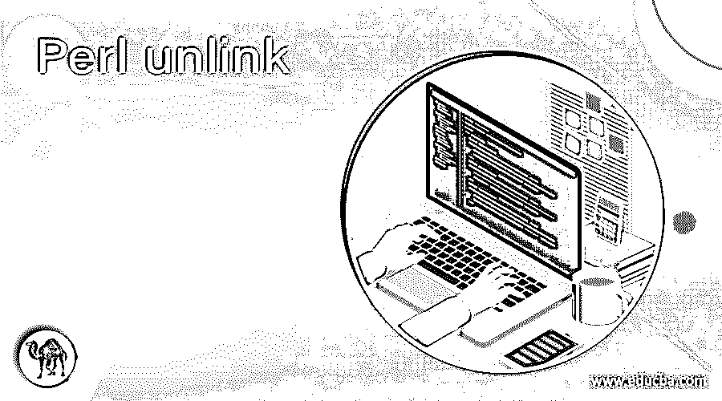
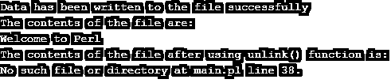
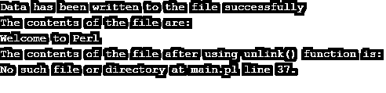

# Perl 取消链接

> 原文：<https://www.educba.com/perl-unlink/>

## Perl unlink 简介

Perl 中的文件可以使用称为 unlink()函数的函数删除，该函数被指定为 unlink()函数的列表，其中列表中的每一项都是要使用 unlink()函数删除的文件的位置的路径，或者可以使用$_ 直接指定文件名，并且在 Perl 中使用 unlink()函数删除的文件无论如何都无法恢复， 因此，建议在使用此函数删除文件之前要非常小心，此函数会永久删除指定的文件，并且不会返回任何内容。

**Perl 中声明 unlink()函数的语法如下:**

<small>网页开发、编程语言、软件测试&其他</small>

`unlink(List); or
unlink($filename);`

其中 List 指定一个列表，其中每个项目指定要删除的文件的位置路径，filename 指定要删除的文件的名称。

### Perl 中 unlink()函数的使用

Perl 中 unlink()函数的工作原理如下:

*   Perl 中的文件可以使用一个名为 unlink()函数的函数来删除，该函数被指定为 unlink()函数的列表。
*   指定给 unlink()函数的列表是一个列表，其中列表中的每一项都是要使用 unlink()函数删除的文件的位置的路径。
*   可以使用$_ 将文件名直接指定给 unlink()函数。
*   在 Perl 中使用 unlink()函数删除的文件无论如何都无法恢复，所以建议在使用该函数删除文件之前要非常小心。
*   函数的作用是:永久删除指定的文件，并且不返回任何内容。

### Perl unlink 的例子

让我们讨论 Perl unlink 的例子。

#### 示例#1

**代码:**

`use warnings;
use strict;
#The contents to be written to the file are stored in a string called strwrite
my $strwrite = <<END;
Welcome to Perl
END
#a temporary file is created to write the data into the file
my $filepath = "https://cdn.educba.com/tmp/tempfile.txt";
#open function is used to open the file using file handler to write the data to the file
open(FH, '>', $filepath) or die $!;
print FH $strwrite;
close(FH);
print "Data has been written to the file successfully\n";
my $filepath1 = "https://cdn.educba.com/tmp/tempfile.txt";
#open function is used to open the file using file handler to read the data from the file
open(FH1, '<', $filepath1) or die $!;
#displaying the contents of the file
print "The contents of the file are:\n";
while(<FH1>){
print $_;
}
close(FH1);
#using unlink function to permanently delete the file
unlink("https://cdn.educba.com/tmp/tempfile.txt");
print "The contents of the file after using unlink() function is:\n";
my $filepath2 = "https://cdn.educba.com/tmp/tempfile.txt";
#open function is used to open the file using file handler to read the data from the file
open(FH2, '<', $filepath2) or die $!;
#trying to display the contents of the file after using unlink() function
while(<FH2>){
print $_;
}
close(FH2);`

**上述程序的输出如下图所示:**

在上面的程序中，我们将要写入文件的数据存储在一个名为 strwrite 的字符串中。然后，我们使用 open 函数和文件处理程序将数据写入文件。数据写入文件后，我们使用相同的 open 函数和文件处理程序来读取文件内容，并将数据作为输出显示在屏幕上。然后我们使用 unlink()函数永久删除该文件。然后，我们再次尝试使用 open 函数和 file handler 来重新读取该文件，但失败了，因为该文件被 unlink()函数永久删除了，相应的消息作为输出显示在屏幕上。

#### 实施例 2

**代码:**

`use warnings;
use strict;
#The contents to be written to the file are stored in a string called strwrite
my $strwrite = <<END;
Welcome to Perl
END
#a temporary file is created to write the data into the file
my $filepath = "https://cdn.educba.com/tmp/tempfile.txt";
#open function is used to open the file using file handler to write the data to the file
open(FH, '>', $filepath) or die $!;
print FH $strwrite;
close(FH);
print "Data has been written to the file successfully\n";
my $filepath1 = "https://cdn.educba.com/tmp/tempfile.txt";
#open function is used to open the file using file handler to read the data from the file
open(FH1, '<', $filepath1) or die $!;
#displaying the contents of the file
print "The contents of the file are:\n";
while(<FH1>){
print $_;
}
close(FH1);
#using unlink function to permanently delete the file
unlink("https://cdn.educba.com/tmp/tempfile.txt");
print "The contents of the file after using unlink() function is:\n";
my $filepath2 = "https://cdn.educba.com/tmp/tempfile.txt";
#open function is used to open the file using file handler to read the data from the file
open(FH2, '<', $filepath2) or die $!;
#trying to display the contents of the file after using unlink() function
while(<FH2>){
print $_;
}
close(FH2);`

**上述程序的输出如下图所示:**

在上面的程序中，我们将要写入文件的数据存储在一个名为 strwrite 的字符串中。然后，我们使用 open 函数和文件处理程序将数据写入文件。数据写入文件后，我们使用相同的 open 函数和文件处理程序来读取文件内容，并将数据作为输出显示在屏幕上。然后我们使用 unlink()函数永久删除该文件。然后，我们再次尝试使用 open 函数和 file handler 来重新读取该文件，但失败了，因为该文件被 unlink()函数永久删除了，相应的消息作为输出显示在屏幕上。

### 结论

在本文中，我们通过编程示例及其输出，了解了 Perl 中 unlink()函数的定义、语法和工作原理。

### 推荐文章

这是一个 Perl unlink 的指南。这里我们讨论 Perl 中 unlink()函数的介绍、语法、工作原理以及代码实现的例子。您也可以看看以下文章，了解更多信息–

1.  [在 Perl 中转到](https://www.educba.com/goto-in-perl/)
2.  [Perl 中的文件处理](https://www.educba.com/file-handling-in-perl/)
3.  [Perl 注释](https://www.educba.com/perl-comments/)
4.  [Perl 开关](https://www.educba.com/perl-switch/)

