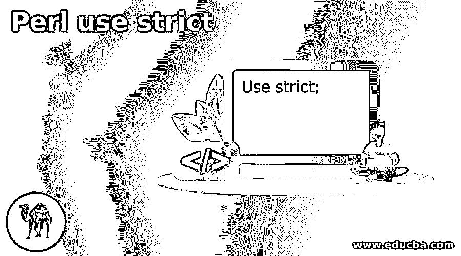
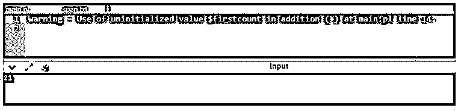

# Perl 使用严格

> 原文：<https://www.educba.com/perl-use-strict/>

## Perl 使用入门。

Perl use strict 是 Perl 中的一个警告，它是 Perl 编程中最常使用的 Pragma，被用来获取“危险代码”。pragma 是 Perl 包中的一个特殊模块，它控制 Perl 的聚合时间或运行时行为的某些元素，这是严格的警告。当警告 pragma 被利用时，编译器将检查错误，针对代码给出警告，并禁止某些编程开发和策略。这个 pragma 会在任何潜在的印刷错误点发出警告，并搜索潜在的问题。程序执行过程中可能出现各种潜在问题；然而，“告诫”实用程序主要搜索最常见的脚本错误和句子结构错误。

**语法和参数:**

<small>网页开发、编程语言、软件测试&其他</small>

`Use strict;`

这是用于在 Perl 编程中产生所有警告的语法。如果警告没有改变，那么程序将产生语法错误。

### Perl 中函数的严格程度如何？

下面给出了 strict 函数的工作原理以及这些警告在 Perl 中是如何出现的:

#### 示例:

**代码:**

`use strict;
use warnings;
local $SIG{__WARN__} = sub
{
my $pda = shift;
log6('warning', $pda);
};
my $firstcount;
count();
print "$firstcount\n";
sub count
{
$firstcount = $firstcount + 21;
}
sub log6
{
my ($level, $msg) = @_;
if (open my $out, '>>', 'span.txt')
{
chomp $msg;
print $out "$level - $msg\n";
}
}`

**输出:**

在上面的程序中，我们看到“使用严格的杂注”与“使用警告”的工作方式类似；然而，主要的区别在于，如果发现了一个错误，严重警告会提前结束程序的执行，而警告警告只会给出警告，不会提前结束程序的执行。因此程序被执行，输出如上面的快照所示。

Perl 5.6 和更高版本中出现了这种“利用率警告”的 pragma 对于更成熟的变体，可以通过使用套件 n kaboodle/hashbang 行中的“- w”来打开警报:

**代码:**

`#!/usr/nearby/receptacle/perl – w`

Perl 中的警告可以通过利用 Perl 中名为“小心”的预定义工作来实现。Perl 中的警告工作会针对错误生成警告消息，但不会留下内容。内容将继续执行代码的剩余部分。随后，当只需要打印警告消息，然后继续程序的剩余部分时，使用小心工作。

在上面的代码中，标量值的任务对$c 产生了一个错误，但对$b 没有，这是因为在方块中使用了 no alerts pragma。Perl 允许您创建和注册自己的警报，目的是让不同的客户机能够在词法扩展中有效地授权和限制它们。这应该可以通过使用预定义的 pragma“warnings::register”来实现。现在，这个警告类可以通过使用警告' Geeks::Perl_program '来启用，也可以通过不使用警告' Geeks::Perl_program '来禁用。要检查 guest 虚拟机的词汇扩展是否启用了警告分类，可以使用 warnings::enabled()。另一个 pragma warnings::warnif()可用于发送通知，只要警报现在基本上。

Use strict 本质上是一个编译器标语，建议 Perl 编译器以 3 种重要的方式改变其行为。你可以独立地杀上和三个区域，但是如果你只是简单地合成，就要严重地利用；在每个 Perl 文档(两个内容和模块)的最高点，在那一点上，您打开它们中的每一个 3。尽管总的来说，在所有的代码中有严格的要求是最理想的，但是有些情况下，我们可能想要利用额外的附魔能力而不需要严格的要求。对于这种情况，我们可能希望有关闭它的选项。当您启用严重利用时，您可以专门删除一个词法扩展中的几个或全部 3 个部分。也就是说，你可以在几个波浪形支撑{}内消除部分严重性。万一您在记录中使用了它们，各种模块将因此而可验证地转而在该特定文档中利用精确。

### 结论

因此，我们的结论是，可以通过在代码中使用“使用严格的”pragma 来实现警告。无论如何，这个 pragma 必须在更新的 Perl 表单中使用，例如，Form 5.6 或更高版本。尽管事实上这可以被用来授权警告，但是这个“- w”在整个程序中授权警告，甚至在由其他人组成和保持的外部模块中。同样，这种警告性杂注也可以用 Modern::Perl 来代替。这种策略在词汇层面上增强了警报的能力。通过在学位中使用“无通知”pragma 以及争用列表，可以特别削弱警告。万一没有给出争用列表，那么这个 pragma 将会妨碍该范围内的所有警告。

### 推荐文章

这是一个 Perl 使用指南。在这里，我们讨论 Perl 中的介绍和严格函数如何工作？分别是。您也可以看看以下文章，了解更多信息–

1.  [Perl 卸载](https://www.educba.com/perl-unshift/)
2.  [Perl 解包](https://www.educba.com/perl-unpack/)
3.  [Perl 数组长度](https://www.educba.com/perl-array-length/)
4.  perl eval

