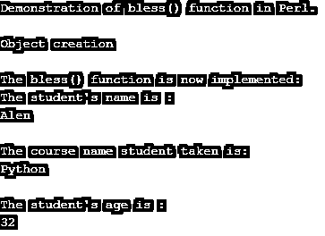
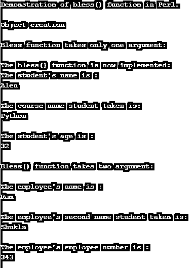

# Perl 祝福

> 原文：<https://www.educba.com/perl-bless/>

## Perl 祝福函数简介

在 Perl 中，bless 函数是一个内置函数，它可以定义为一个函数，用于将程序中的任何变量标记为某个特定类的对象，使用该函数时，该函数接受类名和引用，该对象引用哪个类，并在内部通知 Perl 编译器，因为传递给该 bless 函数的变量被标记为任何特定类的对象的变量。一般来说，我们可以将 bless function()定义为一个函数，用于使程序知道用这个 bless function 标记的变量是一个属于特定类的对象，其中类的名称和对这个变量的引用被传递给这个函数。

### Perl 中 bless()函数的使用及实例

在本文中，我们将讨论一个内置函数，在这个函数中，程序可以理解变量可以成为 Perl 中某个特定类的对象，这个函数称为 bless()函数。与其他编程语言不同，Perl 创建了一个类似于变量创建或声明的对象。所以要创建一个对象，我们确实要像声明变量一样创建它，但是程序如何区分变量和对象。因此，Perl 编程语言提供了一个名为 bless()函数的内置函数，这使得变量看起来像它所属的特定类的对象。

<small>网页开发、编程语言、软件测试&其他</small>

这个 bless()函数通常以类名和一个需要作为对象的变量的引用作为参数，这样它就可以在内部为变量设置一个标志，使程序知道这个变量被标识为某个特定类的对象，并且这个对象属于那个类。

现在让我们看看下面这个例子中 bless()函数的语法和例子。

**语法:**

`bless var_ref, class_name;`

**参数:**

*   var_ref:该参数用于将变量作为指定了类名的类的对象来引用。
*   class_name:该参数用于指定类名，通过将变量引用标记为该参数中指定的该类的对象来创建对象。

该函数也可以将唯一的 var_ref 作为参数，并且该函数返回标记变量的引用作为对对象的引用，该对象被赋予特定或指定的类名，如传递给该函数的参数中所指定的。

一般来说，这个函数告诉参数 var_ref 所引用的对象现在不是一个变量，而是一个特定类的对象，这个类被再次指定为参数，并使这个引用变量成为这个类的对象，并且它只属于这个类。并且如果没有类名被指定为 bless 函数的参数，其中仅传递 var_ref 引用参数，则默认情况下，bless()函数将当前类包作为要创建的对象的类，并将其标记为该当前类的对象。

### 例子

现在让我们看一个演示 bless()函数的简单例子。

#### 示例#1

**代码:**

`use strict;
use warnings;
print "Demonstration of bless() function in Perl.";
print "\n";
print "\n";
package student_data;
sub stud
{
my $class_name = shift;
my $var_ref = {
'stud_first_name' => shift,
'stud_course_name' => shift,
'stud_age' => shift,
};
print "The bless() function is now implemented:";
print "\n";
bless $var_ref, $class_name;
return $var_ref;
}
print "Object creation";
print "\n";
print "\n";
my $info = stud student_data("Alen","Python",32);
print "The student's name is :";
print "\n";
print "$info->{'stud_first_name'}\n";
print "\n";
print "The course name student taken is:";
print "\n";
print "$info->{'stud_course_name'}\n";
print "\n";
print "The student's age is :";
print "\n";
print "$info->{'stud_age'}\n";
print "\n";`

**输出:**

在上面的程序中，我们可以看到我们在 Perl 中使用关键字 package 定义了类“stud”。然后，我们创建了一个子程序，在其中打印学生的详细信息。这个函数或子例程也可以说是一个类的构造函数，我们在这里为类“stud”创建对象。变量$var_ref 的创建类似于在 Perl 中创建标量变量。这个变量我们将每个变量引用到类名，使用对象创建的变量引用和类名作为上面程序中 bless()函数的参数。然后我们返回一个引用值，这个对象是使用 var_ref 创建的，它属于并指向 stud 类。然后我们打印所创建的对象的每个值。

在下面的例子中，我们将看到 bless 函数只有一个参数和两个参数。

#### 实施例 2

**代码:**

`use strict;
use warnings;
print "Demonstration of bless() function in Perl.";
print "\n";
print "\n";
package student_data;
sub stud
{
my $class_name = shift;
my $var_ref = {
'stud_first_name' => shift,
'stud_course_name' => shift,
'stud_age' => shift,
};
print "The bless() function is now implemented:";
print "\n";
bless $var_ref;
return $var_ref;
}
package Employee;
sub emp {
my $class2 = shift;
my $var_ref2 = {
'emp_firstName' => shift,
'emp_lastName' => shift,
'emp_epn' => shift,
};
bless $var_ref2, $class2;
return $var_ref2;
}
print "Object creation";
print "\n";
print "\n";
print "Bless function takes only one argument:";
print "\n";
print "\n";
my $info = stud student_data("Alen","Python",32);
print "The student's name is :";
print "\n";
print "$info->{'stud_first_name'}\n";
print "\n";
print "The course name student taken is:";
print "\n";
print "$info->{'stud_course_name'}\n";
print "\n";
print "The student's age is :";
print "\n";
print "$info->{'stud_age'}\n";
print "\n";
print "Bless() function takes two argument:";
print "\n";
print "\n";
my $per_info = emp Employee("Ram", "Shukla", 343);
print "The employee's name is :";
print "\n";
print "$per_info->{'emp_firstName'}\n";
print "\n";
print "The employee's second name student taken is:";
print "\n";
print "$per_info->{'emp_lastName'}\n";
print "\n";
print "The employee's employee number is :";
print "\n";
print "$per_info->{'emp_epn'}\n";
print "\n";`

**输出:**

在上面的程序中，我们可以看到我们已经声明了两个类“student_data”和“employee ”,其中“Student_data”类我们用单个参数定义了函数 bless (),因此当只传递变量引用时，它将默认只取当前类的值，而不取“Employee”类的值。因此，将分别打印学生数据和员工数据的值。

### 结论

在本文中，我们得出结论，bless()函数是 Perl 中的内置函数，用于标记引用对象创建的变量，这些变量属于特定的类，其类名被指定为 bless()函数中的参数。在本文中，我们已经看到了带有两个参数的 bless()函数的例子，以及如果有两个类，并且没有将类名指定为函数中的一个参数(默认情况下，函数将采用当前的类名)会发生什么。

### 推荐文章

这是一个 Perl 祝福指南。这里我们讨论 Perl 中 bless()函数的介绍和工作原理，并举例说明以便更好地理解。您也可以看看以下文章，了解更多信息–

1.  [Perl unlink](https://www.educba.com/perl-unlink/)
2.  [Perl 文件存在](https://www.educba.com/perl-file-exists/)
3.  [Perl readdir](https://www.educba.com/perl-readdir/)
4.  [Perl 不等于](https://www.educba.com/perl-not-equal/)

