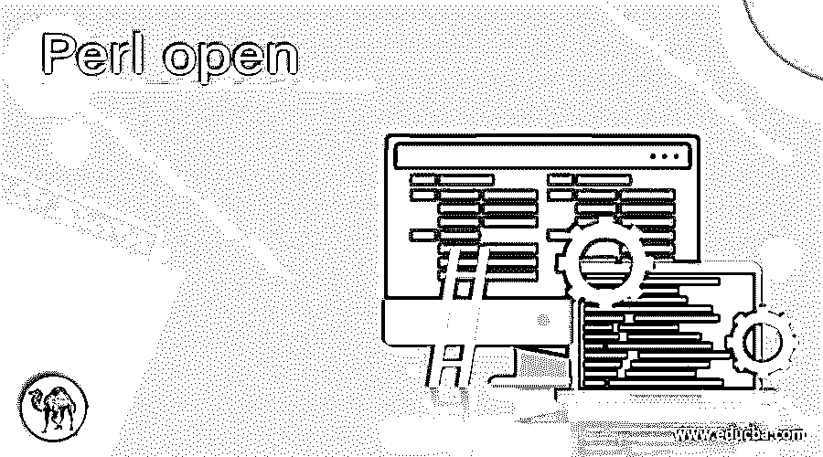
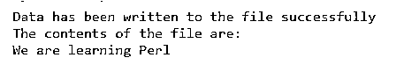
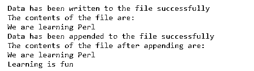

# 打开 Perl

> 原文：<https://www.educba.com/perl-open/>

## Perl open 简介

与文件相关联的变量称为文件句柄，根据我们打开文件的方式，通过它可以读取文件的内容或向文件写入数据。为了使用指定的文件句柄打开文件，我们使用了 Perl 中的 open()函数。它采用三个参数，即与要打开的文件相关联的 filehandle，指定文件是为读取数据、写入数据还是追加数据而打开的 mode，指定要打开的文件的位置的路径的 filepath。

**Perl 中声明 open()函数的语法如下:**

<small>网页开发、编程语言、软件测试&其他</small>

`Open(FileHandle, mode, filepath);`

其中 FileHandle 是与要打开的文件相关联的变量，

模式指定是否打开文件进行读取、写入或追加

filepath 指定要打开的文件的位置路径。

### Perl 中 open()函数的使用

Perl 中 open()函数的工作原理如下:

*   与文件相关联的变量称为文件句柄，通过它可以读取文件的内容或向文件写入数据，这取决于我们如何打开文件。
*   为了使用指定的文件句柄打开文件，我们使用了 Perl 中的 open()函数。
*   Perl 中的 open()函数有三个参数，即文件句柄、模式和文件路径。
*   FileHandle 是与要打开的文件相关联的变量。
*   模式指定是否打开文件进行读取、写入或追加。
*   操作数
*   操作数>指定如果文件存在，则以写模式打开文件，如果文件不存在，则创建一个新文件，并且当我们以写模式打开文件时，文件的内容被删除，并且从文件的开头开始写。
*   操作数>>指定文件以追加模式打开，通过该模式可以将数据追加到文件中的现有数据，但是现有数据不能更改。

### 例子

让我们讨论 Perl open 的例子。

#### 示例#1

**Perl 程序演示 open 函数的工作方式，以写模式打开文件，将数据写入文件，然后通过以读模式打开文件来读取文件内容，以显示文件内容:**

**代码:**

`use warnings;
use strict;
#The contents to be written to the file are stored in a string called datawrite
my $datawrite = <<END;
We are learning Perl
END
#a temporary file is created to write the data into the file
my $pathtothefile = "https://cdn.educba.com/tmp/file.txt";
#open function is used to open the file through file handler to write the data to the file
open(tow, '>', $pathtothefile) or die $!;
print tow $datawrite;
close(tow);
print "Data has been written to the file successfully\n";
#open function is used to open the file through file handler to read the data from the file
open(tor, '<', $pathtothefile) or die $!;
#displaying the contents of the file
print "The contents of the file are:\n";
while(<tor>){
print $_;
}
close(tor);`

上述程序的输出如下面的快照所示:

在上面的程序中，要写入文件的数据存储在一个名为 datawrite 的字符串中。然后我们利用 open 函数以 write 模式打开文件，将字符串中存储的数据写入文件。然后，我们再次使用 open 函数以读取模式打开文件，读取写入文件的数据，并将数据显示为屏幕上的输出。

#### 实施例 2

**Perl 程序演示 open 函数的工作方式，以写模式打开文件，将数据写入文件，然后通过以读模式打开文件来读取文件的内容，以显示文件的内容，然后以追加模式打开文件，将数据追加到文件中，然后在屏幕上显示追加的内容作为输出:**

**代码:**

`use warnings;
use strict;
#The contents to be written to the file are stored in a string called datawrite
my $datawrite = <<END;
We are learning Perl
END
#a temporary file is created to write the data into the file
my $pathtothefile = "https://cdn.educba.com/tmp/file.txt";
#open function is used to open the file through file handler to write the data to the file
open(tow, '>', $pathtothefile) or die $!;
print tow $datawrite;
close(tow);
print "Data has been written to the file successfully\n";
#open function is used to open the file through file handler to read the data from the file
open(tor, '<', $pathtothefile) or die $!;
#displaying the contents of the file
print "The contents of the file are:\n";
while(<tor>){
print $_;
}
close(tor);
#The contents to be appended to the file are stored in a string called datawrite1
my $datawrite1 = <<END;
Learning is fun
END
#open function is used to open the file through file handler to append the data to the file
open(tow, '>>', $pathtothefile) or die $!;
print tow $datawrite1;
close(tow);
print "Data has been appended to the file successfully\n";
#open function is used to open the file through file handler to read the data from the appended file
open(tor, '<', $pathtothefile) or die $!;
#displaying the contents of the file
print "The contents of the file after appending are:\n";
while(<tor>){
print $_;
}
close(tor);`

上述程序的输出如下面的快照所示:

在上面的程序中，要写入文件的数据存储在一个名为 datawrite 的字符串中。然后我们利用 open 函数以 write 模式打开文件，将字符串中存储的数据写入文件。然后，我们再次使用 open 函数以读取模式打开文件，读取写入文件的数据，并将数据显示为屏幕上的输出。然后，我们再次利用追加模式中的 open 函数将数据追加到文件中。然后，在读取模式下使用打开功能再次打开文件，以读取文件的附加内容并将其显示在屏幕上。

### 结论

在本文中，我们通过编程实例及其输出，从 open()函数的定义、语法和工作原理，学习了 Perl 中 open()函数的概念。

### 推荐文章

这是一个 Perl open 指南。这里我们讨论 Perl 中 open()函数的介绍和工作原理，并举例说明以便更好地理解。您也可以看看以下文章，了解更多信息–

1.  [Perl sort()](https://www.educba.com/perl-sort/)
2.  [Perl STDIN](https://www.educba.com/perl-stdin/)
3.  [Perl while 循环](https://www.educba.com/perl-while-loop/)
4.  [Perl 下一步](https://www.educba.com/perl-next/)

