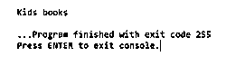

# Perl XML 解析器

> 原文：<https://www.educba.com/perl-xml-parser/>

## Perl XML 解析器简介

*   Perl XML Parser 是一个 Perl 模块，作为 James Clark 的 XML 解析器 expat 的接口。
*   拉里·沃尔最初制作了一个模型，克拉克·库珀继续推进这个有用的装置。
*   大多数需要 XML 解析器的 Perl 应用程序可能被分为两类。主要的用途是处理 XML 的显式使用，例如 RDF 或 MathML。对于这些，应该编写一个 XML::parser 的子类，使设备在理论上更接近当前任务。
*   第二种利用将在任何调整的 XML 档案上工作，以发现或筛选记录的片段，或者发现有关其结构的东西。

**语法:**

`use XML::Parser;`

<small>网页开发、编程语言、软件测试&其他</small>

这是语法，因为每当我们在 Perl 编程中使用 XML 解析器时，我们都必须使用这个语法来让解析器工作。

### XML 解析器如何在 Perl 中工作？

现在，我们看一个 XML 解析器如何在 Perl 中工作的例子。

**例子**

`use strict;
use warnings;
use XML::Simple;
my $xml = s{<booklist>
<writer>Span Rao</writer>
<book>
<name>Kids books</name>
<language>German</language>
<year>1995</year>
<country>Switzerland</country>
</book>
</booklist>};
my $data = XMLin($xml);
print $data->{book}{name}, "\n"`

**输出:**

首先，我们应该检查一下当前的 XML::Parser 接口。就像 James Clark 的 expat 库一样，XML::Parser 是一个基于场合的解析器。在解析报告之前，应用程序向解析器注册不同的场合监督。在这一点上，当解析报告时，当重要部分被感知时，控制器被考虑。

大多数工具只需要注册 3 个监督:开始、结束和角色控制器。当感知到 XML 开始标签时，考虑开始监督；结束控制器已经接近结束标记的确认，并且为组件内的非标记内容调用字符监督。下面的主模型使用默认控制器。

当解析器发现记录的一个段没有监管者被登记时(除了开始和结束标签之外)，考虑登记的默认控制器。到目前为止，你还不能为像注释和标记确认这样的东西注册控制器。然而，当这些事情被察觉时，登记的默认监督者将被考虑。当没有为特定场合登记的其他监督者时，默认控制器同样被调用(除了开始和结束标签)。我们将通过搜索默认控制器中以“

我最初设计这个模型的时候比较混乱，因为我不知道是否通过给监督者打一个电话就能不断传达意见。在我做了一些调查并看了一眼外籍人士守则后，我发现确实如此。如果 expat 曾经将一个注释分成多次对监管者的调用，我们需要检查该注释是否在当前调用中结束；在这一点上，我们需要设置一个横幅，表明我们在一个开放的评论中；无论我们是在寻找一个评论的开始还是结束，都依赖于这个横幅。

当我们启动一个 Elinfo 对象时，会产生三个未知的散列，分别针对监护人、年轻人和角色。当我们发现一个父表时，我们可以在父表中增加它的开口，并在父表的子表中增加我们的空间。此外，如果这个组件包含在其他组件中，那么这个组件就不能为空。

最后，我们管理剩余的边界，这是作为名称和价值集传递给这个组件的特征。我们将名称移到$att 变量中，用它来刷新我们的属性表，这时我们放弃了 quality worth。这样做，直到边界列表未被填充。

### 结论

因此，我想在结束时声明，XML remarks 实用程序打印出给定档案中的所有注释，并带有注释开始的行号。最后，它打印出找到的全部注释。在检查作为主要争用的文档是否存在之后，程序的主要部分使 parser 对象的 ErrorContext 替换设置为 2。这就要求在档案中的错误被解释为一个重大失误事件的一面或另一面的 2 行设置。注册了两个控制器，角色监督和默认监督。此时，记录被解析。所有的活动都在 default_handler 工作。

### 推荐文章

这是一个 Perl XML 解析器的指南。这里我们讨论 Perl 中的介绍、语法、XML 解析器如何工作？和代码实现示例。您也可以看看以下文章，了解更多信息–

1.  [Perl 或](https://www.educba.com/perl-or/)
2.  [Perl 打印哈希](https://www.educba.com/perl-print-hash/)
3.  [Perl 卸载](https://www.educba.com/perl-unshift/)
4.  [珠光打开](https://www.educba.com/perl-open/)

