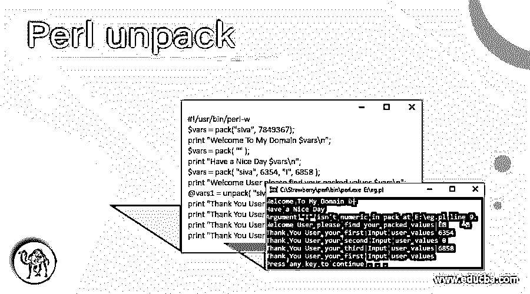
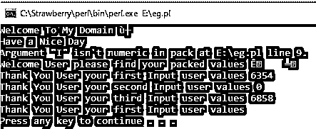
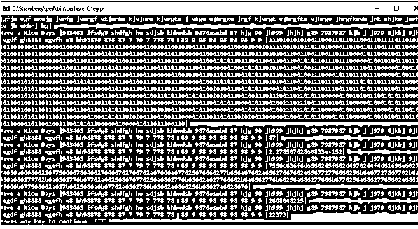
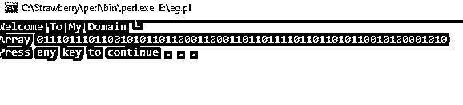

# Perl 解包

> 原文：<https://www.educba.com/perl-unpack/>

## Perl 解包简介

Perl unpack 被定义为可用于创建或扩展二进制数据类型值的函数之一。加密和解密技术都支持二进制数据。二进制数据是 0 和 1，因此它将用于密码和其他数据或信息集，这些数据或信息与内置模板格式相关，并在内置模板格式的帮助下转换为其他值列表。这些格式值存储在单独的变量中，它将在脚本函数中被更多地表示和调用。

**语法:**

<small>网页开发、编程语言、软件测试&其他</small>

在与 perl 脚本函数、关键字和其他内置语法相关的表示的帮助下，unpack 是可以将二进制数据类型值转换或变换为用户定义的数据类型模板的函数之一。类似下面的代码是在 perl 脚本中创建和使用解包函数的基本语法。

`#!/usr/bin/perl -w
$vars= pack(“”);
@vars1=unpack(“$vars”);`

—一些 Perl 脚本逻辑代码取决于需求—

在上面的代码中，我们使用 unpack()和 pack()函数将函数值存储在单独的变量中，这些值在脚本中加密和解密数据。

### Perl 中的 unpack 函数是如何工作的？

一般来说，perl 脚本不必以随机的方式访问内存，它有一些结构化的方式，并使用一些转换器(如 pack 和 unpack()函数)来表示相同的内容。当我们在脚本中选择 pack()方法时，用户输入值被转换为字节序列，它有一些默认的表示，它可以像模板一样被调用，如果我们使用 unpack()函数，它似乎是 pack()函数的相反过程，它将导出的值集转换为字节字符串的内容。如果值以字节格式存储在内存中，则它必须是排序格式，因此在这种情况下将进行排序。具有某些特定结构的二进制数据(每个值都有自己的引用)存储在内存中。这些值存储在堆栈存储器中，因此特定的微处理器架构假定并且只接受包含在堆栈帧中的有限字节集。因此，pack 函数包含列出值并打包或转换为字符串特定格式，但 unpack 仅采用带有字符串的格式，并在脚本中对带有指定格式和赋值变量的字符串进行一些分隔。

### 例子

让我们讨论一下 Perl 解包的例子。

#### 示例#1

**代码:**

`#!/usr/bin/perl -w
$vars = pack("siva", 7849367);
print "Welcome To My Domain $vars\n";
$vars = pack( "" );
print "Have a Nice Day $vars\n";
$vars = pack( "siva", 6354, "I", 6858 );
print "Welcome User please find your packed values $vars\n";
@vars1 = unpack( "siva", "$vars" );
print "Thank You User your first Input user values $vars1[0]\n";
print "Thank You User your second Input user values $vars1[1]\n";
print "Thank You User your third Input user values $vars1[2]\n";
print "Thank You User your first Input user values $vars1[3]\n";`

**输出:**

在上面的例子中，我们使用了 pack()和 unpack()函数，我们也可以使用像$vars 这样的变量。我们已经将值赋给了特定的变量，并根据他们的需求使用了 pack 和 unpack()函数。当我们使用 pack()函数时，用户输入应该被打包，打包后的值将显示在输出控制台上。我们使用了一些默认的字符，如 I，I，T，V 等。这些字符是用有符号整数、无符号整数、长整数、双精度、十六进制、字符串等数据类型来标识用户输入值的。

#### 实施例 2

**代码:**

`#! perl -w
use strict;
sub exa {
shift;
}
sub demo1 {
unpack "i*", shift;
}
sub demo2 {
unpack "V*", shift;
}
sub demo3 {
unpack "I*", shift;
}
sub demo4 {
unpack "a*", shift;
}
sub demo5 {
unpack "b*", shift;
}
sub demo6 {
unpack "c*", shift;
}
sub demo7 {
unpack "d*", shift;
}
sub demo8 {
unpack "h*", shift;
}
sub demo9 {
unpack "l*", shift;
}
sub demo10 {
unpack "n*", shift;
}
sub finsa{
my $vars= shift;
my $vars1 = "Welcome To My DOmain wdejfh bwefvhd gdv gv jgfjw egf wkejg jerfg jewrgf ekjwrhw kjejhrw kjergkw j ehgw ejhrgke jrgf kjergk ejhrgfkw ejhrge jhrgfkweh jrk ehjkw jerhke jh ekhrj hg";
my $vars2 = "983465 ifsdg8 shdfgh he sdjsb khbwdsh 9876asnbd 87 hjg 90 jh999 jhjhj g89 7987987 hjh j j979 8jkhj 9jh egdf gh8888 wgefh w8 hh98878 878 87 7 79 7 778 78 89 9 98 98 98 98 98 9 9 ";
my $vars3 = $vars->($vars1);
if ($vars3 =~ /^$vars2/i) {
print "Welcome Users\n";
}
else {
print "Have a Nice Days |$vars2|$vars3|\n";
}
}
finsa \&exa;
finsa \&demo1;
finsa \&demo2;
finsa \&demo3;
finsa \&demo4;
finsa \&demo5;
finsa \&demo6;
finsa \&demo7;
finsa \&demo8;
finsa \&demo9;
finsa \&demo10;`

**输出:**

在第二个示例中，我们使用 pack and unpack()函数和单独的子类，每个类都调用了名为 exa 的父子类。然后，我们使用 unpack()函数，默认字符及其功能，这些将通过使用名为 finsa 的主要类别进行验证。它将通过用户输入进行验证。

#### 实施例 3

**代码:**

`#!/usr/bin/perl -w
$vars = pack("B*", 192, 168,42, 76);
print "Welcome To My Domain $vars\n";
@vars1 = unpack("B*", "welcome\n");
print "Array $vars1[0]\n";`

**输出:**

最后一个例子我们在 ip 号中使用了基本的 pack()和 unpack()函数。基本上是借助于。“运算符或符号我们可以拆分这些数字，并将其设置为系统的 ip 地址。因此，在这种情况下，解包用于 Perl 脚本中该任务的安全目的。

### 结论

最后，我们使用的 Perl 具有默认的控制基本结构、功能、用户输入和输出操作，这些是通过脚本保存的概念，用于根据用户需求创建任务。在二进制数据集中，pack 和 unpack()函数是脚本中最重要的功能。

### 推荐文章

这是一个 Perl 解包指南。这里我们讨论一下 Perl 中的介绍和 unpack 函数是如何工作的？用例子来更好的理解。您也可以看看以下文章，了解更多信息–

1.  [Perl for 循环](https://www.educba.com/perl-for-loop/)
2.  [Perl 读取文件](https://www.educba.com/perl-read-file/)
3.  [Perl 哈希](https://www.educba.com/perl-hash/)
4.  [Perl 子程序](https://www.educba.com/perl-subroutine/)

