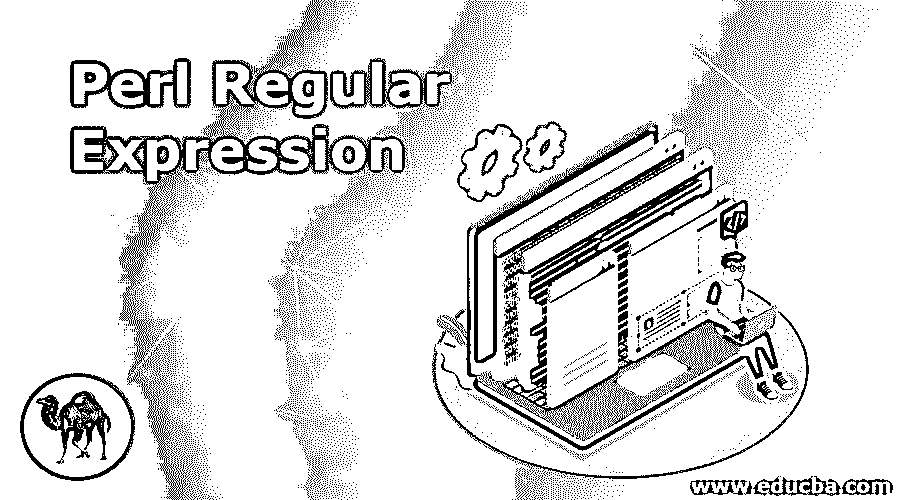
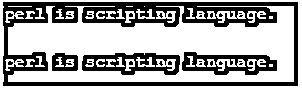

# Perl 正则表达式

> 原文：<https://www.educba.com/perl-regular-expression/>

## Perl 正则表达式简介

Perl 正则表达式用于定义 Perl 中字符串或字符的模式，使用 Perl 中的正则表达式我们可以定义任何字符串或字符的模式。正则表达式类似于 shell 脚本或 Linux 系统中的 awk、grep 和 sed 命令，语法也类似于 awk、grep 和 sed 命令。在 Perl 中，正则表达式对于定义任何字符串或字符的模式非常重要。在 Perl 中应用正则表达式的基本方法是使用模式绑定运算符=~ and！~，第一个运算符是赋值运算符。

### Perl 中的正则表达式是如何工作的？

下面是 Perl 中正则表达式的工作原理。Perl 中主要有三种正则表达式操作符，如下所示。

<small>网页开发、编程语言、软件测试&其他</small>

*   匹配正则表达式运算符
*   替换正则表达式运算符
*   音译正则表达式运算符

#### 1.Perl 中的匹配运算符

下面是 Perl 中可用的匹配运算符修饰符。

*   CG–用于在全局匹配失败时继续搜索。
*   g–用于搜索所有匹配项。
*   I–它用于搜索所有不区分大小写的匹配项。
*   m–它与新的线边界一起使用，而不是一个连接边界。
*   o–在 Perl 中，它只允许表达式求值一次。
*   s——它用于匹配 Perl 中的换行符。
*   x–在表达式中使用空格。

我们用过 Perl 匹配运算符=~ and！~匹配字符串中给定的单词。

#### 2.Perl 中的替换运算符

*   Perl 中的替换运算符只是匹配运算符的扩展。
*   它用于将替换的文本与我们在代码中使用的新文本进行匹配。
*   下面是 Perl 中替换运算符的语法。

**语法**

`s/old_pattern/new_pattern/;`

#### 3.Perl 中的翻译运算符

*   翻译操作符类似于 Perl 中的替换操作符。但是在正则表达式或替换值搜索中不使用转换。
*   下面是 Perl 中翻译运算符的语法如下。

**语法—**

`tr/old_letter/new_letter/;`

*   转换和替换类似于 Linux 中使用的 sed 命令。
*   Perl 中的正则表达式是一种模式，它提供了一种灵活简洁的方法来匹配 Perl 中的字符串。
*   Perl 中的正则表达式也称为 regexp 或 regex。
*   正则表达式类似于 shell 脚本或 Linux 系统中的 awk、grep 和 sed 命令，语法也类似于 awk、grep 和 sed 命令。
*   Perl 正则表达式用于定义 Perl 中字符串或字符的模式。在 Perl 中使用正则表达式，我们必须定义任何字符串或字符的模式。
*   在 Perl 中应用正则表达式的基本方法是使用模式绑定运算符=~ and！~，第一个运算符是赋值运算符。
*   正则表达式在 Perl 中定义任何字符串或字符的模式是非常重要和有用的。
*   Perl 中的正则表达式既可以复杂也可以简单。这取决于我们在代码中使用的模式。
*   我们可以使用 m 操作符来构造正则表达式模式。在这个正则表达式模式中，所需的模式简单地放在两个斜杠和绑定操作符之间。
*   在 Perl 中使用绑定操作符之前，我们需要在 Perl 中定义一个构建模式。绑定操作符在 Perl 中非常重要和有用。
*   在 Perl 中，我们通常将绑定操作符与 **m** 操作符一起使用。因为它适合匹配所需的模式。
*   正则表达式操作符主要用于将字符串与 Perl 中的正则表达式进行匹配。
*   在正则表达式中，左边的语句将包含一个与右边的模式匹配的字符串。
*   在 Perl 中，正则表达式求反的 regex 操作符用于检查字符串是否等于右边指定的正则表达式。

### 用 Perl 实现正则表达式的例子

下面是例子如下。

#### 例 1。Perl 匹配运算符(=~)

匹配运算符用于将单词与给定的字符串进行匹配。下面的例子显示了如下的匹配运算符。

在下面的例子中，我们使用字符串名称作为“匹配操作符 Perl”。

**代码:**

`$line = "Matching operator perl.";
if ($line =~ /perl/){
print "Matched\n";
} else {
print "Not Matched\n";
}
if ($line =~ /Linux/){
print "Matched\n";
} else {
print "Not Matched\n";
}`

**输出:**

#### 例 2。Perl 匹配运算符(！~)

这个运算符与 Perl 中的运算符=~相反。以下示例显示了匹配运算符(！idspnonenote)。~)如下。

在下面的例子中，我们使用字符串名称作为“匹配操作符 Perl”。

**代码:**

`$line = "Matching operator perl.";
if ($line !~ /perl/){
print "matched\n";
} else {
print "Not Matched\n";
}
if ($line !~ /Linux/){
print "Matched\n";
} else {
print "Not Matched\n";
}`

**输出:**

#### 例 3。Perl 匹配运算符($_)

我们可以在 Perl 中用$_ 匹配字符串。以下示例显示匹配运算符($_)如下。

在下面的例子中，我们使用字符串名称作为“匹配操作符 Perl”。

**代码:**

`$_ = "Matching operator perl.";
if (/perl/) {
print "Matched\n";
}
else {
print "Not Matched\n";
}
if (/Perl/) {
print "Matched\n";
}
else {
print "Not Matched\n";
}`

**输出:**

#### 实施例 4。Perl 替换运算符

Perl 替换操作符是 Perl 中匹配操作符的扩展。下面的例子显示了 Perl 替换操作符如下。

我们用 s/ /替换值；在 Perl 中。

**代码:**

`$sub_line = "perl is programming language.";
$sub_line =~ s/programming/scripting/;
print "$sub_line\n";
print"\n";
$sub_line = "perl is scripting language.";
$sub_line =~ s/programming/scripting/g;
print "$sub_line\n";`

**输出:**

#### 例 5。Perl 翻译运算符

翻译操作符类似于 Perl 中的替换操作符。下面的例子显示了 Perl 替换操作符如下。

**代码:**

`$tr_line = "perl is known as scripting language.";
$tr_line =~ tr/l/z/;
print "$tr_line\n";`

**输出:**

### 结论

正则表达式在 Perl 中定义任何字符串或字符的模式是非常重要和有用的。正则表达式类似于 shell 脚本或 Linux 操作系统中的 awk、grep 和 sed 命令。正则表达式语法也类似于 awk、grep 和 sed 命令。

### 推荐文章

这是一个 Perl 正则表达式指南。这里我们讨论正则表达式在 Perl 中是如何工作的，并通过例子来更好地理解。您也可以阅读以下文章，了解更多信息——

1.  [Perl 变量](https://www.educba.com/perl-variables/)
2.  [什么是 Perl？](https://www.educba.com/what-is-perl/)
3.  [如何安装 Perl](https://www.educba.com/install-perl/)
4.  [Perl 命令](https://www.educba.com/perl-commands/)

