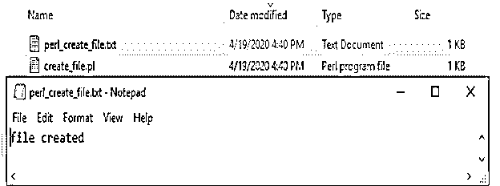
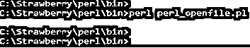
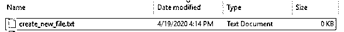
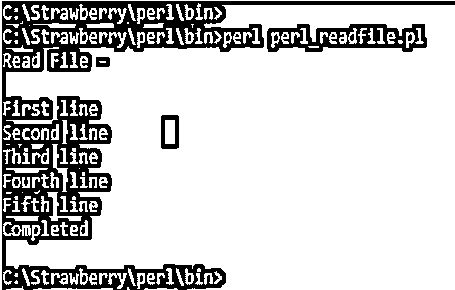
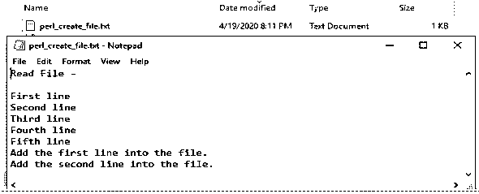
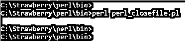
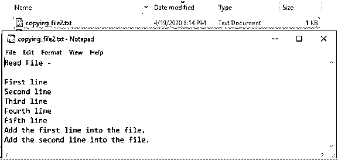

# Perl 中的文件处理

> 原文：<https://www.educba.com/file-handling-in-perl/>

## **Perl 文件处理简介**

文件处理是 Perl 中最重要的任务，它是与文件名相关联的文件的内部结构。在 Perl 中使用文件处理可以打开、创建、读取、写入和关闭文件，在 Perl 中打开文件使用了>、<和>、>运算符。换句话说，Perl 中的文件处理不过是文件的连接，用来修改文件的内容，文件名被提供给访问文件的连接。Perl 中有三个可用的文件句柄:STDERR、STDOUT 和 STDIN。

### Perl 中的各种文件操作

Perl 文件句柄用于文件创建、打开、读取、写入、关闭和复制文件。Perl 中可用的文件操作如下:

<small>网页开发、编程语言、软件测试&其他</small>

#### 1.Perl 创建文件

*   我们将创建一个文件名“perl_create_file ”,以定义一个在 perl 中创建文件的例子。
*   我们使用了$fh(这是一个文件处理程序标量变量)变量，它是在 Perl 的 open 函数中定义的。
*   在下面的例子中，我们可以在 open 函数中定义标量变量。
*   我们使用“>”符号来打开文件以进行写操作。此外，我们还使用了像“$create_file”这样的变量。该变量用于定义文件的路径或位置。
*   打印功能用于将任何文本打印到文件中。我们已经使用$fh 变量打开和关闭了文件。
*   以下示例显示了 Perl 中的创建文件操作如下。

**代码:**

`use warnings;
use strict;
## Create a file name as perl_create_file
my $create_file = 'perl_create_file.txt';
## Opening perl_create_file file for write operation.
open(my $fh, '>', $create_file) or die "File is not opening '$create_file' $!";
## Writing below contents in perl_create_file file
print $fh "file created\n";
## Closing the file.
close $fh;
print "file closed\n";`

**输出:**

#### 2.Perl 打开文件

我们用下面的操作符在 Perl 中打开一个文件如下。我们将逐一讨论如下。

*   <
*   >
*   +>和+<
*   >

**1。<T1】**

*   “
*   下面的例子显示了“

**代码:**

`open FILE, "<", "perl_create_file.txt" or die $!`

**2。>T1】**

*   ">"符号主要用于打开一个现有的文件，或者创建一个新文件，如果它在 perl 中不存在的话。使用该操作符时，文件将以写模式打开。
*   下面的例子显示了">"操作符如下。

**代码:**

`open FILE, ">", "create_new_file.txt" or die $!`

**3。+ >和+ <**

*   和
*   以下示例显示了 perl 中的+>和+

**代码:**

`open FILE, "+<", "perl_create_file.txt" or die $!`

`open FILE, "+>", "perl_create_file.txt" or die $!`

**4。>T3**

*   ">>"这个符号在 perl 中基本上是用来读取和追加文件内容的。
*   下面的例子显示了>>运算符如下。

**代码:**

`open FILE, "+>", "perl_create_file.txt" or die $!`

#### 3.Perl 读取文件

在 Perl 语言中，我们可以使用读文件操作一次读取单行或多行。

*   **从文件**中读取单行

下面的例子显示了从文件中读取单行如下。

**代码:**

`use strict;
use warnings;
## Define file name for reading operation.
my $read_file = 'perl_create_file.txt';
## Opening perl_create_file file for read operation.
open(my $fh, '<', $read_file) or die "file is not opening '$read_file' $!";
my $row = <$fh>;
print "$row\n";
print "Completed\n";`

**输出:**

*   **从文件中读取多行内容**

下面的例子显示了从文件中读取多行如下。

**代码:**

`use strict;
use warnings;
## Define file name for reading operation.
my $read_file = 'perl_create_file.txt';
## Opening perl_create_file file for read operation.
open(my $fh, '<', $read_file) or die "file is not opening '$read_file' $!";
##Pring multiple lines.
while (my $row = <$fh>) {
chomp $row;
print "$row\n";  }
print "Completed\n";`

**输出:**

#### 4.Perl 写文件

在用 Perl 写文件时，最后一行被添加到文件中。下面的例子显示了用 Perl 写一个文件如下。

**代码:**

`my $write_file = 'perl_create_file.txt';
## Opening perl_create_file file for write operation.
open (FILE, ">> $write_file") || die "problem in file opening $write_file\n";
##Print the first line in the file.
print FILE "Add the first line into the file.\n";
## write a first array of lines in to the file.
print FILE @lines1;
##Print the second line in the file.
print FILE "Add the second line into the file.";
# write a second array of lines in to the file.
print FILE @lines2;`

**输出:**

#### 5.Perl 关闭文件

*   关闭文件操作用于在 perl 中关闭文件。我们在 Perl 中使用了关闭函数来关闭文件。
*   关闭文件在 perl 中不是强制操作，如果我们没有在代码中定义关闭函数，Perl 会自动关闭文件。
*   下面的例子显示了 Perl 中的关闭文件操作如下。

**代码:**

`my $close_file = 'perl_close_file.txt';
## Opening perl_create_file file for close operation.
open (FILE, ">> $close_file") || die "problem in file opening $close_file\n";
##Close file.
close perl_close_file.txt;`

**输出:**

#### 6.Perl 复制文件

下面的例子显示了 Perl 中的关闭文件操作如下。复制操作会将文件的内容从一个文件复制到另一个文件。

**代码:**

`open(Datafile1, "<perl_create_file.txt");
open(Datafile2, ">copying_file2.txt");
while(<Datafile1>)
{
print Datafile2 $_;
}
close Datafile1;
close Datafile2;`

**输出:**

### 结论

文件处理在每种语言中都非常重要，在 Perl 中我们可以打开、创建、读取、写入和关闭文件。Perl 中有三个可用文件处理程序:STDERR、STDOUT 和 STDIN。文件处理是与文件名相关联的文件的内部结构。

### 推荐文章

这是一个 Perl 文件处理指南。在这里，我们讨论了 Perl 中文件处理的简要概述及其不同的例子和代码实现。您也可以浏览我们推荐的其他文章，了解更多信息——

1.  [什么是 Perl？](https://www.educba.com/what-is-perl/)
2.  [Perl 下一步](https://www.educba.com/perl-next/)
3.  [JavaScript 中的文件处理](https://www.educba.com/file-handling-in-javascript/)
4.  [c++中的文件处理](https://www.educba.com/file-handling-in-c-plus-plus/)

