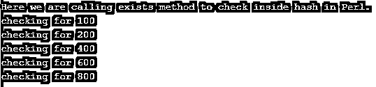
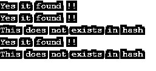

# Perl 存在

> 原文：<https://www.educba.com/perl-exists/>

## 存在对 Perl 的介绍。

顾名思义 exists 函数是用来检查元素的存在性的。简而言之，如果我们想检查数组中的元素是否存在，我们可以使用这个函数来检查它。这个函数并不仅限于数组，通过使用它我们还可以检查散列元素，所以 exists 函数在 Perl 中既可以用于数组也可以用于散列；此外，它是一个内置函数，非常容易使用，我们不需要任何外部库来使用它。在下一节中，我们将更详细地讨论这个函数。

**语法**

<small>网页开发、编程语言、软件测试&其他</small>

它是一个带参数检查数组和 hash 中值的函数；我们可以将表达式作为参数传递到函数中。让我们看看它的语法细节，以便更好地理解如何在编程中使用它，见下文；

`exists(value_to_check)`

在上面的语法中，正如你所看到的，我们在这个函数中传递一个值作为参数，这样它将根据散列或数组计算值；如果值存在，它将返回 1 否则 0。在下一节中，我们将更详细地讨论方法签名。

### Perl 中的 exists 函数是如何工作的？

我们知道现有的函数用于检查 Perl 中给定数组或散列中的元素。如果我们希望在数组或散列中存在某些特定值的情况下执行任何特定的操作，这个函数就很重要。同样，我们可以根据我们得到的结果应用一些条件；这可以相应地进行。在这一节中，我们将根据 Perl 文档讨论 exists 函数的签名。此外，我们将讨论返回类型和一个示例，以详细理解其工作原理。让我们从下面的方法签名开始。

### 方法签名

**1。exists(value):** 通过使用这个函数，我们可以在 Perl 中检查数组或 hash 内部的值。根据它的签名，它接受一个参数作为输入。我们可以在 ant 数组或 Perl 中的 hash 对象上调用这个方法。在这之后，我们可以在给定的数组或散列中传递我们想要检查的值。

**2。返回类型:**该函数根据结果返回 0 或 1 的整数值。如果在数组或哈希中找到该值，它将返回“1”；如果该值不在给定的数组或哈希中，它将返回“0”。

现在我们将看到 exists 函数的一个实践例子，它是如何在 Perl 内部工作的；要更好地理解它，请看下文；

`my %myhash = (100 => 'Hello', 200 => 'bye', 300 => 'hello 3', 400 => 'hello 4');
print "calling function here " if exists $myhash{400};`

正如你在上面几行代码中看到的，我们在 Perl 中使用 exists 函数来检查数组和 hash 中的元素。但是在这个例子中，我们检查的是散列。首先，我们创建了一个 hash 对象，并分配了几个值作为键值对。在这里，我们将键保存为整数，值保存为字符串，如 100、200、300、400 等等。在这之后，我们在 hash 对象上调用 exists 函数来检查其中的值。我们要检查的值我们已经把它放在花括号' {} '中返回了，之后我们将在 hash 中检查这个值并把结果返回给我们。这样，我们可以在 Perl 中检查 hash 或 array 中的元素。

在 Perl 中使用 exists 函数时要记住的几点；

1.因为我们知道它是 Perl 的内置函数，所以我们不需要包含任何库就可以在 Perl 中使用这个函数。

2.这个函数将一个参数作为输入参数，它将决定在给定的数组或散列中需要检查什么值。

3.它将返回一个整数值 1 或 0，但不是我们搜索的值。

### 例子

下面举几个例子

#### 示例#1

在本例中，我们创建了一个散列对象并分配了一些值。之后，我们使用 Perl 中可用的 exists 函数来检查这些值。这是一个简单的例子，供初学者在实际使用中开始使用。

**代码:**

`my %myhash = (100 => 'Hello', 200 => 'bye', 300 => 'hello 3', 400 => 'hello 4', 500 => 'hello 5', 600 => 'hello 6', 700 => 'hello 7', 800 => 'hello 8');
print "Here we are calling exists method to check inside hash in Perl. \n";
print "checking for 100 \n" if exists $myhash{100};
print "checking for 200 \n" if exists $myhash{200};
print "checking for 400  \n" if exists $myhash{400};
print "checking for 600 \n" if exists $myhash{600};
print "checking for 800 \n" if exists $myhash{800};`

**输出:**

#### 实施例 2

在这个例子中，我们试图通过使用 if 和 else 块来打印一些东西，以使函数更具交互性。对于初学者来说，这将更清楚地了解内部发生了什么，它是如何工作的，以及它正在打印什么。是否计算正确。

**代码:**

`my %myhash = (100 => 'Hello', 200 => 'bye', 300 => 'hello 3', 400 => 'hello 4', 500 => 'hello 5', 600 => 'hello 6', 700 => 'hello 7', 800 => 'hello 8');
if(exists($myhash{600}))
{
print "Yes it found !! \n";
}
else
{
print "This does not exists in hash \n"
}
if(exists($myhash{200}))
{
print "Yes it found !! \n";
}
else
{
print "This does not exists in hash \n"
}
if(exists($myhash{1000}))
{
print "Yes it found !! \n";
}
else
{
print "This does not exists in hash \n"
}
if(exists($myhash{300}))
{
print "Yes it found !! \n";
}
else
{
print "This does not exists in hash \n"
}
if(exists($myhash{180}))
{
print "Yes it found !! \n";
}
else
{
print "This does not exists in hash \n"
}`

**输出:**

### 结论

因此，通过使用 exist 函数，我们可以在 Perl 中检查数组或散列中的元素。这个函数非常容易使用，可读性强，并且只接受一个参数。我们可以在 Perl 中的数组或散列上调用这个函数。利用这一点，我们可以检查给定输入中的任何元素。

### 推荐文章

这是一个 Perl 存在的指南。这里我们讨论 exists 函数如何在 Perl 中工作，以及代码和输出。您也可以阅读以下文章，了解更多信息——

1.  [Perl 不等于](https://www.educba.com/perl-not-equal/)
2.  [Perl sort()](https://www.educba.com/perl-sort/)
3.  [Perl chop()](https://www.educba.com/perl-chop/)
4.  perl eval

