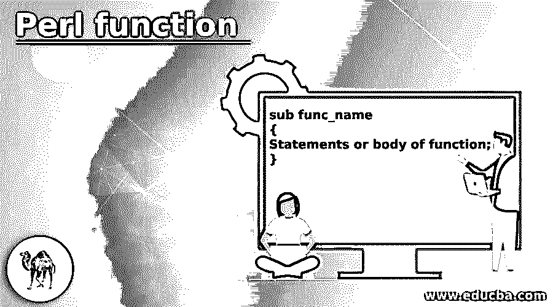
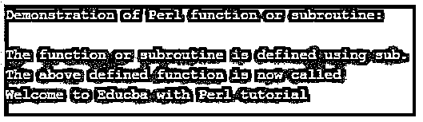
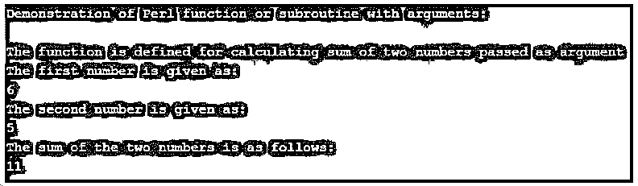
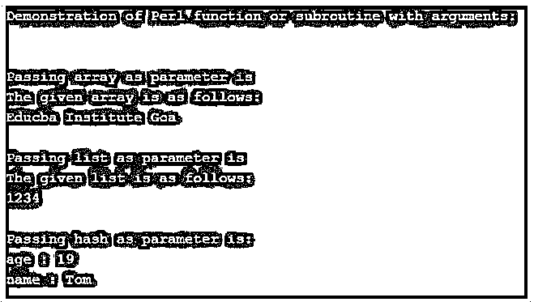

# Perl 函数

> 原文：<https://www.educba.com/perl-function/>

## Perl 函数简介

在 Perl 中，函数被定义为一组可以在 Perl 程序中编写的逻辑代码，而 Perl 程序需要反复编写相同的逻辑代码。因此，我们不是重写程序中的逻辑代码，而是将这个逻辑代码写在函数内部，使用提供给这个函数的名称，并在需要执行代码时使用同一个函数名称在程序中调用它。在 Perl 编程中，语言函数也被称为子例程或方法，意思相同，不像在其他编程语言中，子例程与函数和方法是不同的。一般来说，Perl 函数被定义为包含子代码或逻辑代码集的函数，用于执行某些任务，并且可以在程序中重用。

### Perl 函数的使用示例

在本文中，我们将看到如何在 Perl 编程中声明和使用该函数。Perl 中的函数或子例程被定义为与其他编程语言中的其他函数相同。子例程包含一组需要在程序中反复执行的逻辑代码。使用子例程，当我们想执行这个逻辑代码而不需要重复编写整个逻辑代码时，我们调用子例程。因此，子程序一旦写入整个程序就可以重复使用。在 Perl 中，子例程或函数是使用子例程名前的“sub”关键字创建或声明的，该子例程名是程序中重用的逻辑代码集。在 Perl 中，Perl 编译器首先编译程序，然后执行程序，而不考虑子例程或函数的声明。

<small>网页开发、编程语言、软件测试&其他</small>

在 Perl 中，函数或子例程像在其他编程语言中一样，我们可以将任意数量的参数传递给子例程，也可以将列表、数组、散列传递给 Perl 中的子例程，但是返回值时，我们可以返回不超过一个的数组和散列，这可能会导致数组或散列的身份不明确。

现在让我们看看用 Perl 定义子例程的语法:

**语法:**

`sub func_name
{
Statements or body of function;
}`

在上面的语法中，我们可以看到无论何时我们都在定义子例程；我们首先在子例程或函数名前使用“sub”关键字，需要反复执行的代码集写在花括号内，这就是所谓的子例程或函数体。上述语法用于定义或声明子例程。

现在让我们看看调用子程序的语法。

**语法:**

`func_name(parameter_lst);`

如果我们使用低于 5 的 Perl 版本，上面的语法会有所不同，因为上面的调用子例程的语法只在 Perl 版本 5 和更高版本中起作用，如果我们使用低于 5 的版本，那么我们需要在 func_name 前面使用一个&符号，例如" &func_name(parameter_lst)"，通常不使用它，因为它意味着绕过子例程原型，因此不建议使用。

现在让我们看几个如何在 Perl 中定义函数或子例程的例子:

#### 示例#1

**代码:**

`#!/usr/bin/perl
print "Demonstration of Perl function or subroutine:";
print "\n";
print "\n";
print "The function or subroutine is defined using sub.";
print "\n";
sub func_name {
print "Welcome to Educba with Perl tutorial";
print "\n";
}
print "The above defined function is now called ";
print "\n";
func_name();`

**输出:**

在上面的程序中，我们可以看到我们在子例程名称前使用关键字“sub”定义了子例程或函数，在上面的代码中，子例程名称是“func_name ”,在函数内部，我们只是打印消息，然后使用其名称调用子例程，在上面的代码中，我们定义了没有参数的子例程。

现在我们将看到另一个例子，它使用传递给已定义的函数或子例程的参数。

#### 实施例 2

**代码:**

`#!/usr/bin/perl
print "Demonstration of Perl function or subroutine with arguments:";
print "\n";
print "\n";
print "The function is defined for calculating sum of two numbers passed as argument";
print "\n";
sub add_func
{
$op1 = $_[0];
print "The first number is given as: ";
print "\n";
print $op1;
print "\n";
$op2 = $_[1];
print "The second number is given as:";
print "\n";
print $op2;
print "\n";
return ($op1 + $op2);
}
$res_sum = add_func(6, 5);
print "The sum of the two numbers is as follows:";
print "\n";
print $res_sum;`

**输出:**

在上面的程序中，我们可以看到我们已经定义了一个函数，它将计算给定数字的总和，并且这些数字在被调用时作为参数传递给该函数。在上面的代码中，我们可以看到传递的两个数字被打印出来，在函数中，我们使用 return 语句返回这两个数字的和。然后当我们调用这个函数并传递任意两个需要相加的数字时。

现在我们将看到另一个例子，我们可以将列表、数组和散列作为参数传递。

#### 实施例 3

**代码:**

`#!/usr/bin/perl
print "Demonstration of Perl function or subroutine with arguments:";
print "\n";
print "\n";
sub arr_func
{
print "The given array is as follows:";
print "\n";
print @arr1;
print "\n";
return;
}
sub lst_func
{
@list = @_;
print "The given list is as follows:";
print "\n";
print @list;
print "\n";
}
sub hash_func
{
(%hash) = @_;
foreach $key (keys %hash )
{
$val = $hash{$key};
print "$key : $val\n";
}
}
@arr1 = ("Educba ", "Institute ", "Goa");
@lst1 = (1, 2, 3, 4);
%hash1 = ('name' => 'Tom', 'age' => 19);
print "\n";
print "Passing array as parameter is";
print "\n";
arr_func(@arr1);
print "\n";
print "Passing list as parameter is";
print "\n";
lst_func(@lst1);
print "\n";
print "Passing hash as parameter is:";
print "\n";
hash_func(%hash1);
print "\n";`

**输出:**

在上面的程序中，我们可以看到我们有一个定义好的数组，list 和 hash。在上面的代码中，我们可以看到我们使用了“@”来声明列表和数组，使用了“%”。在上面的代码中，我们只是将这些数组、列表和散列传递给所定义的子例程或函数。

### 结论–Perl 函数

在本文中，我们得出结论，Perl 中的函数或子例程被定义为用于在程序中反复执行某些任务的一组代码，因此，要使用这组代码，我们在函数或子例程中编写这段代码，并按其名称调用该函数或子例程。本文还看到了不同的例子，展示了如何通过传递参数来定义函数或子例程，而不传递参数，传递列表、数组和散列作为参数。

### 推荐文章

这是一个 Perl 函数的指南。为了更好地理解，我们在这里讨论 Perl 函数的介绍和工作原理。您也可以看看以下文章，了解更多信息–

1.  [Perl 哈希](https://www.educba.com/perl-hash/)
2.  [Perl 正则表达式](https://www.educba.com/perl-regular-expression/)
3.  [Perl for 循环](https://www.educba.com/perl-for-loop/)
4.  [Perl sort()](https://www.educba.com/perl-sort/)

