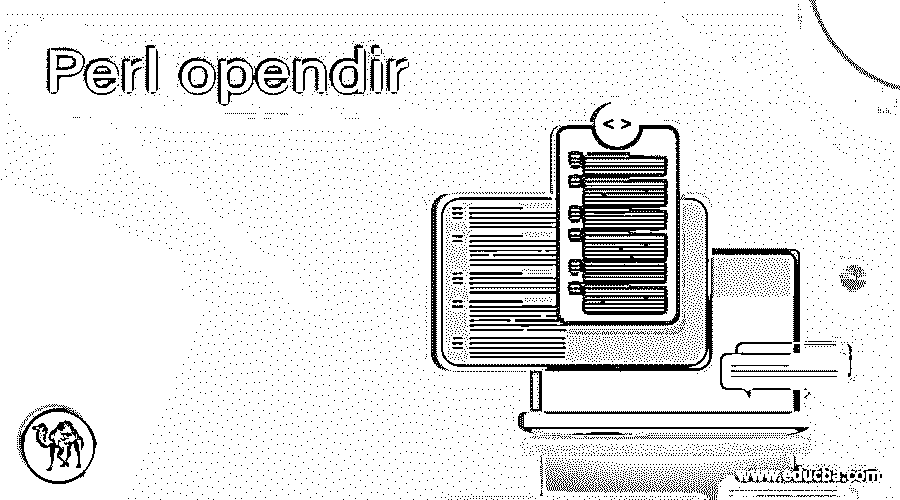
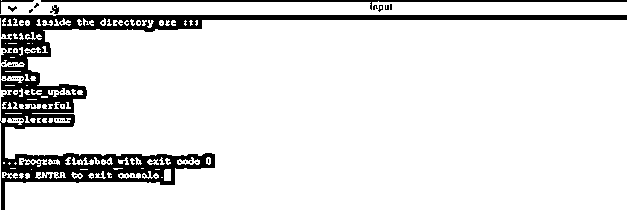

# Perl opendir

> 原文：<https://www.educba.com/perl-opendir/>

## Perl opendir 简介

在 Perl 中，我们可以通过使用 Perl 目录函数来处理目录上的操作；在这个的帮助下，我们可以打开、阅读、关闭等。opendir 是 Perl 中打开目录的函数。它与两个以上的变量一起使用，如 DIRHANDLE，EXPR；第一个代表目录句柄，第二个代表表达式。同样，这个函数根据我们得到的结果返回一个布尔值。在下一节中，我们将更详细地讨论 opendir 函数，以便更好地理解。

**语法**

<small>网页开发、编程语言、软件测试&其他</small>

正如我们已经看到的，opendir 是一个用于在 Perl 中处理目录操作的函数。我们有不同的功能可以对目录进行操作。让我们来看看语法，以便更好地理解这个函数的细节，见下文；

`opendir DIRHANDLE, EXPR`

根据 Perl 文档，这是 opendir 函数的基本语法。这里我们有两个参数作为输入。一个是目录句柄，另一个是表达式。让我们来看一个练习语法，以便更好地理解下面的函数:

`opendir(DIR, 'Your_directory_name_here') or die;`

在下一节中，我们将更详细地了解如何在用 Perl 编程时使用它。

### opendir 函数在 Perl 中如何工作？

到目前为止，我们知道 opendir 函数用于打开 Perl 中的目录。在 Perl 编程语言中，我们有不同的函数可以用来处理对目录的操作。如果我们想在 Perl 中打开一个目录，那么我们可以通过指定目录路径来使用这个函数。让我们看看 Perl 中这个函数的方法签名，见下文；

**方法签名:**

`opendir (DIR, $directory) or die;`

正如我们在上面的方法签名中看到的，它在这里接受两个参数作为输入。第一个参数是目录句柄，方法中的第二个参数指定系统中的目录路径。打开目录后，我们还可以读取目录中所有可用的文件和 sun 文件夹。为此，我们可以使用 Perl 目录的 reader 函数。然后，我们可以轻松地读取当前指向的目录句柄中所有可用的文件。现在，我们将看到一段示例代码，通过提及路径来实际使用或练习 Senecio 下面我们开始看；

**举例:**

`#!/usr/bin/perl
my $mysample = '/your/path/to/directory. ..';
opendir (DIR, $mysample) or die "Error occured, $!";
while ($myfile = readdir DIR) {
// our logic goes here //
// here we can read the files
}`

正如您在上面几行代码中看到的，我们使用 opendir 函数在 Perl 中打开目录并读取文件；我们在 Perl 中提供了 readdir 函数。首先，我们创建一个变量，它指向我们实际想要读取的目录路径，命名为“my sample”。然后，我们调用 opendir 函数对目录执行操作。在这个函数中，我们传递两个参数作为输入。第一个参数是处理输出的目录句柄，第二个参数是系统的目录路径。在这之后，我们将在 DIR first 参数中得到所有结果；我们可以通过使用它来读取当前目录指针中的目录或文件。所以我们使用 Perl 目录中的 readdir 函数来读取循环内部的目录结果；我们可以用我们的逻辑去阅读它们。这样，我们在 Perl 中使用的是 opendir 函数；通过使用它，我们可以打开目录并读取文件。

如果我们谈论返回类型，我们有下面提到的 Perl 中的这个函数的要点:

*   返回类型:这个函数返回一个布尔值作为结果；如果成功，它将返回 true。如果失败，它将返回 false 作为值。

在 Perl 中使用 opendir 函数时要记住的几点:

*   该功能用于打开目录。
*   这意味着我们现在可以访问当前搜索目录中的文件或 sun 目录。
*   这是通过 Perl 编程访问目录信息和其他 stiff 的另一种方法；这将帮助我们从 Perl 代码中读取文件。
*   如果函数没有找到提到的路径，我们也可以返回一些错误消息。我们可以使用一个名为“die”的关键字；这可以用来抛出或返回一些用户容易理解的错误消息。
*   如果没有找到提到的目录，甚至我们也没有使用“die”抛出任何错误，那么它将在运行时抛出一个异常，说“没有找到这样的文件或目录”。
*   为了读取和关闭目录，我们可以使用 Perl 目录库中的 readdir 和 closedir 函数。
*   成功读取并打开目录后，我们要关闭目录；否则会导致一些内存泄漏。

### 例子

在本例中，我们尝试打开目录。之后，我们试图读取目录文件名。但是请确保您有正确的目录路径；下面，我已经提到了来自我的系统的路径；如果您没有提到正确的路径，程序将不会运行，并抛出一些错误，说“没有找到这样的目录。”

**举例:**

`#!/usr/bin/perl
my $mydirectory = 'C:/project';
opendir (DIR, $mydirectory) or die "error while finding directory path in system, $!";
while ($myfiledemo = readdir DIR) {
print "file name is ::\n"
print "$myfiledemo\n";
}`

**输出:**

### 结论

Opendir 函数用于在 Perl 中对目录执行操作。我们可以打开目录并访问其中的文件。这使得对目录的操作易于处理；我们有这么多不同的功能可以读取，根据需要关闭目录。

### 推荐文章

这是一个 Perl opendir 的指南。在这里，我们讨论 opendir 函数在 Perl 中是如何工作的，以及输出的例子。您也可以阅读以下文章，了解更多信息——

1.  [Perl readdir](https://www.educba.com/perl-readdir/)
2.  [Perl for 循环](https://www.educba.com/perl-for-loop/)
3.  [Perl 写入文件](https://www.educba.com/perl-write-to-file/)
4.  [Perl join](https://www.educba.com/perl-join/)

