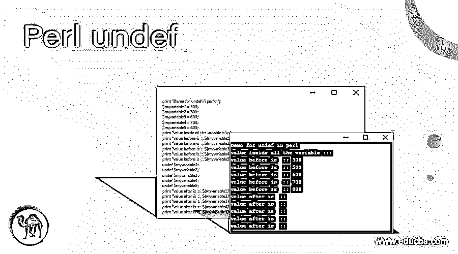
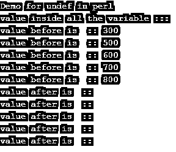
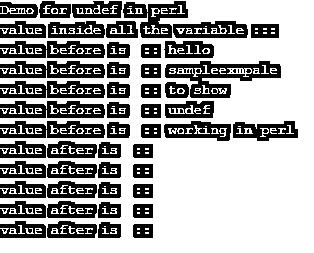

# Perl undef

> 原文：<https://www.educba.com/perl-undef/>

## Perl undef 函数简介

Undef 函数用于使变量的值在 Perl 中未定义。如果我们想让变量的值不被定义，那么我们可以使用 Perl 中的 undef 函数；该函数可用于变量、散列、列表等。undef 函数不会删除值，而是会清除变量值并使其未定义。因此，如果我们想删除任何值，那么我们必须使用删除函数；对任何变量使用 undef 后，会将其置空或重置。在下一节中，我们将更详细地讨论这个函数，以便更好地理解。

**语法**

<small>网页开发、编程语言、软件测试&其他</small>

正如我们已经讨论过的，这个函数用于使列表、标量变量、散列的值成为未定义的。它会重置它们。让我们看看它的语法，以便更好地理解如何在编程时使用它(见下文);

1) **undef EXPR** :在这里，我们可以提供表达式，它可以是任何东西，也可以是变量、列表或散列。

2) **undef** :这个函数也可以不用括号。

3) **undef()** :如果我们愿意，也可以有括号。

紧接在 undef 关键字之后，我们可以编写变量名，使它在 Perl 中未定义。在下一节中，我们将看到更多的示例，以便初学者更好地理解。

### 函数在 Perl 中是如何工作的？

我们知道，we undef 函数与列表、散列或标量变量一起使用，可以使它们的值不被定义。如果你想让值不定义或者想在某个操作后重置变量的值，那么我们可以使用 Perl 中的 undef 函数。在使它未定义之后，我们可以检查它是否为空。有时我们可能需要在编程时重新初始化变量，这样我们就可以使用 undef 函数；在 Perl 中，我们可以使用这个函数，不管有没有括号。紧接在这个函数之后，我们可以提供我们的变量，我们希望它是未定义的。让我们讨论具有返回类型的方法签名，见下文；

**方法签名:**

1) undef your_variable:这个函数可以不用括号；在此之后，我们可以指定变量名。这将重置变量值并使其未定义。

2)返回类型:该函数将未定义的作为值返回。

让我们看一个示例，看看如何在 Perl 中使用这个函数；下面是一个简单的例子，让初学者了解它的工作原理。

例如:

`print "Demo for undef in perl\n";
$myvariable = 50;
print "value before is  :: ${myvariable}\n";
undef $myvariable;
print "value after is  ::  ${myvariable}\n";`

在上面几行代码中，我们使用了 undef 函数。首先，我们创建了一个名为“myvariable”的变量，并将其赋值为 50。但是在一些操作之后，我们正在使用 undef 函数来重置它的值，所以我们调用这个函数，并在这里提到变量名作为输入参数。一旦计算出来自函数的值，它将使变量' myvariable '成为未定义的，当我们试图打印它时，它将是空白的。在调用 undef 函数之前，变量的值是' 50 '，但是在对这个变量调用 undef 函数之后，我们有一个未定义的值或者空白作为那个变量中的值。

在 Perl 中使用 undef 函数时要记住的几点:

1)该函数不会从内存 t 中删除变量，只是使其为空。

2)如果我们想删除变量，我们必须使用 Perl 中的 delete 函数。

3)这个功能非常好用；在函数之后，我们可以简单地提到变量名。这非常容易阅读和理解。

### 例子

下面举几个例子

#### 示例#1

在这个例子中，我们使用 undef 函数来定义变量的值。我们已经创建了几个变量来测试它。首先，它将打印值；之后，变量中的所有值都将变空。

**代码:**

`print "Demo for undef in perl\n";
$myvariable1 = 300;
$myvariable2 = 500;
$myvariable3 = 600;
$myvariable4 = 700;
$myvariable5 = 800;
print "value inside all the variable :::\n";
print "value before is  :: ${myvariable1}\n";
print "value before is  :: ${myvariable2}\n";
print "value before is  :: ${myvariable3}\n";
print "value before is  :: ${myvariable4}\n";
print "value before is  :: ${myvariable5}\n";
undef $myvariable1;
undef $myvariable2;
undef $myvariable3;
undef $myvariable4;
undef $myvariable5;
print "value after is  ::  ${myvariable1}\n";
print "value after is  ::  ${myvariable2}\n";
print "value after is  ::  ${myvariable3}\n";
print "value after is  ::  ${myvariable4}\n";
print "value after is  ::  ${myvariable5}\n";`

**输出:**

#### 实施例 2

在这个例子中，我们试图在 Perl 中将 undef 与 string 变量一起使用。在这个例子中，我们也创造了这么多的变量，使它更容易更好地理解。之后，我们调用 undef 函数来生成空白。

**代码:**

`print "Demo for undef in perl\n";
$myvariable1 = "hello";
$myvariable2 = "sampleexmpale";
$myvariable3 = "to show";
$myvariable4 = "undef";
$myvariable5 = "working in perl";
print "value inside all the variable :::\n";
print "value before is  :: ${myvariable1}\n";
print "value before is  :: ${myvariable2}\n";
print "value before is  :: ${myvariable3}\n";
print "value before is  :: ${myvariable4}\n";
print "value before is  :: ${myvariable5}\n";
undef $myvariable1;
undef $myvariable2;
undef $myvariable3;
undef $myvariable4;
undef $myvariable5;
print "value after is  ::  ${myvariable1}\n";
print "value after is  ::  ${myvariable2}\n";
print "value after is  ::  ${myvariable3}\n";
print "value after is  ::  ${myvariable4}\n";
print "value after is  ::  ${myvariable5}\n";`

**输出:**

### 结论

通过使用 undef 函数，我们可以使变量的值为空或未定义；它基本上代表未定义。该函数不删除变量；相反，它使它空白。这个功能非常容易使用和理解。我们可以在重置变量后对它们进行检查。此外，它是 Perl 的内置函数，我们不需要包含任何来自市场的库。

### 推荐文章

这是一个 Perl-undef 指南。在这里，我们讨论了 undef 函数在 Perl 中是如何工作的，并给出了代码和输出。您也可以阅读以下文章，了解更多信息——

1.  [Perl 不等于](https://www.educba.com/perl-not-equal/)
2.  [Perl sort()](https://www.educba.com/perl-sort/)
3.  [Perl 读取文件](https://www.educba.com/perl-read-file/)
4.  [Perl chop()](https://www.educba.com/perl-chop/)

