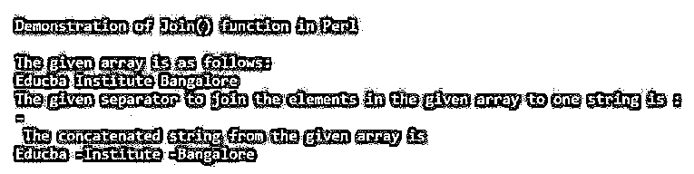
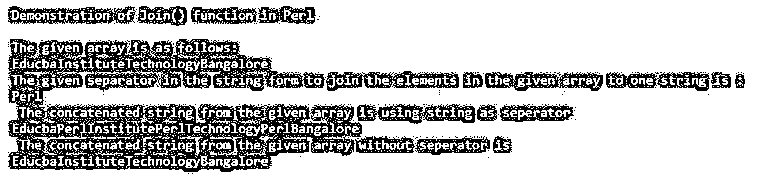
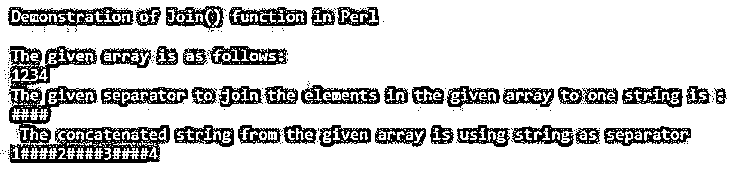

# Perl 连接数组

> 原文：<https://www.educba.com/perl-join-array/>

## Perl 连接数组简介

在 Perl 中，join 是一个函数，它被定义为连接数组中的元素或项目的函数，或者是一组元素，这些元素是与函数中给出的连接表达式一起指定的，以便将所有这些元素连接成一个字符串。一般来说，Perl 中的 join()函数被定义为将给定数组或元素列表中的所有元素组合成单个字符串的函数，该函数使用分隔符进行替换，并且从给定元素数组中仅返回一个字符串，这意味着数组被转换为单个数组。

### Perl 中数组 join()函数的使用及实例

在本文中，我们将看到 join()函数用于连接指定的数组和给定的分隔符，分隔符用于分隔数组中的每个元素(这些分隔符只放在元素之间，而不是第一个元素之前，也不是最后一个元素之后)，并且可以替换为其他给定的分隔符，使给定的数组成为 Perl 编程语言中的一个字符串。

<small>网页开发、编程语言、软件测试&其他</small>

因此，这个 join()函数用于将具有元素列表的给定数组连接成一个字符串，并在元素之间使用分隔符。这个函数也可以用来将给定数组中的元素追加到一个字符串中。Perl 中的 join()函数的工作方式与 split()函数完全相反，因为它将给定的单个字符串按照 Perl 中指定的分隔符分成一个元素数组。

**语法:**

`Join( SEP_EXPR, LST);`

**参数:**

*   **SEP_EXPR:** 该参数用于指定给定数组或列表中的分隔符，该分隔符也可以是任何可以被给定数组或列表中的分隔符替换的字符串，一般作为给定数组中的连接元素，将其转换为一个字符串。
*   **LST:** 该参数用于指定需要使用 join()函数转换为单个字符串的元素的数组或列表。

上面的 join()函数语法返回唯一一个字符串，该字符串看起来像 LST 参数中指定的数组或元素列表中所有元素的连接字符串。

#### 示例#1

**代码:**

`#!/usr/bin/perl
print "Demonstration of Join() function in Perl";
print "\n";
print "\n";
@arr = ('Educba ', 'Institute ', 'Bangalore ');
$sep = '-';
print "The given array is as follows:";
print "\n";
print @arr;
print "\n";
print "The given separator to join the elements in the given array to one string is :";
print "\n";
print $sep;
print "\n";
$str1 = join( $sep, @arr );
print " The concatenated string from the given array is ";
print "\n";
print $str1;
print "\n";`

**输出:**

在上面的程序中，我们可以看到我们首先用一个名为“@arr”的变量声明了一个数组，该数组有 3 个元素，每个元素的末尾都有一个空格字符。然后，我们在变量“$sep”中指定了一个分隔符作为“-”，它用作将给定数组转换为一个字符串的连接元素。然后我们打印指定的数组和分隔符。然后，我们使用 join()函数，并将 join()函数的结果存储在变量“$str1”中，我们将给定的数组和分隔符传递给该函数，它只返回一个字符串，如“‘Educba-Institute–Bangalore”。我们可以看到，元素的末尾附加了空格，因此给定的分隔符连接在空格之后，这样我们可以在上面的屏幕截图中看到输出。

我们将看到一个例子，其中 join()函数中没有指定分隔符，而是使用一个字符串作为分隔符。

#### 实施例 2

**代码:**

`#!/usr/bin/perl
print "Demonstration of Join() function in Perl";
print "\n";
print "\n";
@arr = ('Educba', 'Institute', 'Technology', 'Bangalore');
$sep ="Perl";
print "The given array is as follows:";
print "\n";
print @arr;
print "\n";
print "The given separator in the string form to join the elements in the given array to one string is :";
print "\n";
print $sep;
print "\n";
$str1 = join( $sep, @arr );
print " The concatenated string from the given array is using string as seperator ";
print "\n";
print $str1;
print "\n";
$str2 = join( "", @arr );
print " The concatenated string from the given array without seperator is ";
print "\n";
print $str2;
print "\n";`

**输出:**

在上面的程序中，我们可以看到我们在声明为“@arr”和$sep”的变量中声明了一个数组和 sep。然后我们打印了指定的数组和分隔符。然后我们使用 join()函数，它将返回一个字符串，比如第一个字符串中的“$str1”和“$ str 2”；我们使用 separator 作为字符串，给出为“Perl”，它将在数组的元素之间使用，并将产生“educpaperinstituteteperltechnologyperlbangalore”，在字符串$str2 中，我们有一个字符串，其中 join()函数中没有给出分隔符，并将返回为“educbainstitutetetechnologybangalore”。因此我们可以在上面的截图中看到上面代码的输出。

在下面的例子中，我们还可以对数组中的数字元素使用 join()函数。

#### 实施例 3

**代码:**

`#!/usr/bin/perl
print "Demonstration of Join() function in Perl";
print "\n";
print "\n";
@arr = (1, 2, 3, 4);
$sep ="####";
print "The given array is as follows:";
print "\n";
print @arr;
print "\n";
print "The given separator to join the elements in the given array to one string is :";
print "\n";
print $sep;
print "\n";
$str1 = join( $sep, @arr );
print " The concatenated string from the given array is using string as separator ";
print "\n";
print $str1;
print "\n";`

**输出:**

在上面的代码中，我们可以看到我们声明了一个数组，该数组的元素是数字，分隔符是“####”，用于将数组的元素连接成一个字符串。上面代码的输出可以在截图中看到。

### 结论

在本文中，我们得出结论，Perl 中的 join()函数被定义为使用分隔符连接或组合指定数组或元素列表中的元素并将其转换为一个字符串的函数。在本文中，我们看到了 join()函数如何工作以及如何将数组和分隔符指定为函数的参数的语法和几个示例，该函数的工作方式与 Perl 中的 split()函数相反。

### 推荐文章

这是一个 Perl 连接数组的指南。这里我们用例子来讨论 Perl 中数组的 join()函数的介绍和工作原理。您也可以看看以下文章，了解更多信息–

1.  [Perl unlink](https://www.educba.com/perl-unlink/)
2.  [Perl 文件存在](https://www.educba.com/perl-file-exists/)
3.  [Perl sort()](https://www.educba.com/perl-sort/)
4.  [Perl chop()](https://www.educba.com/perl-chop/)

