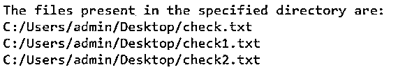
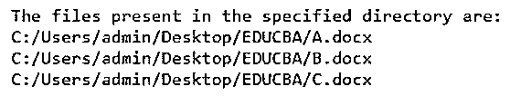
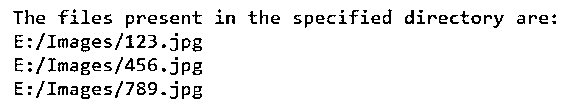
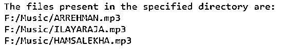
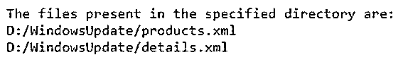

# Perl 多行注释

> 原文：<https://www.educba.com/perl-multiline-comment/>

## Perl 多行注释简介

在任何使程序用户友好的编程语言中，注释都是开发人员的朋友。解释器跳过代码中包含注释的部分。注释对程序的功能没有任何影响。Perl 中有两种类型的注释，即单行注释和多行注释，其中多行注释以(=begin)语句开始，以(=cut)语句结束，解释器将(=begin)解释为多行注释部分的开始，将(=cut)解释为多行注释部分的结束以及(=begin)之间的所有内容。编译器忽略了(=剪切)部分。

**在 Perl 中声明多行注释的语法:**

<small>网页开发、编程语言、软件测试&其他</small>

`=begin
Comments
=cut`

### Perl 多行注释的例子

下面是 Perl 多行注释的例子:

#### 示例#1

Perl 程序，通过使用(=begin)和(=cut)语句指定多行注释段的开始和结束来演示多行注释。

**代码:**

`=begin
making use of glob function by passing the path of the directory where the files are present to print the names of the files present in the directory
=cut
@filenames = glob('C:/Users/admin/Desktop/*');
print "The files present in the specified directory are:\n";
foreach $eachfile(@filenames){
print "$eachfile\n";
}`

**输出:**

在上面的程序中，我们在多行注释部分使用(=begin)和(=cut)语句描述了程序的功能。然后，我们使用 glob()函数，传递文件所在目录的路径，以打印目录中文件的名称。然后，目录中的文件名将作为输出打印在屏幕上。输出显示在上面的快照中。

#### 实施例 2

Perl 程序，通过使用(=begin)和(=cut)语句指定多行注释段的开始和结束来演示多行注释。

**代码:**

`=begin
making use of glob function by passing the path of the directory where the files are present to print the names of the files present in the directory
=cut
@filenames = glob('C:/Users/admin/Desktop/EDUCBA/*');
print "The files present in the specified directory are:\n";
foreach $eachfile(@filenames){
print "$eachfile\n";
}`

**输出:**

在上面的程序中，我们在多行注释部分使用(=begin)和(=cut)语句描述了程序的功能。然后，我们使用 glob()函数，传递文件所在目录的路径，以打印目录中文件的名称。然后，目录中的文件名将作为输出打印在屏幕上。输出显示在上面的快照中。

#### 实施例 3

Perl 程序，通过使用(=begin)和(=cut)语句指定多行注释段的开始和结束来演示多行注释。

**代码:**

`=begin
making use of glob function by passing the path of the directory where the files are present to print the names of the files present in the directory
=cut
@filenames = glob(‘img/*’);
print "The files present in the specified directory are:\n";
foreach $eachfile(@filenames){
print "$eachfile\n";
}`

**输出:**

在上面的程序中，我们在多行注释部分使用(=begin)和(=cut)语句描述了程序的功能。然后，我们使用 glob()函数，传递文件所在目录的路径，以打印目录中文件的名称。然后，目录中的文件名将作为输出打印在屏幕上。输出显示在上面的快照中。

#### 实施例 4

Perl 程序，通过使用(=begin)和(=cut)语句指定多行注释段的开始和结束来演示多行注释。

**代码:**

`=begin
making use of glob function by passing the path of the directory where the files are present to print the names of the files present in the directory
=cut
@filenames = glob(‘F:/Music/*’);
print "The files present in the specified directory are:\n";
foreach $eachfile(@filenames){
print "$eachfile\n";
}`

**输出:**

在上面的程序中，我们在多行注释部分使用(=begin)和(=cut)语句描述了程序的功能。然后，我们使用 glob()函数，传递文件所在目录的路径，以打印目录中文件的名称。然后，目录中的文件名将作为输出打印在屏幕上。输出显示在上面的快照中。

#### 实施例 5

Perl 程序，通过使用(=begin)和(=cut)语句指定多行注释段的开始和结束来演示多行注释。

**代码:**

`=begin
making use of glob function by passing the path of the directory where the files are present to print the names of the files present in the directory
=cut
@filenames = glob(‘D:/WindowsUpdate/*’);
print "The files present in the specified directory are:\n";
foreach $eachfile(@filenames){
print "$eachfile\n";
}`

**输出:**

在上面的程序中，我们在多行注释部分使用(=begin)和(=cut)语句描述了程序的功能。然后，我们使用 glob()函数，传递文件所在目录的路径，以打印目录中文件的名称。然后，目录中的文件名将作为输出打印在屏幕上。输出显示在上面的快照中。

### 推荐文章

这是一个 Perl 多行注释指南。这里我们分别讨论 Perl 多行注释的介绍和例子。您也可以看看以下文章，了解更多信息–

1.  [Perl 卸载](https://www.educba.com/perl-unshift/)
2.  [Perl 解包](https://www.educba.com/perl-unpack/)
3.  [珠光打开](https://www.educba.com/perl-open/)
4.  perl eval

