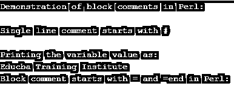
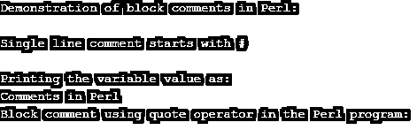

# Perl 块注释

> 原文：<https://www.educba.com/perl-block-comment/>

## Perl 块元素简介

在 Perl 中，注释或块注释被定义为编写或选择源代码或对源代码的解释，可以用单行或多行编写。这种多行注释被称为块注释，其中这一行或多行将以某个分隔符(符号)开始，以一个分隔符结束。一般来说，我们可以将块注释定义为 Perl 程序中的多行注释声明，这是为了让开发人员更好地理解代码，并进一步编码，这是通过在注释的开头和结尾使用一些符号或单词来完成的。

### 如何用实例在 Perl 中声明块注释？

在本文中，我们将讨论如何用 Perl 编程语言编写块注释。在 Perl 中，有两种类型的注释单行注释和多行注释，也可以称为块注释，这些块注释可以在行首和行尾使用某种分隔符来声明或创建，我们需要将其声明为注释，用于描述编写的代码，这意味着它将被使用，并且在程序中使用注释的最佳实践是使代码可理解。

<small>网页开发、编程语言、软件测试&其他</small>

在 Perl 中，在注释行的开头使用“#”符号定义和声明了一行，而在末尾没有任何符号。块注释或多行注释被定义为对代码块或某些文本进行注释，在注释的开头使用“=begin ”,在注释行的结尾使用“=end ”,这仅适用于多行注释或块注释。有时在多行注释的末尾，甚至在定义块注释时也用“=cut”代替“=end”。

现在让我们看看 blow 部分中演示注释块的语法和示例。

**语法:**

`=begin`

一些内容或语句或代码。

`=end`

所以在上面的语法中，我们可以看到这种格式可以用于注释多行，其中上面的语法可以用=start 代替=begin，也可以用=cut 代替=end。

在 Perl 中，通常情况下，当一行注释中的 80 个字符结束时，我们必须重新开始一行。在 Perl 中，第一行本身包含注释符号，它通知 shell 下面的代码将被 Perl 编译器传递。一般来说，我们可以说多行注释以“=”和“=end”或“=cut”语句开始，这种多行注释是一种特殊的注释，称为普通旧文档(POD)，这些标记之间的文本将被注释掉。

**举例:**

`#!/usr/bin/perl
print "Demonstration of block comments in Perl:";
print "\n";
print "\n";
print "Single line comment starts with #";
#this is single line comment in Perl.
print "\n";
print "\n";
print "Printing the variable value as:";
print "\n";
$a = "Educba Training Institute";
print $a;
print "\n";
print "Block comment starts with = and =end in Perl:";
print "\n";
=begin
This is a multi line comment or block comment.
The comments are not printed on the output screen
as they will be ignored by the Perl compiler.
=cut`

**输出:**

在上面的程序中，我们可以看到我们首先在代码的第一行中使用“#”定义和声明了单行注释。在上面的代码中，我们声明了一个保存字符串的变量，可以使用 print 命令打印该变量。然后我们声明了一个多行注释，以“=begin”开头，后面是需要被注释掉的语句，然后为了结束这个注释行，我们在上面的代码中写了“=cut ”,这样任何阅读代码的人都可以看出它是块注释还是多行注释。因此，正如在每一种编程语言中一样，注释仅用于帮助更好地理解代码，编译器会忽略这些注释，因此注释不会打印在输出屏幕上。上面的截图可以看到上面代码的输出。

还有一种方法是在程序的每一行的开头使用#符号，但是这不是定义注释的更好的方法；我们可以把它说成是多行注释而不是多行注释。在 Perl 中，我们还可以使用引号操作符来定义和声明多行注释，这可以在下面的部分用一个例子来演示。

**举例:**

`#!/usr/bin/perl
print "Demonstration of block comments in Perl:";
print "\n";
print "\n";
print "Single line comment starts with #";
#this is single line comment in Perl.
print "\n";
print "\n";
print "Printing the variable value as:";
print "\n";
$a = "Comments in Perl";
print $a;
print "\n";
print "Block comment using quote operator in the Perl program:";
print "\n";
q{
This is block comment.
This is done by using the quote operator q.
};`

**输出:**

在上面的程序中，我们声明了一个变量来查看 print 命令的输出，然后我们使用引号操作符来声明块注释，比如 q{ with comment statements }。因此，要在 Perl 中声明或定义多行注释，除了使用“=begine”和“=end”，我们还可以编写以字母“q”开头的多行注释，后面跟着需要注释掉的语句，这些语句写在花括号{}内。上面的代码输出可以在上面的屏幕截图中看到，如上所述，由于 Perl 编译器忽略了这些注释，所以永远不会打印出来。

### 结论

在本文中，我们得出结论，在 Perl 中定义单行注释更容易，并且也用于多行注释，但是在需要注释掉的每一行的开头有“#”。在 Perl 中，多行注释也称为块注释，定义时在行首使用“=begin ”,在注释行尾使用“=end ”,使用块注释的另一种方式是使用引号操作符 q{}。这两个演示都是在上面的文章中用例子完成的。

### 推荐文章

这是一个 Perl 块注释指南。这里我们讨论如何用 Perl 声明块注释，并给出例子和输出。您也可以看看以下文章，了解更多信息–

1.  [Perl 复制文件](https://www.educba.com/perl-copy-file/)
2.  [Perl readdir](https://www.educba.com/perl-readdir/)
3.  [Perl sort()](https://www.educba.com/perl-sort/)
4.  [Perl 正则表达式](https://www.educba.com/perl-regular-expression/)

