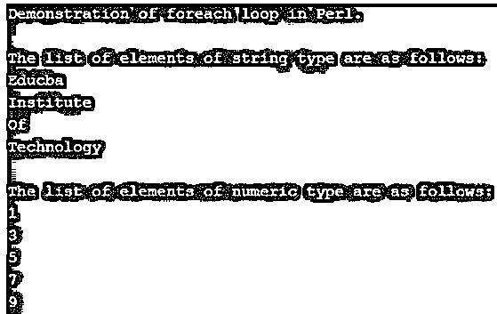
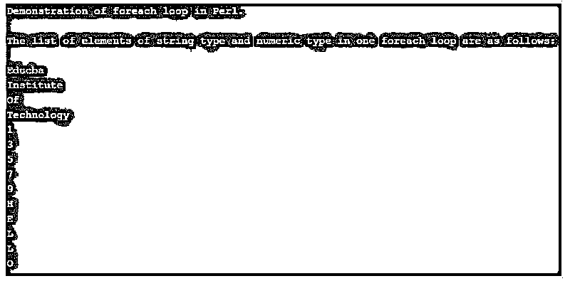
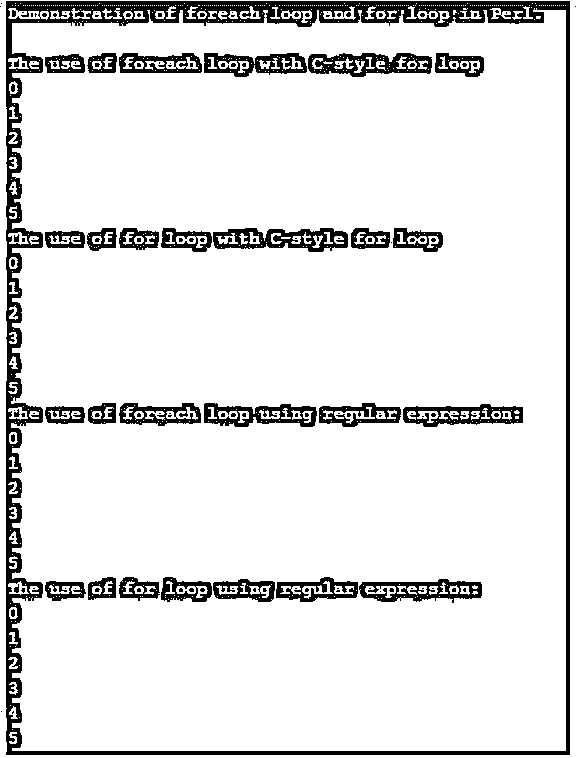

# Perl foreach

> 原文：<https://www.educba.com/perl-foreach/>

## Perl foreach 简介

在 Perl 中，foreach 被定义为一个循环语句，它可以一次遍历或迭代一个给定的列表或元素集，并且是唯一已知的用于遍历给定的项目集的语句，当我们想要迭代集合中的项目而不是迭代给定的整个范围时，这是由 foreach 循环自动完成的。一般来说，我们可以定义 foreach 来遍历元素集合，其中包含给定集合中这些元素的值的变量一次一个，这在 Perl 和其他编程语言中有时被称为 for 循环。

### Perl 中 foreach 的使用实例

在本文中，我们将看到 Perl 中的 foreach 循环，它主要在我们想要遍历给定的数组、列表或项目集时使用，这意味着它迭代或遍历元素的值集，并将进一步为列表或元素集中的每个元素设置变量，这将很容易使用 foreach 循环一次访问一个元素。在 Perl 中，for 和 foreach 是可以互换的。

<small>网页开发、编程语言、软件测试&其他</small>

在 Perl 中，for 和 foreach 循环都用作同义词，而 for 循环使用分号分隔的三个部分，但在 foreach 中，我们只声明一个列表或一组元素，其中有一个选项提供作为任何正则表达式的列表，也没有强制指定整个元素列表，因此许多开发人员使用 foreach，这使得编写和理解变得容易，但“for”循环类似于 C 语言中的 as，因此在 Perl 中它被称为 C 风格的“for”循环。

现在让我们看一下 Perl 中演示 foreach 循环的语法和示例:

**语法:**

`foreach variable_name (list_of_items) { some executable code }`

从上面的语法中，我们可以看到传递的是一个列表，其中该列表中的元素值被逐个迭代，因此 Perl 中的 foreach 循环返回列表中元素的每个值，并在输出屏幕上逐个打印这些值。在这个 foreach 中，我们需要使用“$”作为变量名，我们在“foreach”关键字和括号中指定的元素列表之间指定变量名。在 Perl 中，提供了另一个函数，它可以将多个列表合并成一个大列表，这个大列表可以在括号中指定，每个列表名称用逗号分隔。请注意，列表以“@”开头，后面是列表名称。

#### 示例#1

**代码:**

`print "Demonstration of foreach loop in Perl.";
print "\n";
print "\n";
@lst_1 = ('Educba ', 'Institute ', 'Of ', 'Technology ');
@lst_2 = (1, 3, 5, 7, 9);
print "The list of elements of string type are as follows: ";
print "\n";
foreach $lst_str (@lst_1)
{
print $lst_str;
print "\n";
}
print "\n";
print "The list of elements of numeric type are as follows: ";
print "\n";
foreach $lst_num (@lst_2)
{
print $lst_num;
print "\n";
}`

**输出:**

在上面的程序中，我们可以看到我们声明了两个列表，一个有字符串，另一个有数字。以上是演示“foreach”循环的简单代码；在第一个 foreach 循环中，我们使用自己的变量名，如“lst_str ”,来引用列表“@lst_1”中的每个元素，这将打印列表中元素的所有字符串值。类似地，另一个 foreach 循环打印列表“@lst_2”中元素的数值。

现在我们将看到另一个简单的例子，我们可以重写上面的代码；我们可以只指定列表名，而不是调用 foreach 两次。下面的示例演示了这一点。所以我们可以说，在 Perl 中，当我们想要一次遍历多个列表并打印所有列表中元素的所有值时，这个 foreach 循环非常有用。

#### 实施例 2

**代码:**

`print "Demonstration of foreach loop in Perl.";
print "\n";
print "\n";
@lst_1 = ('Educba ', 'Institute ', 'Of ', 'Technology ');
@lst_2 = (1, 3, 5, 7, 9);
@lst_3 = ('H', 'E', 'L', 'L', 'O');
print "The list of elements of string type and numeric type in one foreach loop are as follows: ";
print "\n";
print "\n";
foreach $lst_ns (@lst_1, @lst_2, @lst_3)
{
print $lst_ns;
print "\n";
}
print "\n";`

**输出:**

在上面的程序中，我们声明了 3 个不同的列表，它们有 3 种不同的数据类型，比如字符串、数字和字符类型。因此，我们可以看到，我们不需要像在前面的例子中那样对每个列表使用 foreach 循环来显示元素；相反，我们可以只声明一个变量名来显示所有列表的所有元素，这些元素可以在括号中指定，如上面的代码所示，我们只使用了一个 foreach 循环，输出可以在上面的屏幕截图中看到。因此，这就是 foreach 循环如何帮助编写小代码，而不是编写冗长的代码。

现在让我们看看 Perl 提供了一个循环，其工作方式与 foreach 循环相同；因此，没有区别，所以他们说这些是同义词。但唯一的区别是，foreach 循环处理一组元素中每个元素的每个实例，而 for 循环可以处理任何数据，而不只是像 foreach 循环那样处理元素的集合或集合。

#### 实施例 3

**代码:**

`print "Demonstration of foreach loop and for loop in Perl.";
print "\n";
print "\n";
print "The use of foreach loop with C-style for loop";
print "\n";
foreach (my $i=0; $i <= 5; $i++) {
print "$i\n";
}
print "The use of for loop with C-style for loop";
print "\n";
for (my $i=0; $i <= 5; $i++) {
print "$i\n";
}
print "The use of foreach loop using regular expression:";
print "\n";
foreach my $x (0..5) {
print "$x\n";
}
print "The use of for loop using regular expression:";
print "\n";
for my $y (0..5) {
print "$y\n";
}`

**输出:**

在上面的程序中，我们可以看到我们编写了 for 和 foreach 循环来执行相同的代码，并且我们可以在输出屏幕中看到没有区别，因此 for 和 foreach 循环是同义词。

### 结论

在本文中，我们得出结论，Perl 中的 foreach 被定义为一个循环，用于遍历元素列表或元素集，并使用 foreach 循环中声明的单个变量显示列表中元素的每个值。在本文中，我们看到了一个简单的 foreach 示例，还看到了一个使用单个 foreach 循环显示多个列表的示例。最后，我们看到 for 和 foreach 循环在 Perl 中是同义词。

### 推荐文章

这是一个 Perl foreach 的指南。这里我们分别用例子来讨论 foreach 在 Perl 中的引入和工作。您也可以看看以下文章，了解更多信息–

1.  [Perl sort()](https://www.educba.com/perl-sort/)
2.  [Perl 读取文件](https://www.educba.com/perl-read-file/)
3.  [Perl 哈希](https://www.educba.com/perl-hash/)
4.  [Perl 开关](https://www.educba.com/perl-switch/)

