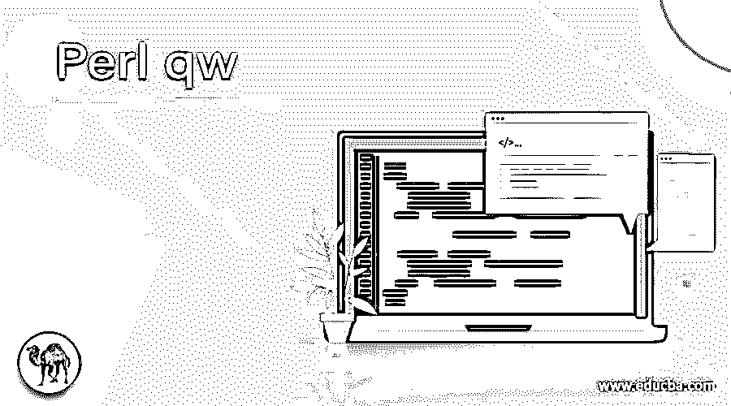
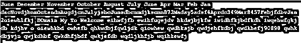
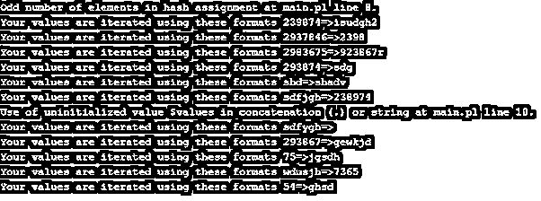

# Perl qw

> 原文：<https://www.educba.com/perl-qw/>

## Perl qw 简介

Perl qw 被定义为用于提取数据的操作符之一，这些数据是每组元素的用户输入。它应该是字符串格式，它作为数组存储在内存中，就像一个元素数组，使用一些符号，比如单引号符号。如果我们在脚本中使用这种符号，那么给定的用户输入作为定义的和等价于字符串中的每组单词的字符在那之前，输入可能是句子的集合，并且它转到一些行，但是当我们使用这种操作符时，句子可能被转换成每组字符串。

### 句法

Perl 有一些默认的操作符集，用于在脚本代码执行后执行的一组操作。同样，qw()是操作符和函数，用于通过使用单引号、括号等分隔符将句子拆分成每个字符串。它主要返回元素的数组作为列表值。

<small>网页开发、编程语言、软件测试&其他</small>

`@array = qw(some sentences based on the users input);
Loop used for to iterate the values $variable (@array)
{
--some script codes logics---
}`

以上代码是在脚本中使用 qw()操作符的基本语法。在向方法传递输入时，我们可以使用任何一组分隔符。

### qw 在 Perl 中是如何工作的？

Perl 中用来分割用户输入的句子的 qw 操作符可能是他们给脚本输入的 n 行。所以很难在脚本中执行从内存中存储和检索数据的操作。使用分隔符，我们可以以各种方式拆分字符串，但字符串字符是拆分的，并且等同于相应的用户输入值。qw 是与 qq 和 q 等其他运营商相关的引用词。

用户输入数据存储为数组的元素，因为列表是使用标量类型输入变量和值的有序集合，而数组是保存在 Perl 代码列表中的变量。我们可以提取字符串数据类型值中的每个数组元素；它可能超出了使用空格、逗号、引号、反斜杠、正斜杠等分隔符的列表范围。这些是 Perl 脚本中可用的一些默认分隔符。对于每个 Perl 脚本函数，使用一些默认循环将操作符分配给变量值；这些值被迭代并显示在输出屏幕上。

用户输入有时是列表格式列表是一组序列标量值，可以使用它，并使用括号和逗号运算符分隔数据。通过使用这些操作符，将构建列表，并且列表的每个值也称为列表元素；这些元素是用索引值排序的某种排序类型。这些值将通过存储器中的一些存储位置进行设置和分配。Quote 函数使用嵌入类型的空白。如果我们在字符串中使用非字母数字字符，我们使用 q/和 q//操作符作为分隔符；列表是他们在元素中使用的任何类型。

每组列表元素都存储在内存列表中的特定位置。运算符的范围集不仅针对字符串使用这些函数来执行；通过使用量子阱；我们可以避免引号。我们在列表中输入的数据较少，我们使用一组标点符号作为数组变量的分隔符。无论何时使用分隔符，数组元素中的左括号和右括号都必须相同。

### Perl qw 的例子

下面举几个例子

#### 示例#1

**代码:**

`#!/usr/bin/perl
use warnings;
use strict;
my @months = qw(Dec Nov Oct Aug July June May Apr Mar Feb Jan);
$months[0] = 'June';
@months[1..6] = qw(December November October August July June May April March February January);
print("@months","\n");
my @var = qw(dacNovdjbnmOctsndmAugdjcnJulyjsbcJunsdbcnmdjkscmn873Madsy5sdsf4Aprdc349Mar8457FebjfdbvJan);
my @var1 = sort @var;
print("@var1","\n");
my @first = qw(Welcome To My DOmain kdjhv hkdsjbjkfw     qwdkhefj90898 iwidhfkjbdfkdh   qwdjehfkdbj o                                   qhkwdbjfqwljdk    qwhkdbjvjn wqdljkhfjb    qwkjefdb   qwjkdhbf qwkdhfjbdf wqihkewfj 2oiewhlfkj iwqehwfgkjdb eihwfjfb ewihfugejdv  owhefb oiewhkbd  qwdhksjb qiowhew);
my @second = sort @first;
print("@second","\n");`

**输出:**

#### 实施例 2

**代码:**

`#!/usr/bin/perl
use warnings;
use strict;
my @expn=();
@expn = ('12', '763', '127344', '73784','629387867', '23784', '82347', '346c', '73', '387', '83', '8374r', '83', '467', '837', '874', '93897', '3748', '784', '93');
@expn = qw/12 763 127344 73784 629387867 23784 82347 346c 73 387 83 8374r 83 467 837 874 93897 3748 784 93/;
my %vars = ();
%vars = qw(54 ghsd shd shadv 75 jgsdh wdusjh 7365 2983675 923867r 293867 gewkjd 239874 isudgh2 293874 sdg 2937846 2398 sdfjgh 238974 sdfygh);
while (my ($keys, $values) = each %vars) {
print "Your values are iterated using these formats $keys=>$values\n"
}`

**输出:**

#### 实施例 3

**代码:**

`#!/usr/local/bin/perl
use strict;
use warnings;
my %example = ();
%example = qw(
1 718253
6253 welcome To My Domain kjagdsvj j kqwdbvwjkdfd lwjekfjwekjlfwekljf helfkjvwekjfhkwerhrfj kwejf kehgf wekrjg ewkhrjgh ewiiurh erjh 298 98 9028 928 cguh 2983
2763 jqwhevg 728365 28937 wdghe 298376 sdhgc 2837we sjdhg 3847 siudy 23847re6 sdedf 237eyr wdjh 23847r ewuy23  3847 weduf233 384 sjd qiwh 987 kjh 978 kjwqegh 786
);
foreach my $var (sort keys %example) {
print " have a nice day users $var=>$example{$var}\n";
}`

**输出:**

在上面的三个例子中，我们在不同的场景中使用了 qw()操作符；我们可以使用一些方法来使用操作符，比如对脚本的数组和列表中的元素进行排序、取消排序和切片。

### 结论

在 Perl 脚本中，我们使用不同的操作符、关键字、变量和函数，通过文本操作、数据安全、其他 IT、系统相关问题、Web 开发和网络编程概念来创建应用程序。在那个编程概念中，这个操作符必须被连接起来，并使用某种定界技术分割巨大的数据。

### 推荐文章

这是一个 Perl qw 指南。在这里，我们讨论了 qw 在 Perl 中是如何工作的，并给出了代码和输出。您也可以看看以下文章，了解更多信息–

1.  [Perl 写入文件](https://www.educba.com/perl-write-to-file/)
2.  [Perl STDIN](https://www.educba.com/perl-stdin/)
3.  [Perl last](https://www.educba.com/perl-last/)
4.  [在 Perl 中拆分](https://www.educba.com/split-in-perl/)

