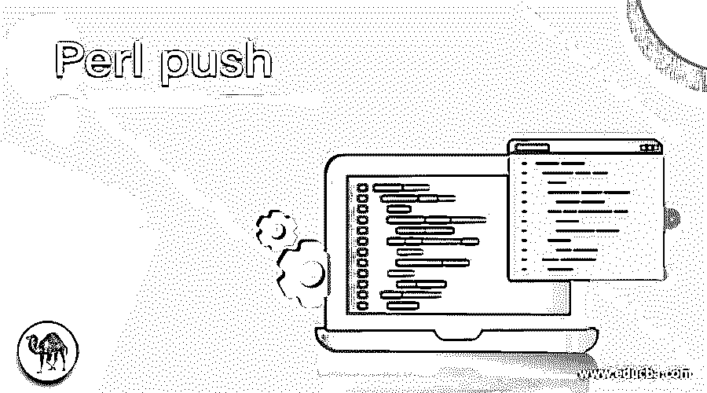
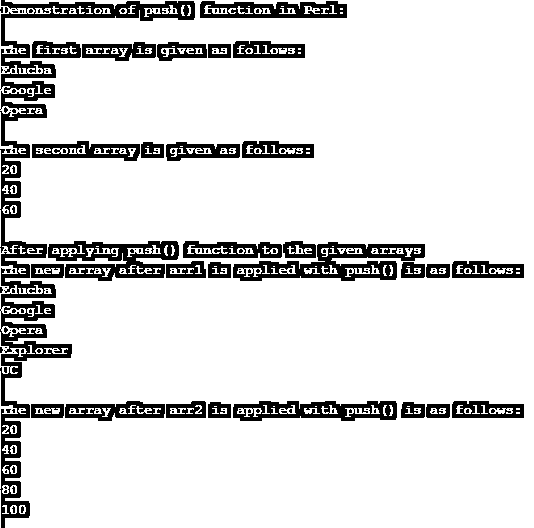
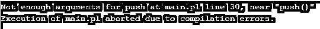
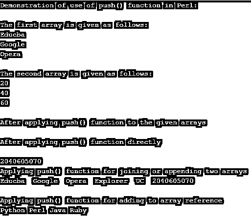

# Perl 推送

> 原文：<https://www.educba.com/perl-push/>

## Perl push 简介

在 Perl 中，push()函数被定义为一个函数，该函数使用 push 和 pop 函数在元素上进行堆叠，或者将元素添加到在实现元素的堆叠或数组中使用的现有项目集中，以便添加或删除元素。一般而言，push()函数可被定义为用于将一组项目或值插入或添加到另一组项目或项目数组的数组或堆栈函数，其中该 push 函数独立于在该组元素中传递的值的类型，这意味着该组元素可具有字母、数字或字母数字值。

### 举例说明 push()函数在 Perl 中的应用

在本文中，我们将讨论 Perl 提供的 push()函数，该函数用于向现有的元素堆栈或元素数组中插入或添加一组元素，它主要与 pop()函数一起用作堆栈函数，pop()函数的作用与 push()函数相反，即 pop()从元素堆栈或元素数组中移除或删除元素组或元素列表。在 Perl 语言中，push()函数被定义为将项插入到数组或堆栈中，并作为参数传递给 push()函数，我们还需要传递另一个数组来将这些添加的项存储到已定义的数组中，并返回添加了元素的数组。

<small>网页开发、编程语言、软件测试&其他</small>

现在让我们看看 Perl 中 push()函数的语法和参数:

**语法:**

`push( arr_name, res_list)`

**参数:**

arr_name:该参数用于指定在代码开头声明的数组名，该数组已经有元素，元素被添加到这个数组中。

res_list:该参数用于指定需要添加到定义的数组中的由逗号分隔的元素的集合或列表，这是 push()函数的第一个参数。

这个 push()函数再次返回一组元素作为新的数组，该数组具有前一个数组的元素以及添加到该前一个或定义的数组中的元素。

### Perl 中 push()函数的例子

现在让我们看一个简单的例子，演示如何在 Perl 中使用 push()函数:

#### 示例 1

**代码**:

`#!/usr/bin/perl
print "Demonstration of push() function in Perl:";
print "\n";
print "\n";
@arr1 = ('Educba  ', 'Google  ', 'Opera  ');
print "The first array is given as follows: ";
print "\n";
foreach $x (@arr1)
{
print "$x";
print "\n";
}
print "\n";
@arr2 = (20, 40, 60);
print "The second array is given as follows: ";
print "\n";
foreach $r (@arr2)
{
print "$r";
print "\n";
}
print "\n";
print "After applying push() function to the given arrays";
print "\n";
push(@arr1, 'Explorer  ', 'UC  ');
push(@arr2, (80, 100  ));
print "The new array after arr1 is applied with push() is as follows:";
print "\n";
foreach $y (@arr1)
{
print "$y";
print "\n";
}
print "\n";
print "The new array after arr2 is applied with push() is as follows:";
print "\n";
foreach $s (@arr2)
{
print "$s";
print "\n";
}`

**输出:**

在上面的程序中，我们声明了两个不同的数组，一个包含字符串类型，另一个包含数值类型的值。在上面的代码中，我们首先打印开始时声明的数组中的所有元素，然后，我们调用 push 函数。我们传递 arr1 和 arr2 这样的数组，后面是需要添加到前面声明的数组中的元素。然后我们打印新的数组，它有额外的元素(“Explorer”和“UC to arr1，“80”和“100”to arr2)以及数组 arr1 和 arr2 中以前的元素。现在，arr1 和 arr2 包含使用 push()函数推送到以前声明的数组中的元素，例如 arr1 和 arr 2 现在将有 5 个元素，分别为 arr1 = ('Educba '，' Google '，' Opera '，' Explorer '，' UC ')和 arr2 = (20，40，60，80，100)。输出显示新数组，并使用 foreach 循环打印值。

在上面的代码中，我们应该注意到我们已经向 push()函数传递了参数，但是如果我们没有向该函数传递任何参数，它将抛出一个错误，提示传递足够的参数来执行 push()函数 Perl。我们可以在下面的代码输出截图中看到，上面的代码被修改了，只调用了“push()”，而没有调用任何其他参数。

现在让我们看看 push()函数在 Perl 语言中的另一种用法，比如像上面的例子中那样将元素添加到给定的数组中，不管数组中的值是什么数据类型，也不管是否追加了两个数组，我们都可以使用 push()函数将元素添加到数组引用中。让我们看看下面的例子，注意，我们甚至可以将多个值或元素直接推送到数组中。

#### 示例 2

**代码**:

`#!/usr/bin/perl
print "Demonstration of use of push() function in Perl:";
print "\n";
print "\n";
@arr1 = ('Educba  ', 'Google  ', 'Opera  ');
print "The first array is given as follows: ";
print "\n";
foreach $x (@arr1)
{
print "$x";
print "\n";
}
print "\n";
@arr2 = (20, 40, 60);
print "The second array is given as follows: ";
print "\n";
foreach $r (@arr2)
{
print "$r";
print "\n";
}
print "\n";
print "After applying push() function to the given arrays";
print "\n";
push(@arr1, 'Explorer  ', 'UC  ');
print "\n";
print "After applying push() function directly";
print "\n";
push @arr2, (50, 70);
print "\n";
print @arr2;
print "\n";
print "Applying push() function for joining or appending two arrays";
print "\n";
push(@arr1,@arr2);
print @arr1;
print "\n";
print "\n";
print "Applying push() function for adding to array reference";
print "\n";
my @arr = qw(Python Perl);
my $arr_ref = \@arr;
push ( @{ $arr_ref }, qw(Java Ruby));
print "@{ $arr_ref }\n";
exit 0;`

**输出:**

在上面的程序中，我们可以看到我们使用 push 函数直接添加元素，我们还看到了如何使用 push()来连接两个数组，我们还看到了如何将元素添加到数组引用中。输出如上图截图所示。

### 结论

在本文中，我们得出结论，Perl 的 push()函数用于将元素推送到数组元素。在本文中，我们看到了一个简单的例子，展示了如何对不同类型的值使用 push()函数。在这里，我们还看到了 push()函数在追加数组中的各种用法，以及如何将元素添加到数组引用中。

### 推荐文章

这是一个关于 Perl push 的指南。在这里，我们通过例子讨论了 push()函数在 Perl 中的工作方式，以及 push()函数如何用于不同的类型。您也可以看看以下文章，了解更多信息–

1.  [Perl sort()](https://www.educba.com/perl-sort/)
2.  [在 Perl 中转到](https://www.educba.com/goto-in-perl/)
3.  [Perl for 循环](https://www.educba.com/perl-for-loop/)
4.  [Perl last](https://www.educba.com/perl-last/)

