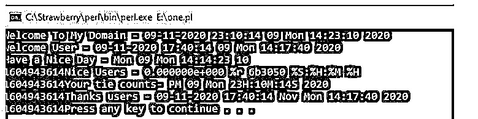
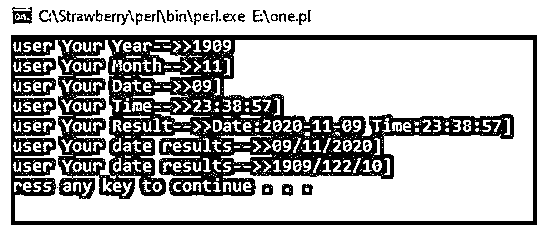
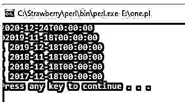

# Perl datetime

> 原文：<https://www.educba.com/perl-datetime/>

## Perl 日期时间简介

Perl datetime 是使用 localtime()方法的 Perl 脚本语言的特性之一；我们想要计算机器的当前日期和时间，没有传递给日期和时间方法的参数，该方法通过使用一些预定义的模块和一些导入包来处理，默认类将根据模块使用它们的引用，日期和时间戳将计算更准确，因为当我们计算时间时，它取决于各种单位，如毫秒、秒，但日期将以相同的格式计算和显示。

**语法:**

<small>网页开发、编程语言、软件测试&其他</small>

Perl 脚本总是具有用于处理应用程序的默认变量、关键字和函数。同样，datetime 是对名为 localtime()的特定函数的引用或实例，该函数有助于显示机器的当前本地日期和时间。同样，gmtime()、time()或其他预定义的函数也是作为日期和时间间隔来计算的。

`#!/usr/bin/perl
use DateTime;
$variable name = localtime();
$var1 = DateTime -> now;
---some perl script codes based on the application requirements---`

以上代码是借助 localtime()函数在系统中创建日期和时间的基本语法。变量和其他内置方法用于计算特定区域的日期和时间间隔。

### Perl 中的 datetime 函数是如何工作的？

*   Perl 脚本是最重要的，它广泛用于可移植和跨平台。它主要用于与其他支持平台如面向对象、存储过程等相协调。日期和时间引用是通过使用 Perl 脚本的预定义模块来处理的，DateTime 是预定义模块之一，使用该模块，Perl 脚本将使用默认类作为 DateTime 包，它遵循一些带有时间格式的新旧科学日历。当我们在 Perl 中使用 localtime()方法时，显示当前日期和时间；我们不需要在方法中传递任何参数。当我们在脚本中需要时调用这个引用时，使用一些格式来计算日期时间，如%dd，%mm，%yy，%hh "日期、月、年和小时。通过使用“set”关键字和方法，为合并区域设置日期和时间。
*   如果我们想设置“非洲”大陆的时区，我们可以使用名为“set_time_zone('Africa ')”的方法，它将显示非洲大陆所有地区的时区。我们还传递了带有大陆特定区域的参数，如 set_time_zone(“非洲/约翰内斯堡”)，它将返回带有约翰内斯堡时间的非洲大陆，它还与一些日期时间默认方法连接在一起，如 days、前一天、last_day_of_month、附加天数，如果需要，我们可以使用 add(days => numbers)方法添加附加天数，通过使用这些方法，我们将手动添加 n 个天数，此外，我们还使用 subtract(格式(秒、毫秒等)减去时间间隔。)= >数字)。
*   同样，我们也将 set 关键字与不同的方法 set_year()、set_month()、set_day()、set_hour()、set_minute()、set_second()、set_millisecond()和 set _ 纳秒()一起使用。这些是日期-时间引用经常使用的一些方法。DateTime 还设置了用于填充日期和时间间隔的地区代码。如果我们使用美国、英国、意大利等地区代码。这些代码通过使用基于时区的国家来执行应用程序。时间将像 GMT(格林威治标准时间)一样显示。它将计算英国、英国、伦敦。这些是一些基于欧洲的大陆时间。当我们使用 IST(印度标准时间)格式时，它将显示基于印度的时间。通过使用 set 关键字引用方法，我们已经为应用程序上用户提到的格式分配了日期和时间。

### Perl 日期时间的示例

以下是 Perl datetime 的示例:

#### 示例#1

**代码:**

`#!/usr/local/bin/perl
use POSIX qw(strftime);
$var1 = strftime "%c %d %a %S:%H:%M %Y", localtime;
printf("Welcome To My Domain - $var1\n");
$var1 = strftime "%c %d %a %S:%H:%M %Y", gmtime;
printf("welcome User - $var1\n");
$var1 = strftime "%a %d %a %S:%S:%H %M", localtime;
printf("Have a Nice Day - $var1\n");
print time();
$var1 = strftime "%e %r %p %S:%H:%M %H", gmtime;
printf("Nice Users - $var1\n");
print time();
$var1 = strftime "%p %d %a %HH:%MM:%SS %Y", localtime;
printf("Your tie counts- $var1\n");
print time();
$var1 = strftime "%c %b %a %S:%H:%M %Y", gmtime;
printf("Thanks users - $var1\n");
print time();`

**输出:**

**

** 

#### 实施例 2

**代码:**

`use POSIX;
use Time::Piece;
my $var = localtime();
my $var1 = $var->strftime('<Welcome User Your DateTimeFormats>');
use POSIX;
use Time::Piece;
my $var = localtime();
my $mn = $var->strftime('%m');
my $yr = $var->strftime('%Y');
my $dt = $var->strftime('%d');
my $tim = $var->strftime('%X');
my $rslt = $var->strftime('Date:%Y-%m-%d Time:%X');
my $d1 = localtime->dmy('/');
my (undef,undef,undef,$yr,$dyays,$mnths) = localtime;
$yr = $yr+1900;
$mnths += 2;
if (length($mnths)  == 1) {$mnths = "$mnths";}
if (length($yr) == 1) {$yr = "$yr";}
my $tdy = "$yr/$mnths/$dyays";
print "[user Your Year-->>$yr\n";
print "[user Your Month-->>$mn]\n";
print "[user Your Date-->>$dt]\n";
print "[user Your Time-->>$tim]\n";
print "[user Your Result-->>$rslt]\n";
print "[user Your date results-->>$d1]\n";
print "[user Your date results-->>$tdy]\n";`

**输出:**

**

** 

#### 实施例 3

**代码:**

`#!/usr/bin/perl -w
use strict;
use DateTime;
my ($var, $var1, $var2, $var3, $var4, $var5, $var6, @dates);
$var = DateTime->new(year => 2020, day => 18, month => 11);
$var1 = DateTime->new(year => 2020, day => 18, month => 12);
$var2 = DateTime->new(year => 2019, day => 18, month => 11);
$var3 = DateTime->new(year => 2019, day => 18, month => 12);
$var4 = DateTime->new(year => 2018, day => 18, month => 11);
$var5 = DateTime->new(year => 2018, day => 18, month => 12);
$var6 = DateTime->new(year => 2017, day => 18, month => 11);
$var6 = DateTime->new(year => 2017, day => 18, month => 12);
while ($var <= $var1) {
if ($var->day_of_week() > 6) {
push(@dates, $var);
}
$var = $var->add(days => 18);
}
for (@dates) {
print $_, $/, $-;
print "$var2\n, $var3\n, $var4\n, $var5\n, $var6\n";
}`

**输出:**

### 结论

最后，Perl datetime 模块将使用用户来定制不同地区的应用程序。由于使用了默认的方法，所以可以根据要求实现。这些方法实现了隐式和显式转换的重载，它已用于 Perl 脚本的所有内置操作。

### 推荐文章

这是一个 Perl 日期时间的指南。这里我们讨论一下引言，datetime 函数在 Perl 中是如何工作的？并分别举例说明。您也可以看看以下文章，了解更多信息–

1.  [Perl for 循环](https://www.educba.com/perl-for-loop/)
2.  [Perl 正则表达式](https://www.educba.com/perl-regular-expression/)
3.  [Perl 写入文件](https://www.educba.com/perl-write-to-file/)
4.  [Perl while 循环](https://www.educba.com/perl-while-loop/)

