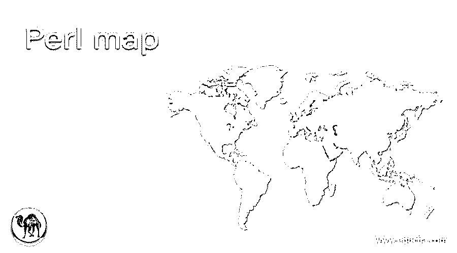
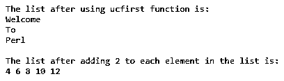
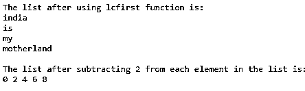
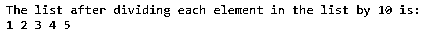

# Perl 文件夹

> 原文：<https://www.educba.com/perl-map/>

## Perl 映射简介

每当我们在 Perl 中处理一个列表时，如果我们想要评估列表中每个元素的表达式或块，我们就使用一个在 Perl 中称为 map()函数的函数。符号$_ 在列表的每次迭代中保存当前元素的值。map()函数可以对数组中的每个元素执行表达式，并在表达式执行后返回一个由结果元素组成的新数组。这个 map()函数通常是原始列表到结果列表的一对一转换，但是结果列表可以比原始列表更短或更长。

**在 Perl 中声明 map()函数的语法如下:**

<small>网页开发、编程语言、软件测试&其他</small>

`map(EXPR, List);
map(BLOCK, List);`

其中，EXPR 是要在名称列表指定的列表的每个元素上计算的表达式，而

BLOCK 是在名称列表中指定的列表的每个元素上要计算的块。

### Perl 中 map()函数的使用

*   每当我们在 Perl 中处理一个列表时，如果我们想要评估列表中每个元素的表达式或块，我们就使用一个在 Perl 中称为 map()函数的函数。
*   符号$_ 在列表的每次迭代中保存当前元素的值。
*   map()函数可以对数组中的每个元素执行一个表达式，并在表达式执行后返回一个由结果元素组成的新数组。
*   map()函数通常是原始列表到结果列表的一对一转换，但是结果列表可以比原始列表更短或更长。

### Perl 映射的示例

下面举几个例子

#### 示例#1

Perl 程序，说明 map()函数的工作方式，以大写字母开始显示给定列表中的每个元素，并对给定列表中的每个元素执行操作，然后显示结果列表:

**代码:**

`#a list consisting of elements is stored in a variable called firstlist
@firstlist = ('welcome', 'to', 'perl');
#map() function is used to display each element of the firstlist beginning with capital letter
@resultlist = map(ucfirst, @firstlist);
print "The list after using ucfirst function is:\n";
#iterating through the resultinglist to display each element in the list one after the other
foreach $element ( @resultlist ) {
print "$element\n";
}
print "\n";
#a list of numbers is stored in a variable called noslist
@noslist = (2, 4, 6, 8, 10);
#map() function is used to add 2 to each element in the list
@resultnoslist = map{$_ + 2} @noslist;
print "The list after adding 2 to each element in the list is:\n";
#the resulting list is displayed as the output on the screen
print "@resultnoslist\n";`

**输出:**

在上面的程序中，由元素组成的列表存储在一个名为 firstlist 的变量中。然后使用 map()函数显示 firstlist 中以大写字母开头的每个元素。然后遍历结果列表，一个接一个地显示列表中的每个元素。然后一个数字列表存储在一个名为 noslist 的变量中。然后使用 map()函数给列表中的每个元素加 2。然后，结果列表作为输出显示在屏幕上。

#### 实施例 2

Perl 程序，说明 map()函数的工作方式，显示给定列表中以一个小写字母开头的每个元素，并对给定列表中的每个元素执行操作并显示结果列表:

**代码:**

`#a list consisting of elements is stored in a variable called firstlist
@firstlist = ('India', 'Is', 'My', 'Motherland');
#map() function is used to display each element of the firstlist beginning with small letter
@resultlist = map(lcfirst, @firstlist);
print "The list after using lcfirst function is:\n";
#iterating through the resultinglist to display each element in the list one after the other
foreach $element ( @resultlist ) {
print "$element\n";
}
print "\n";
#a list of numbers is stored in a variable called noslist
@noslist = (2, 4, 6, 8, 10);
#map() function is used to subtract 2 to from each element in the list
@resultnoslist = map{$_ - 2} @noslist;
print "The list after subtracting 2 from each element in the list is:\n";
#the resulting list is displayed as the output on the screen
print "@resultnoslist\n";`

**输出:**

在上面的程序中，由元素组成的列表存储在一个名为 firstlist 的变量中。然后使用 map()函数显示 firstlist 的每个元素，以一个小写字母开头。然后遍历结果列表，一个接一个地显示列表中的每个元素。然后一个数字列表存储在一个名为 noslist 的变量中。然后使用 map()函数从列表中的每个元素中减去 2。然后，结果列表作为输出显示在屏幕上。

#### 实施例 3

Perl 程序，说明 map()函数对给定列表中的每个元素执行操作并显示结果列表的工作原理:

**代码:**

`#a list of numbers is stored in a variable called noslist
@noslist = (10, 20, 30, 40, 50);
#map() function is used to divide each element in the list by 10
@resultnoslist = map{$_ /10} @noslist;
print "The list after dividing each element in the list by 10 is:\n";
#the resulting list is displayed as the output on the screen
print "@resultnoslist\n";`

**输出:**

在上面的程序中，一个数字列表存储在一个名为 noslist 的变量中。然后使用 map()函数将列表中的每个元素除以 10。然后，结果列表作为输出显示在屏幕上。

### 推荐文章

这是一个 Perl 映射指南。在这里，我们通过编程示例及其输出，通过 Perl 中 map()函数的定义、语法和工作方式，讨论了 Perl 中 map()函数的概念。您也可以看看以下文章，了解更多信息–

1.  [Perl 读取文件](https://www.educba.com/perl-read-file/)
2.  [Perl 注释](https://www.educba.com/perl-comments/)
3.  [Perl sort()](https://www.educba.com/perl-sort/)
4.  [在 Perl 中拆分](https://www.educba.com/split-in-perl/)

