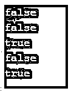

# Perl 布尔值

> 原文：<https://www.educba.com/perl-boolean/>

## Perl 布尔函数简介

Perl 布尔类型是一种值类型，与其他编程语言不同，它的行为方式不同，使用这些值的函数返回 true 或 false。Perl 编程语言在判断值为真或假时并不被认为是传统的。这些值仅用于解释和说明这些是布尔值，而不是用于操作的实际值。布尔值在 Perl 语言中不常用；更确切地说，只有当典型的系统将这些作为标识和操作的返回类型时，才使用它。

**语法:**

<small>网页开发、编程语言、软件测试&其他</small>

虽然没有合适的语法，但 Perl boolean value 仍然会在需要本地布尔数据类型而不是标量值的地方被多次使用，它的表示如下:

`use boolean;
do &always if true_val;
do &never if false_val;
do &maybe if boolean($val)->is_True;`

布尔型模块利用 basic 作为数据类型，该数据类型用于使整个系统包括 f 值，根据该值为真或假。

### 布尔类型在 Perl 中是如何工作的？

在 Perl 中有许多表示布尔值的方法，程序员依赖于这些方法，或者借助于对依赖于 Perl 的布尔值类型的条件检查、系统检查和许多其他因素进行评估的过程来工作。这些值不是任何需要值为真或假的特殊值。另一方面，有许多方法可以用布尔值来处理这个值。

*   在 Perl 编程语言中有一些值总是假的，即，' undef '，0，0.0，"，' 0 '。
*   Boolean for Perl 编程语言使用其他标量值，但不像其他编程语言那样使用简单的值。
*   Perl 中的 Boolean 可以有多种类型，比如如果值为 true，那么它需要根据实现时的需求类型转换为 false。
*   最常见的情况是，值出来是假的，但是在返回值中，可能有一些内置的系统变量，它在内部获得与值的比较，并在其中将值返回为真，这将在一个示例中进一步提到。
*   boolean 有时用于 undef 和空字符串；那么，在这种情况下，非常需要使整个布尔集合与其他需要转换和值得表示的值一致。
*   每当需要正确地进行故障诊断时，对值和执行中的程序使用 Strict 和 warnings 是非常有用的。
*   考虑到空字符串的严格和警告性用法，有时会为任何 Perl 程序的执行提供警告。此外，它有助于使整体结果以某种简化的方式移动。
*   有一些值为 0，这在某种程度上是正确的，布尔值是字符串形式的文本，当它被使用时，它被转换成某种类型的数字，再用字符串转换成某个值。
*   对于一元运算符的使用，有一些值被认为是真的，但当与单个运算符一起使用时，可以转换为假的；除此之外，当双一元运算符！!将用于将整个值转换为一个谎言。

### Perl 布尔值的示例

下面给出了 Perl 布尔值的示例:

#### 示例#1

这个程序演示了 Perl 语句的使用，它被用作一个条件语句，根据场景和需求来检查所取的值是真还是假。

**代码:**

`#!/usr/bin/perl
if ('even_no') {
print 'true';
} else {
print 'false';
}`

**输出:**

#### 实施例 2

这个程序演示了被赋值为 0 的变量的假值，如输出所示。

**代码:**

`#!/usr/bin/perl
$at_1 = 0;
if ($at_1)
{
print "at_1 is True\n";
}
else
{
print "at_1 is False\n";
}`

**输出:**

#### 实施例 3

这个程序演示了在 Perl 中使用 undef 和 condition，它用于给出如下所示的输出。

**代码:**

`#!/usr/bin/perl
foreach my $vl_3 (undef, 0, 0.5, '', '8') {
if ($vl_3) {
print "true\n";
} else {
print "false\n";
}
}`

**输出:**

#### 实施例 4

这个程序演示了一个空字符串，该字符串用于检查输出中显示的返回值为真或假的条件。

**代码:**

`#!/usr/bin/perl
$bt_emp = '';
if ($bt_emp)
{
print "bt_emp is True\n";
}
else
{
print "bt_emp is False\n";
}`

**输出:**

#### 实施例 5

该程序通过使用 warnings 或 strict 作为输出中所示变量的标准文件包含来演示值。

**代码:**

`#!/usr/bin/perl
use warnings;
use strict;
my $one_vr = undef;
print $one_vr + 2;`

**输出:**

#### 实施例 6

有时，字符串形式的值在内部被转换为 0 形式的值，然后在与条件检查(通过评估)进行比较时，被认为是输出中所示的字符串作为值的输入，然后它将值抛出为 true，如图所示。

**代码:**

`#!/usr/bin/perl
if ('0FR1RG') {
print 'true';
} else {
print 'false';
}`

**输出:**

#### 实施例 7

这个程序演示了一元运算符的使用！它用于使用通常用于操作的规范格式将值作为来自谎言的真值。

**代码:**

`#!/usr/bin/perl
use Data::Dumper;
print Dumper !!'Welcome_Everyone!';`

**输出:**

### 结论

Perl boolean 是一种布尔值，用于使 Perl 语言使用，并通过其他方法和函数来标识返回类型是真还是假。总的来说，Perl boolean 虽然用得不多，但一旦使用，就可以解决许多与程序员最常使用的条件检查和评估相关的问题。

### 推荐文章

这是一个 Perl 布尔的指南。这里我们讨论一下介绍，布尔类型在 Perl 中是如何工作的？并分别举例说明。您也可以看看以下文章，了解更多信息–

1.  [Perl join](https://www.educba.com/perl-join/)
2.  [Perl 哈希](https://www.educba.com/perl-hash/)
3.  [Perl for 循环](https://www.educba.com/perl-for-loop/)
4.  [Perl 正则表达式](https://www.educba.com/perl-regular-expression/)

