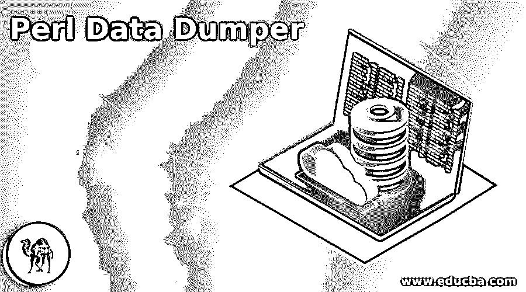
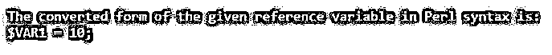
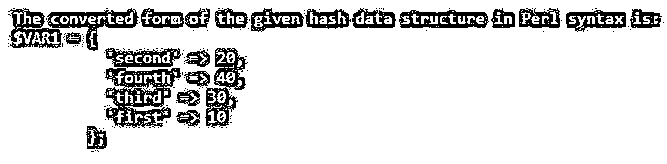
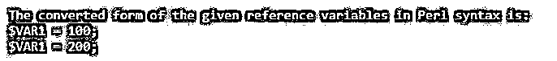
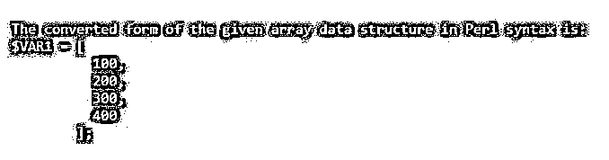
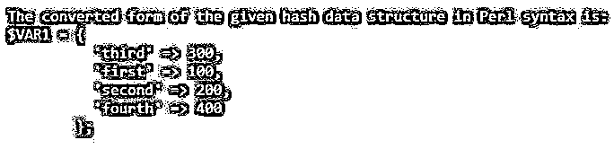

# Perl 数据转储程序

> 原文：<https://www.educba.com/perl-data-dumper/>

## Perl 数据转储器简介

Perl 中的数据结构可以使用名为 Dumper()函数的函数转换为字符串，该函数接受标量列表或引用变量列表，并在语法中输出它们的内容，默认情况下，引用变量以$VARn 形式显示为输出，其中 n 表示引用变量的数量，通过使用 Dumper()函数，数据结构可以作为文本打印出来，如果它被加载到另一个脚本， 我们只能依靠 Perl 将文本解析为结构，并且可以控制输出的缩进样式。

**声明 Dumper()函数的语法**

<small>网页开发、编程语言、软件测试&其他</small>

`use Data::Dumper;`

### Perl 中 Dumper()函数的工作原理

*   可以使用名为 Dumper()函数的函数将数据结构转换为字符串。
*   它接受标量列表或引用变量列表，并在语法中输出它们的内容。
*   默认情况下，引用变量以$VARn 的形式显示为输出，其中 n 表示引用变量的数量。
*   通过使用 Dumper()函数，可以将数据结构作为文本打印出来，如果将其加载到另一个脚本中，我们可以只依赖 Perl 将文本解析为 Perl 结构，并且可以控制所获得的输出的缩进样式。

### 例子

下面是提到的例子:

#### 示例#1

Perl 程序，演示如何使用 Dumper()函数将给定的数据结构转换成语法，并在屏幕上显示输出。

**代码:**

`#making use of Dumper() function to convert the given reference variable to Perl syntax
use Data::Dumper;
$varname=10;
#displaying the converted Perl syntax as the output on the screen
print "The converted form of the given reference variable in Perl syntax is:\n";
print Dumper($varname);`

**输出:**

在上面的程序中，我们利用 Dumper()函数将给定的引用变量转换成 Perl 语法。然后，转换为 Perl 语法的引用变量作为输出显示在屏幕上。

#### 实施例 2

Perl 程序，演示如何使用 Dumper()函数将给定的数组数据结构转换为 Perl 语法，并在屏幕上显示输出。

**代码:**

`#making use of Dumper() function to convert the given array data structure to Perl syntax
use Data::Dumper;
@varname=(10, 20, 30, 40);
#displaying the converted Perl syntax as the output on the screen
print "The converted form of the given array data structure in Perl syntax is:\n";
print Dumper(\@varname);`

**输出:**

在上面的程序中，我们利用 Dumper()函数将给定的数组数据结构转换成语法。然后，转换为语法的数组数据结构作为输出显示在屏幕上。

#### 实施例 3

Perl 程序，演示如何使用 Dumper()函数将给定的散列数据结构转换成 Perl 中的语法，并在屏幕上显示输出。

**代码:**

`#making use of Dumper() function to convert the given hash data structure to Perl syntax
use Data::Dumper;
%varname=(first => 10, second =>20, third =>30, fourth =>40);
#displaying the converted Perl syntax as the output on the screen
print "The converted form of the given hash data structure in Perl syntax is:\n";
print Dumper(\%varname);`

**输出:**

在上面的程序中，我们利用 Dumper()函数将给定的散列数据结构转换成 Perl 语法。然后，转换为语法的散列数据结构作为输出显示在屏幕上。

#### 实施例 4

Perl 程序，演示如何使用 Dumper()函数将给定的数据结构转换成 Perl 语法，并在屏幕上显示输出。

**代码:**

`#making use of Dumper() function to convert the given reference variables to Perl syntax
use Data::Dumper;
$varname=100;
$varname1=200;
#displaying the converted Perl syntax as the output on the screen
print "The converted form of the given reference variables in Perl syntax is:\n";
print Dumper($varname);
print Dumper($varname1);`

**输出:**

在上面的程序中，我们利用 Dumper()函数将给定的引用变量转换成 Perl 语法。然后，转换为语法的参考变量作为输出显示在屏幕上。

#### 实施例 5

Perl 程序，演示如何使用 Dumper()函数将给定的数组数据结构转换为 Perl 语法，并在屏幕上显示输出。

**代码:**

`#making use of Dumper() function to convert the given array data structure to Perl syntax
use Data::Dumper;
@varname=(100, 200, 300, 400);
#displaying the converted Perl syntax as the output on the screen
print "The converted form of the given array data structure in Perl syntax is:\n";
print Dumper(\@varname);`

**输出:**

在上面的程序中，我们利用函数将给定的数组数据结构转换成 Perl 语法。然后，转换为 Perl 语法的数组数据结构作为输出显示在屏幕上。

#### 实施例 6

Perl 程序，演示如何使用函数将给定的散列数据结构转换成 Perl 语法，并在屏幕上显示输出。

**代码:**

`#making use of Dumper() function to convert the given hash data structure to Perl syntax
use Data::Dumper;
%varname=(first => 100, second =>200, third =>300, fourth =>400);
#displaying the converted Perl syntax as the output on the screen
print "The converted form of the given hash data structure in Perl syntax is:\n";
print Dumper(\%varname);`

**输出:**

在上面的程序中，我们利用函数将给定的散列数据结构转换成 Perl 语法。然后，转换为 Perl 语法的散列数据结构作为输出显示在屏幕上。

### 推荐文章

这是一个 Perl 数据转储指南。这里我们分别讨论 perl 中 Dumper()函数的介绍、工作原理和实例。您也可以看看以下文章，了解更多信息–

1.  perl eval
2.  [Perl sort()](https://www.educba.com/perl-sort/)
3.  [Perl 子程序](https://www.educba.com/perl-subroutine/)
4.  [Perl 注释](https://www.educba.com/perl-comments/)

