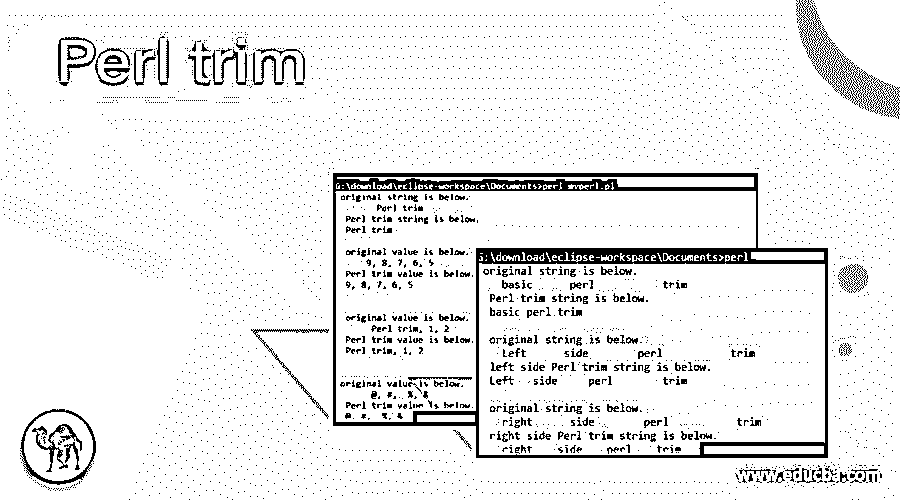
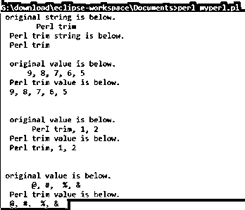
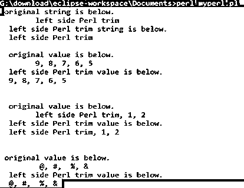
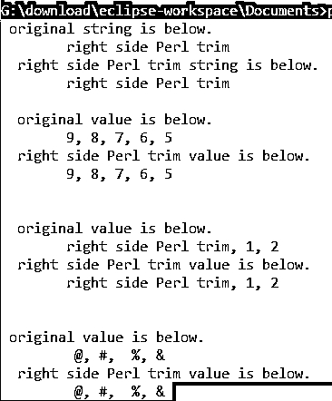

# Perl trim

> 原文：<https://www.educba.com/perl-trim/>

## Perl trim 简介

Perl trim 删除 Perl 字符串开头和结尾不需要的空格。修剪是为了删除 Perl 字符串开始和结束的空白并节省内存。Trim 删除 Perl 字符串中不必要的空白，并将所需的数据存储在数据库中。修剪对于删除字符串的首字符和末字符前的空格很有用。当字符串想要剪切两端不需要的空间并保存必要的数据时，修剪是有用的。

**语法:**

<small>网页开发、编程语言、软件测试&其他</small>

基本的 trim 语法如下。

`$ perl_trim_variable =~ s/^\s+|\s+$//;`

*   此语法用于清除字符串两边的空白。
*   基本的 Perl 语法使用正则表达式来删除字符串中不需要的前导和尾随空格。

左侧修剪语法如下。

`$ left_perl_trim_variable =~  s/^\s+//;`

*   此语法用于清除字符串左侧的空白。
*   左侧的 Perl 语法使用正则表达式来删除 Perl 字符串中不需要的前导空格。

右侧修剪语法如下。

`$ right_perl_trim_variable =~  s/\s+$//;`

*   此语法用于清除字符串右边的空白。
*   右边的语法使用正则表达式来删除 Perl 字符串的尾部空格。

### Perl 中的 trim 函数是如何工作的？

*   下载 Perl 软件并将其安装在设备的操作系统中。

https://www.Perl.org/或 http://strawberryPerl.com/普遍使用软件网站。

*   在设备中创建一个扩展名为 Perl 的文件，并将该文件保存在命令行路径中。

**举例:**

`helloo.pl or first pearl.pl`

*   创建字符串变量并用 trim 的值初始化。

`$ perl_trim_function = "  Perl trim  ";`

*   对给定的 Perl 字符串变量使用所需的 trim 语法。

`$ perl_trim_function =~ s/^\s+|\s+$//;`

*   使用 trim 语法后返回字符串。

`print " Perl trim string is below. \n ";
print" $ perl_trim_function \n ";`

*   修剪的组合工作步骤如下。

`$ perl_trim_function = "  Perl trim  ";
print " original string is below. \n ";
print" $ perl_trim_function \n ";
$ perl_trim_function =~ s/^\s+|\s+$//;
print " Perl trim string is below. \n ";
print" $ perl_trim_function \n ";`

### 例子

以下是下面提到的例子。

#### 示例#1

基本修剪示例和输出。

**代码:**

`$ perl_trim_function = "      Perl trim     ";
print " original string is below. \n ";
print" $ perl_trim_function \n ";
$ perl_trim_function =~ s/^\s+|\s+$//;
print " Perl trim string is below. \n ";
print" $ perl_trim_function \n \n ";
$ perl_trim_function1 ="    9, 8, 7, 6, 5    ";
print " original value is below. \n ";
print" $ perl_trim_function1 \n ";
$ perl_trim_function1 =~ s/^\s+|\s+$//;
print " Perl trim value is below. \n ";
print" $ perl_trim_function1 \n \n \n ";
$ perl_trim_function2 = "     Perl trim, 1, 2    ";
print " original value is below. \n ";
print" $ perl_trim_function2 \n ";
$ perl_trim_function2 =~ s/^\s+|\s+$//;
print " Perl trim value is below. \n ";
print" $ perl_trim_function2 \n \n \n";
$ perl_trim_function3 = "     @, #, $, %, &    ";
print " original value is below. \n ";
print" $ perl_trim_function3 \n ";
$ perl_trim_function3 =~ s/^\s+|\s+$//;
print " Perl trim value is below. \n ";
print" $ perl_trim_function3 \n \n \n";`

**输出:**

#### 实施例 2

左侧修剪示例和输出。

**代码:**

`$ perl_trim_function = "      left side Perl trim     ";
print " original string is below. \n ";
print" $ perl_trim_function \n ";
$ perl_trim_function =~ s/^\s+//;
print " left side Perl trim string is below. \n ";
print" $ perl_trim_function \n \n ";
$ perl_trim_function1 ="      9, 8, 7, 6, 5    ";
print " original value is below. \n ";
print" $ perl_trim_function1 \n ";
$ perl_trim_function1 =~ s/^\s+//;
print " left side Perl trim value is below. \n ";
print" $ perl_trim_function1 \n \n \n ";
$ perl_trim_function2 = "      left side Perl trim, 1, 2    ";
print " original value is below. \n ";
print" $ perl_trim_function2 \n ";
$ perl_trim_function2 =~ s/^\s+//;
print " left side Perl trim value is below. \n ";
print" $ perl_trim_function2 \n \n \n";
$ perl_trim_function3 = "       @, #, $, %, &    ";
print " original value is below. \n ";
print" $ perl_trim_function3 \n ";
$ perl_trim_function3 =~ s/^\s+//;
print " left side Perl trim value is below. \n ";
print" $ perl_trim_function3 \n \n \n";`

**输出:**

#### 实施例 3

右侧修剪示例和输出。

**代码:**

`$ perl_trim_function = "      right side Perl trim     ";
print " original string is below. \n ";
print" $ perl_trim_function \n ";
$ perl_trim_function =~ s/\s+$//;
print " right side Perl trim string is below. \n ";
print" $ perl_trim_function \n \n ";
$ perl_trim_function1 ="      9, 8, 7, 6, 5    ";
print " original value is below. \n ";
print" $ perl_trim_function1 \n ";
$ perl_trim_function1 =~ s/\s+$//;
print " right side Perl trim value is below. \n ";
print" $ perl_trim_function1 \n \n \n ";
$ perl_trim_function2 = "      right side Perl trim, 1, 2    ";
print " original value is below. \n ";
print" $ perl_trim_function2 \n ";
$ perl_trim_function2 =~ s/\s+$//;
print " right side Perl trim value is below. \n ";
print" $ perl_trim_function2 \n \n \n";
$ perl_trim_function3 = "       @, #, $, %, &    ";
print " original value is below. \n ";
print" $ perl_trim_function3 \n ";
$ perl_trim_function3 =~ s/\s+$//;
print " right side Perl trim value is below. \n ";
print" $ perl_trim_function3 \n \n \n";`

**输出:**

#### 实施例 4

trim 使用数组示例和输出。

**代码:**

`@perl_trim_function = ("  basic  ","   perl       ","   trim   ");
print " original string is below. \n ";
print" @perl_trim_function \n ";
@perl_trim_functions =  grep(s/^\s+|\s+$//g, @perl_trim_function);
print " Perl trim string is below. \n ";
print" @perl_trim_functions \n \n ";
@perl_trim_function = ("  Left  ","   side    ","   perl       ","   trim   ");
print " original string is below. \n ";
print" @perl_trim_function \n ";
@perl_trim_functions =  grep(s/^\s+//g, @perl_trim_function);
print " left side Perl trim string is below. \n ";
print" @perl_trim_functions \n \n ";
@perl_trim_function = ("  right  ","   side    ","   perl       ","   trim   ");
print " original string is below. \n ";
print" @perl_trim_function \n ";
@perl_trim_functions =  grep(s/\s+$//g, @perl_trim_function);
print " right side Perl trim string is below. \n ";
print" @perl_trim_functions \n \n ";`

**输出:**

**描述:**

*   grep()方法用于数组元素，并根据用户要求进行修剪。
*   g 运算符用于全局变量，选择所有元素进行修剪。

### 结论

在 Perl 技术中，Trim 对于删除字符串中的空白非常有用。trim 节省了数据库的内存空间，并删除了 Perl 字符串中不必要的空格。

### 推荐文章

这是一个 Perl trim 指南。在这里，我们讨论了 Perl 中的 trim 函数是如何工作的，并给出了代码和输出。您也可以看看以下文章，了解更多信息–

1.  [Perl 复制文件](https://www.educba.com/perl-copy-file/)
2.  [Perl 哈希](https://www.educba.com/perl-hash/)
3.  [Perl sort()](https://www.educba.com/perl-sort/)
4.  [Perl 文件存在](https://www.educba.com/perl-file-exists/)

